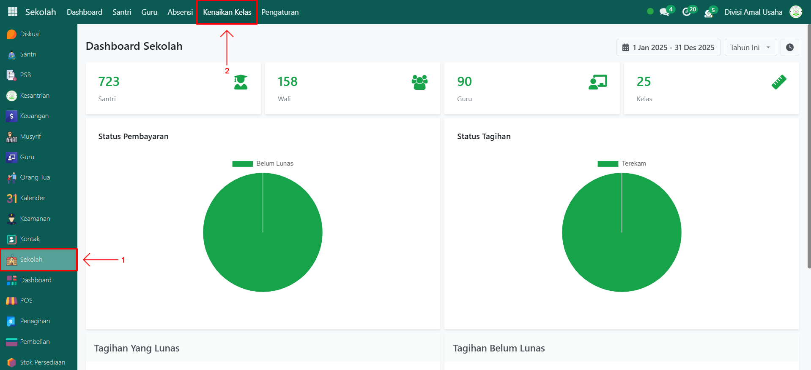
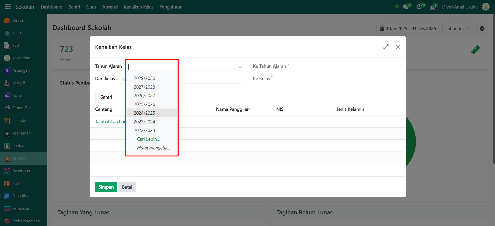
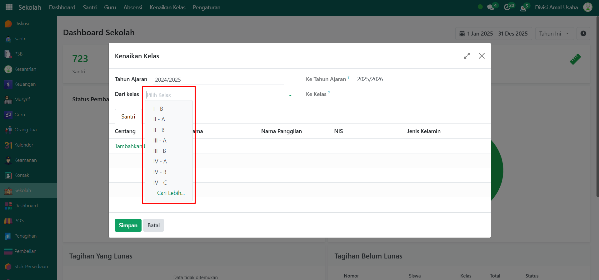
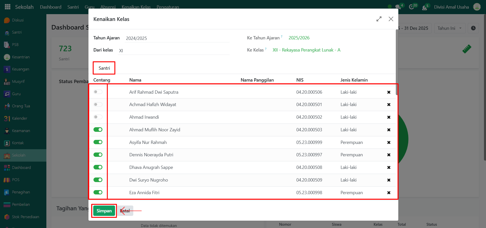
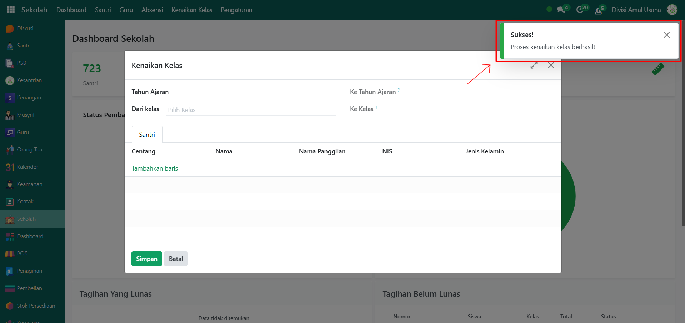
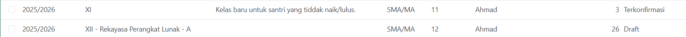

# Proses Kenaikan Kelas



## Proses Kenaikan Kelas

Fitur **Proses Kenaikan Kelas** digunakan untuk memindahkan santri dari kelas yang sedang ditempati ke kelas baru sesuai dengan tahun ajaran berikutnya. Administrator dapat menentukan santri yang naik kelas maupun santri yang tinggal kelas.

### Melakukan Proses Kenaikan Kelas

Berikut adalah langkah-langkah untuk melakukan proses kenaikan kelas pada Odoo Pesantren.

1. Login menggunakan akun administrator. Jika Anda belum memahami cara login sebagai admin, silakan lihat panduan [**Login Admin** di sini](../../panduan-login/login-admin.md).
2.  Buka modul **Sekolah**, lalu klik menu **Kenaikan Kelas**.

    <figure><figcaption></figcaption></figure>

3.  Akan tampil halaman **form Kenaikan Kelas**, pilih **Tahun Ajaran saat ini** yang sedang berjalan.

    <figure><figcaption></figcaption></figure>

4.  Pilih **kelas** yang ada pada tahun ajaran tersebut dan akan dinaikkan ke kelas baru pada tahun ajaran berikutnya.

    <figure><figcaption></figcaption></figure>

5.  Pada **Tab Santri**, sistem akan menampilkan daftar santri yang ada di kelas tersebut. Di tabel daftar santri tersedia opsi **Aktif/Nonaktif**:

    * **Aktifkan** untuk santri yang akan naik kelas.
    * **Nonaktifkan** untuk santri yang tidak naik kelas.

    Klik tombol **Simpan** untuk memproses kenaikan kelas.

    <figure><figcaption></figcaption></figure>

6.  Setelah berhasil, sistem akan menampilkan notifikasi bahwa **proses kenaikan kelas** sudah berhasil.

    <figure><figcaption></figcaption></figure>

7. Status kelas dan daftar santri dapat dicek kembali melalui menu **Ruang Kelas** pada modul Sekolah.
8.  Santri yang **naik kelas** akan otomatis dipindahkan ke kelas baru sesuai jenjangnya di tahun ajaran berikutnya. Sebaliknya, santri yang **tidak naik kelas** akan ditempatkan ke dalam **kelas khusus** yang dibuat otomatis oleh sistem untuk menampung santri tinggal kelas.

    <figure><figcaption></figcaption></figure>

