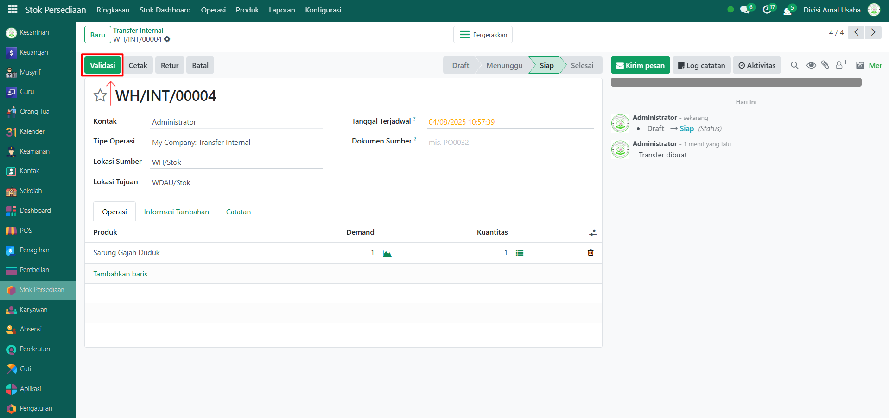

# Operasi Internal



## Operasi Internal

**Operasi Internal** digunakan untuk memindahkan barang antar lokasi di dalam gudang atau antar gudang dalam sistem Odoo Pesantren. Proses ini penting agar data stok tetap akurat sesuai dengan pergerakan barang yang terjadi di lapangan.

### Melakukan Operasi Internal pada Barang

Berikut adalah langkah-langkah untuk melakukan operasi internal pada Odoo Pesantren.

1. Login menggunakan akun administrator. Jika Anda belum memahami cara login sebagai admin, silakan lihat panduan [**Login Admin** di sini](../../panduan-login/login-admin.md).
2.  Buka modul **Stok Persediaan**, lalu klik menu **Operasi** kemudian pilih submenu **Internal**.

    <figure><figcaption></figcaption></figure>

3.  Klik tombol **"Baru"** untuk membuat operasi internal baru.

    <figure><figcaption></figcaption></figure>

4.  Akan tampil halaman form **Operasi Internal**, pilih **Kontak** (bisa diisi dengan pemilik perusahaan atau misalnya administrator), lalu masukkan **Tanggal Operasi**, kemudian pilih **Lokasi Sumber** (asal barang).

    <figure><figcaption></figcaption></figure>

5.  Pilih **Lokasi Tujuan** (lokasi barang akan dipindahkan).

    <figure><figcaption></figcaption></figure>

6.  Pada **Tab Operasi**, lalu masukkan daftar **produk/barang** beserta **kuantitas** yang akan dipindahkan dari lokasi sumber ke lokasi tujuan. Setelah semua inputan diisi dengan benar, klik tombol **"Tandai sebagai Todo"** untuk menandai bahwa operasi internal sudah dijadwalkan/diproses.

    <figure><figcaption></figcaption></figure>

7.  Jika pemindahan barang sudah selesai dilakukan, klik tombol **"Validasi"** untuk mengonfirmasi bahwa operasi internal telah selesai.

    <figure><figcaption></figcaption></figure>

8. Setelah divalidasi, sistem akan otomatis memperbarui data stok sesuai dengan lokasi tujuan, dan status dokumen berubah menjadi _**Selesai**_.
