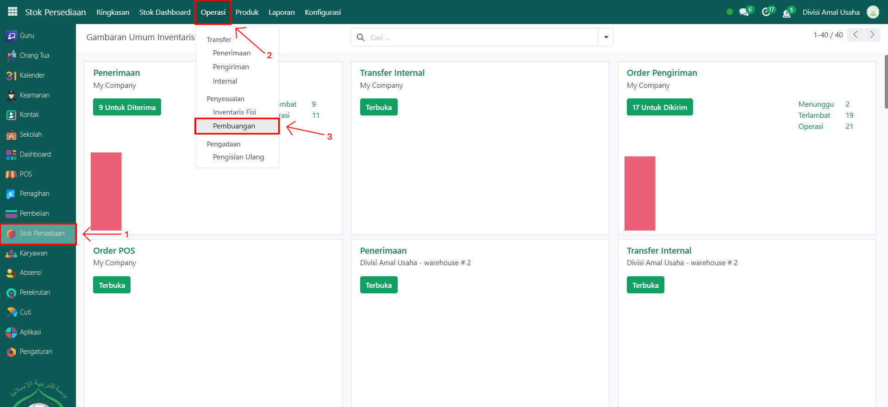
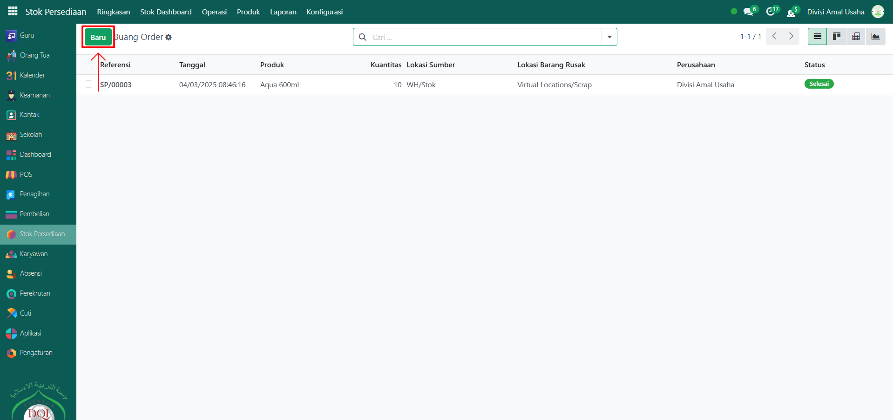
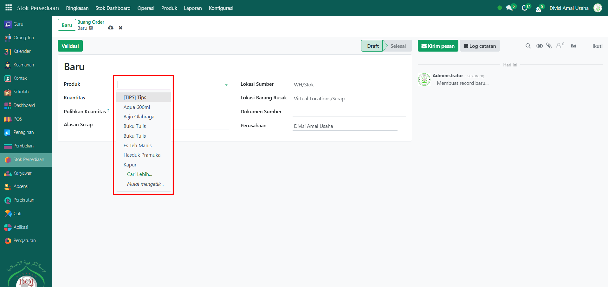
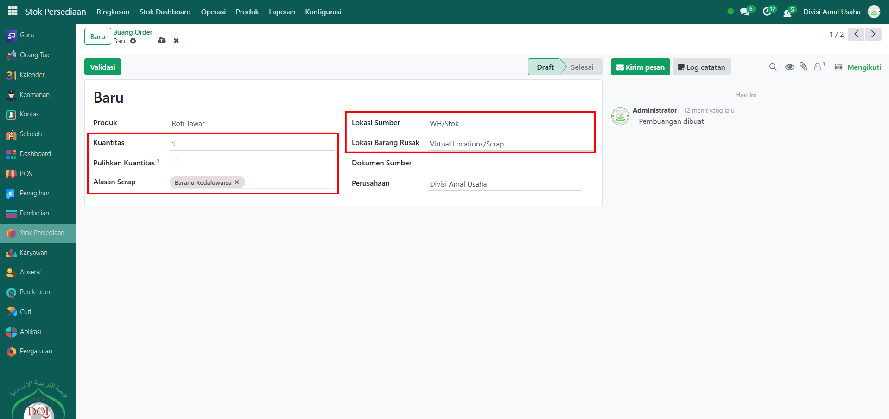
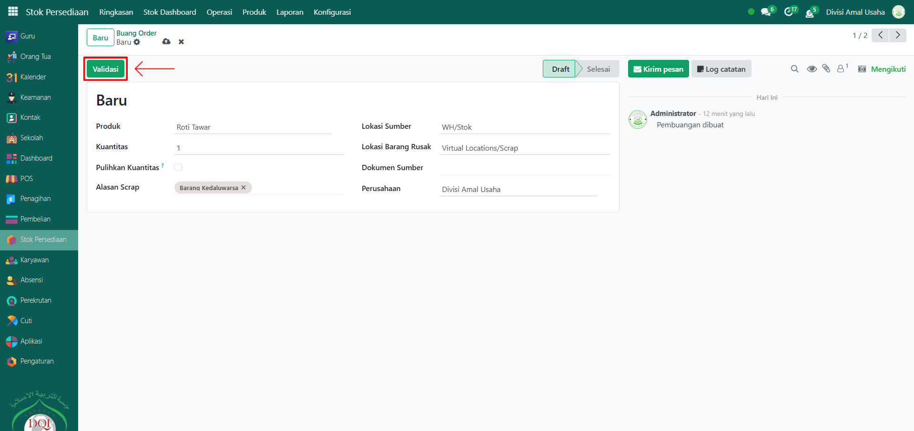
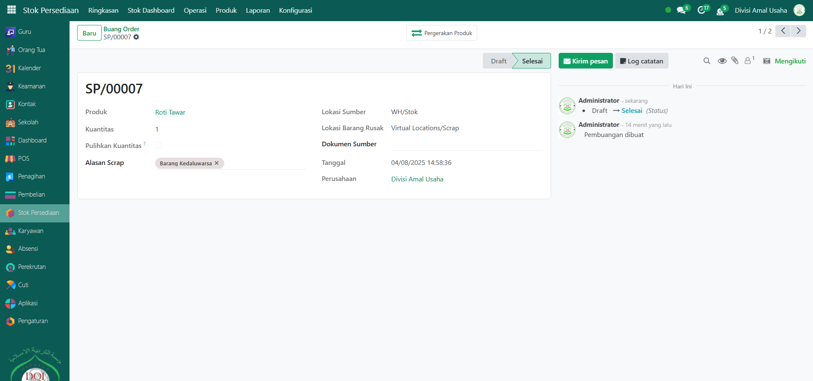

# Pembuangan Barang

Video \[]

## Pembuangan Stok Barang

**Pembuangan Stok Barang** dilakukan untuk mengurangi stok di sistem akibat barang rusak, kadaluarsa, atau tidak layak jual. Proses ini akan memindahkan stok dari gudang utama ke lokasi pembuangan.

### Melakukan Pembuangan Stok Barang

Berikut adalah langkah-langkah untuk melakukan pembuangan stok barang pada Odoo Pesantren.

1. Login menggunakan akun administrator. Jika Anda belum memahami cara login sebagai admin, silakan lihat panduan [**Login Admin** di sini](../../panduan-login/login-admin.md).
2.  Buka modul **Stok Persediaan**, lalu klik menu **Operasi** kemudian pilih submenu **Pembuangan**.

    <figure><figcaption></figcaption></figure>

3.  Klik tombol **"Baru"** untuk membuat transaksi pembuangan stok baru.

    <figure><figcaption></figcaption></figure>

4.  Akan tampil halaman form **Pembuangan Stok Barang**, pilih produk yang ingin dibuang.

    <figure><figcaption></figcaption></figure>

5.  Selanjutnya, isi inputan lainnya seperti kuantitas produk yang akan dibuang, aktifkan pulihkan kuantitas jika ingin memulihkan produk setelah dibuang (pastikan gudang/lokasi mempunyai rute untuk pulihkan kuantitas), lokasi sumber (lokasi barang saat ini berada), dan lokasi barang rusak (lokasi yang akan menjadi tempat dibuangnya barang).

    <figure><figcaption></figcaption></figure>

6.  Setelah semua data terisi dengan benar, klik tombol **"Validasi"** untuk menyelesaikan proses pembuangan.

    <figure><figcaption></figcaption></figure>

7.  Jika berhasil, status transaksi akan berubah menjadi **"Selesai"**, dan stok barang di sistem otomatis berkurang sesuai kuantitas yang dibuang.

    <figure><figcaption></figcaption></figure>

