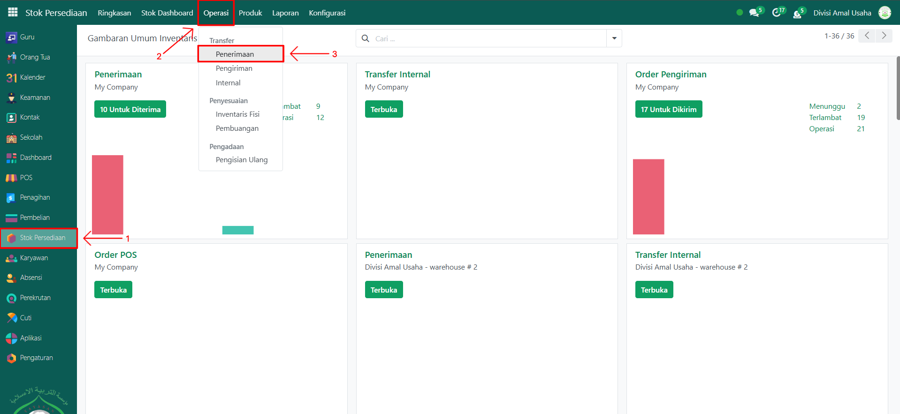
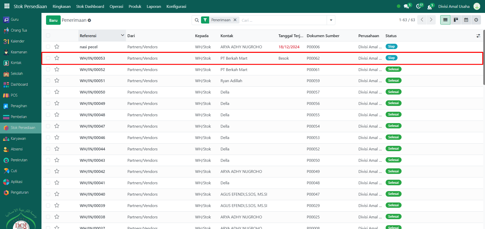
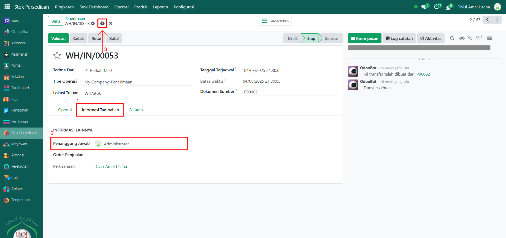
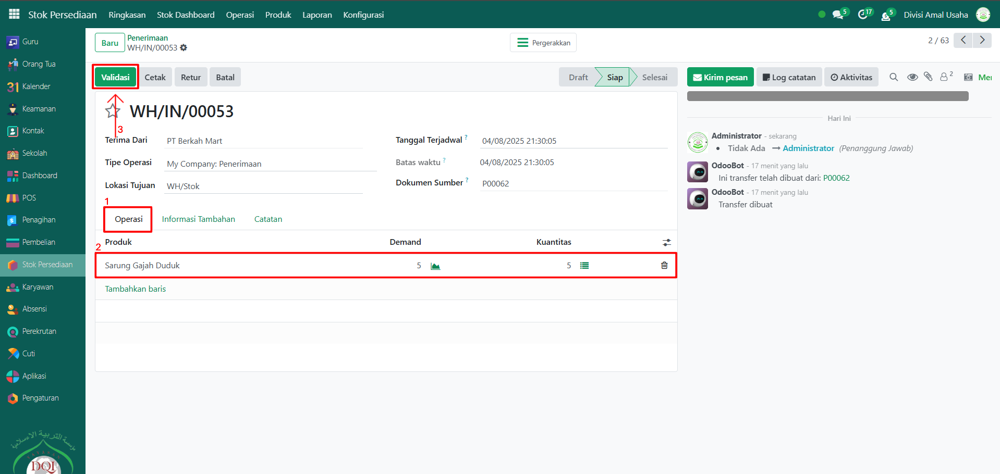
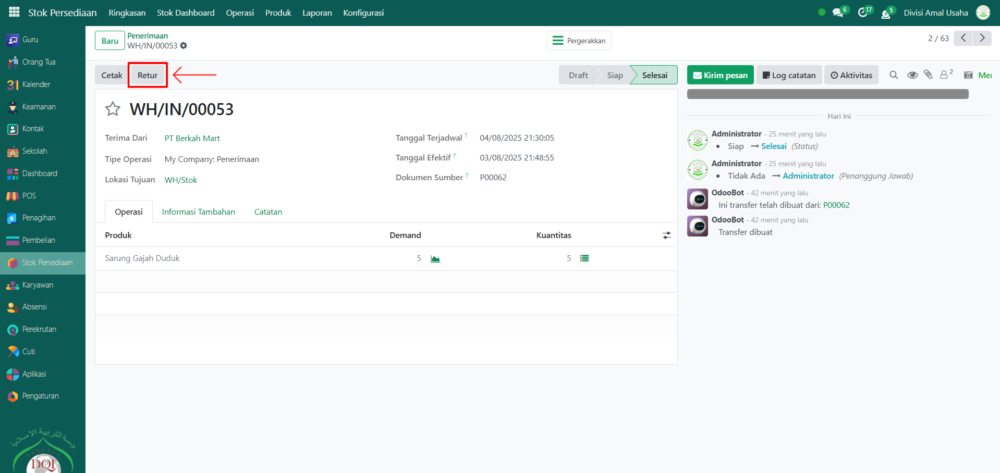
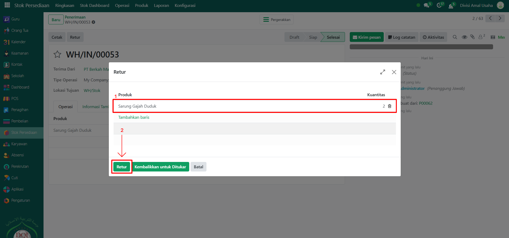

# Penerimaan Barang

Video \[]

## Penerimaan Barang&#x20;

**Penerimaan Barang** pada Odoo Pesantren digunakan untuk mencatat barang yang diterima dari pemasok berdasarkan order pembelian yang sudah dibuat sebelumnya. Proses ini memastikan bahwa stok barang pada sistem sesuai dengan barang yang diterima secara fisik.

### Melakukan Penerimaan Barang dari Pemasok

Berikut adalah langkah-langkah untuk melakukan penerimaan barang dari pemasok pada Odoo Pesantren.

1. Login menggunakan akun administrator. Jika Anda belum memahami cara login sebagai admin, silakan lihat panduan [**Login Admin** di sini](../../panduan-login/login-admin.md).
2.  Buka **modul Stok Persediaan**, lalu klik menu **Operasi** kemudian pilih submenu **Penerimaan**.

    <figure><figcaption></figcaption></figure>

3.  Pilih operasi penerimaan barang berdasarkan **referensi dokumen sumber** yang sesuai dengan order pembelian yang telah dibuat.

    <figure><figcaption></figcaption></figure>

4.  Akan tampil halaman form penerimaan barang. Pindah ke **Tab Informasi Tambahan**, lalu pilih **Penanggung Jawab** atas operasi penerimaan barang ini. Lalu klik icon **Simpan** di sebelah kanan icon **Gear** agar konfigurasi operasi penerimaan tersimpan di sistem.

    <figure><figcaption></figcaption></figure>

5.  Kemudian, pindah ke **Tab Operasi**, pastikan produk, jumlah barang (_kuantitas_), dan detail lainnya sudah sesuai dengan order pembelian. Dan pastikan tipe operasi yaitu penerimaan pada gudang, lalu lokasi tujuan juga harus sesuai dengan lokasi gudang yang dipakai. Jika data sudah sesuai, klik tombol **Validasi** untuk menyelesaikan proses penerimaan barang.

    <figure><figcaption></figcaption></figure>

6. Setelah berhasil divalidasi, sistem akan otomatis memperbarui **stok persediaan** sesuai barang yang diterima, dan status dokumen berubah menjadi _Selesai_.
7. Jika ada ketidaksesuaian barang (lebih/kurang), Anda bisa menyesuaikan kuantitas sebelum validasi atau melakukan proses retur barang setelah validasi.

### Melakukan Proses Retur Barang

Berikut adalah langkah-langkah untuk melakukan proses retur barang pada Odoo Pesantren.

1.  Masih pada dokumen **operasi penerimaan barang** yang sama, klik tombol **Retur** di bagian atas.

    <figure><figcaption></figcaption></figure>

2.  Akan muncul pop up form retur. Pada form ini, isi **kuantitas barang** yang ingin dikembalikan. Tentukan apakah retur dilakukan dengan cara **mengembalikan barang langsung** atau **retur dengan penggantian barang lain**. Setelah itu klik tombol **Retur/Kembalikan untuk Ditukar** untuk melanjutkan proses.

    <figure><figcaption></figcaption></figure>

3.  Sistem akan membuat dokumen baru berupa **form pengembalian barang**. Periksa kembali daftar produk dan jumlah yang akan diretur. Jika sudah sesuai, klik tombol **Validasi** untuk menyelesaikan proses retur barang.

    <figure><figcaption></figcaption></figure>

4. Setelah berhasil divalidasi, status dokumen retur akan berubah menjadi _Selesai_ dan stok persediaan otomatis berkurang sesuai barang yang diretur.
