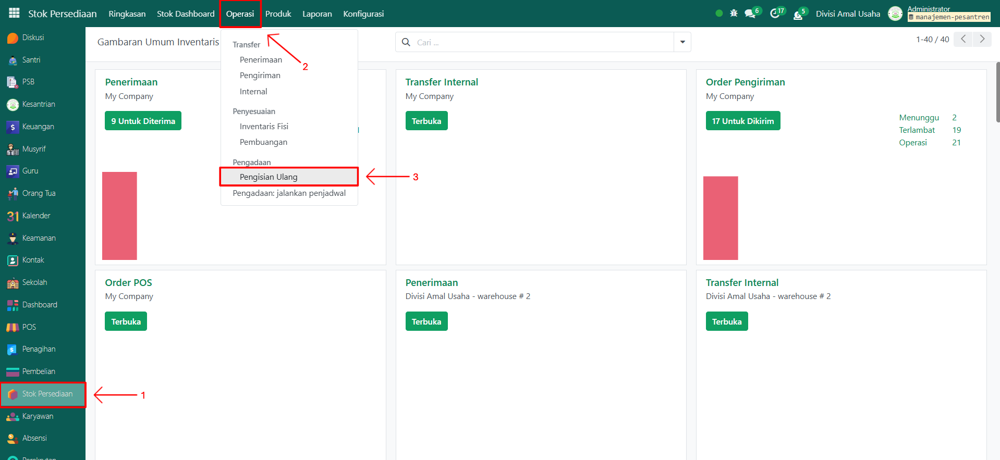
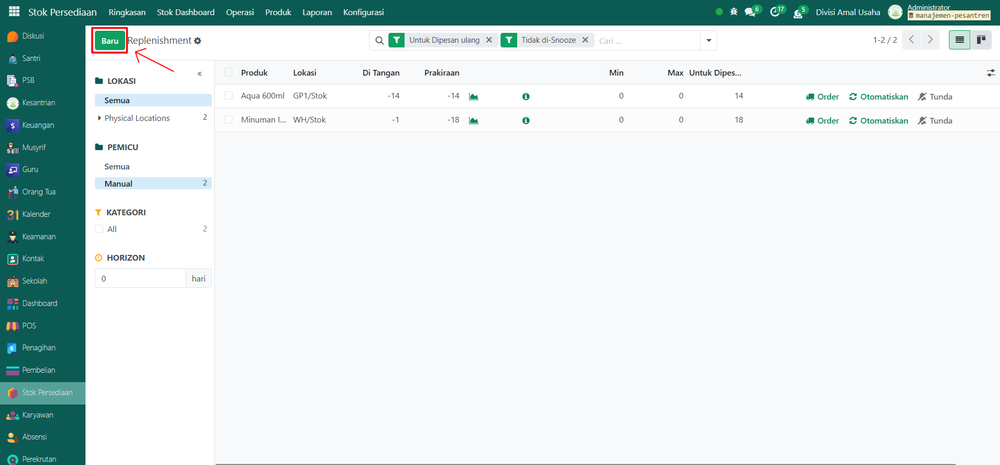
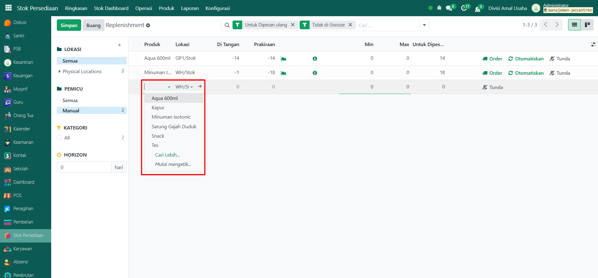
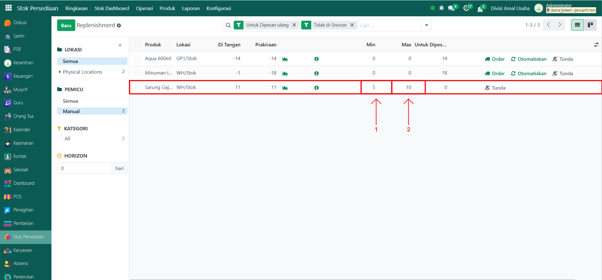

# Pengisian Ulang Barang

Video \[]

## Pengisian Ulang Barang

**Pengisian Ulang Barang (Reordering Rules/Replenisment)** digunakan untuk menjaga ketersediaan barang di gudang. Dengan fitur ini, sistem akan otomatis membuat permintaan pengisian ulang ketika stok barang turun di bawah jumlah minimal yang sudah ditentukan.

### Melakukan Pengisian Ulang Barang

Berikut adalah langkah-langkah untuk melakukan pengisian ulang stok produk pada Odoo Pesantren.

1. Login menggunakan akun administrator. Jika Anda belum memahami cara login sebagai admin, silakan lihat panduan [**Login Admin** di sini](../../panduan-login/login-admin.md).
2.  Buka modul **Stok Persediaan**, lalu klik menu **Operasi** kemudian pilih submenu **Pengisian Ulang**.

    <figure><figcaption></figcaption></figure>

3.  Klik tombol **"Baru"** untuk membuat aturan pengisian ulang stok barang.

    <figure><figcaption></figcaption></figure>

4.  Pada tampilan menu Pengisian Ulang, pilih **produk** yang akan dilakukan pengisian ulang stok barang.

    <figure><figcaption></figcaption></figure>

5.  Sistem akan menampilkan jumlah kuantitas saat ini dari produk yang dipilih. Kemudian masukkan nilai minimal dan maksimal kuantitas produk untuk melakukan proses pengisian ulang stok barang.

    <figure><figcaption></figcaption></figure>

6. Secara otomatis sistem akan menjalankan proses pengisian ulang jika kuantitas produk kurang dari nilai minimal kuantitas produk yang telah ditetapkan dan nilai maksimal kuantitas yang diatur akan disesuaikan dengan stok produk yang akan diisi ulang.

