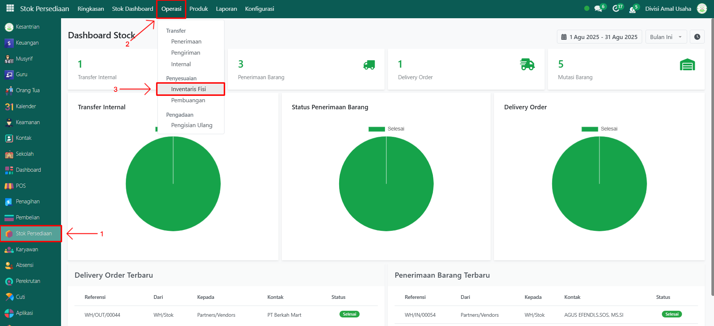
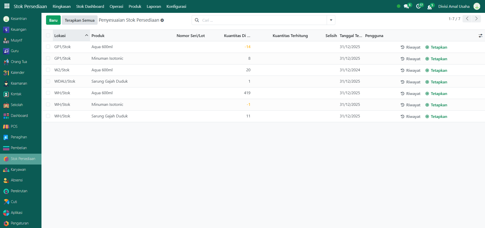
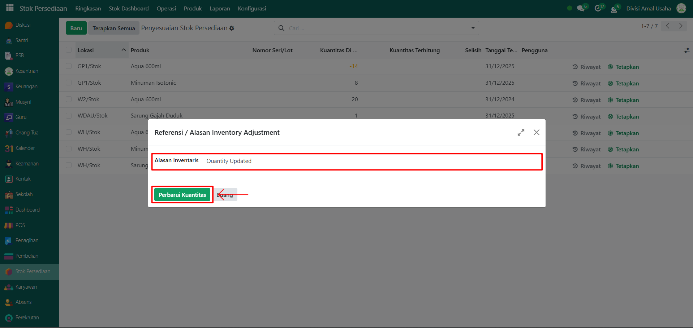

# Penyesuaian Stok



## Penyesuaian Stok

**Penyesuaian Stok** dilakukan untuk memastikan jumlah barang di sistem sama dengan jumlah barang nyata di gudang. Proses ini biasanya dilakukan ketika ada perbedaan stok akibat kerusakan, kehilangan, atau hasil stock opname.

### Melakukan Penyesuaian Stok Barang

Berikut adalah langkah-langkah untuk melakukan penyesuaian stok barang pada Odoo Pesantren.

1. Login menggunakan akun administrator. Jika Anda belum memahami cara login sebagai admin, silakan lihat panduan [**Login Admin** di sini](../../panduan-login/login-admin.md).
2.  Buka modul **Stok Persediaan**, lalu klik menu **Operasi** kemudian pilih submenu **Inventaris Fisi**.

    <figure><figcaption></figcaption></figure>

3.  Pilih produk yang akan dilakukan penyesuaian stok pada daftar produk yang tampil. Lalu isi inputan yang tersedia seperti:

    * **Lokasi** (pilih gudang/lokasi barang yang akan disesuaikan).
    * **Produk** (pilih produk tertentu atau kosongkan untuk menampilkan semua produk).
    * **Kuantitas di Tangan** (jumlah stok yang tercatat di sistem).
    * **Kuantitas Terhitung** (jumlah stok nyata yang dihitung secara fisik).
    * **Selisih** (sistem akan menghitung otomatis dari perbedaan kuantitas di tangan dengan kuantitas terhitung).
    * **Tanggal Terjadwal** (tanggal dilakukannya penyesuaian stok).

    <figure><figcaption></figcaption></figure>

4.  Setelah semua data diisi sesuai kondisi nyata, klik tombol **"Terapkan Semua"**.

    <figure><figcaption></figcaption></figure>

5.  Akan tampil pop up form **Alasan Penyesuaian Stok**, isi keterangan mengenai alasan dilakukannya inventaris. Klik tombol **"Perbarui Kuantitas"** untuk menyelesaikan proses penyesuaian stok.

    <figure><figcaption></figcaption></figure>

6. Sistem akan otomatis memperbarui jumlah stok barang di sistem sesuai dengan hasil penyesuaian yang sudah divalidasi.
