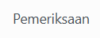
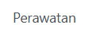
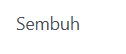

# Aktivitas

Video \[]

**Menu Aktivitas** merupakan fitur yang tersedia khusus bagi pengguna dengan peran **Musyrif** setelah login ke sistem. Menu ini dirancang untuk membantu musyrif dalam mencatat dan memantau berbagai aktivitas keseharian santri di asrama secara langsung dan sistematis. Menu ini terdiri dari empat dropdown utama, yaitu:&#x20;

## 1. Pelanggaran

**Pelanggaran** adalah submenu pada menu Aktivitas yang memungkinkan musyrif mencatat pelanggaran santri dan memantau riwayat pelanggaran yang telah dilakukan.

<figure><figcaption></figcaption></figure>

Pada tampilan tersebut, terdapat kolom yaitu status. Penjelasan kolom status adalah sebagai berikut:&#x20;

| Status                                                                                                                       | Informasi Detail                                                                                           |
| ---------------------------------------------------------------------------------------------------------------------------- | ---------------------------------------------------------------------------------------------------------- |
| 
<figure><figcaption></figcaption></figure>
 | Status awal saat pelanggaran baru dicatat oleh musyrif, tetapi belum diajukan untuk ditinjau lebih lanjut. |
| 
<figure><figcaption></figcaption></figure>
     | Pelanggaran sudah diajukan dan sedang menunggu verifikasi atau peninjauan oleh pihak yang berwenang.       |
| 
<figure><figcaption></figcaption></figure>
    | Pelanggaran telah disetujui dan dicatat secara resmi sebagai pelanggaran yang sah dalam sistem.            |

### Tambah Data Pelanggaran

Untuk menambahkan pengajuan izin pada user orang tua, pada tampilan **Pelanggaran**, silahkan klik tombol **→\[Baru].**

<figure><figcaption></figcaption></figure>

Jika Anda sudah melengkapi isian di atas, klik ikon .png>) untuk menyimpan data perizinan santri yang telah Anda buat, dan statusnya akan menjadi **\[Draft]**. Dan jika pihak pesantren sudah mengkonfirmasi, maka klik tombol **\[Konfirmasi]** untuk mengkonfirmasi pelanggaran yang telah dilakukan.

### Edit dan Hapus Data Pelanggaran

Untuk mengedit data pelanggaran, pilih terlebih dahulu data pelanggaran yang ingin diedit dari daftar tabel, lakukan perubahan yang diperlukan, lalu klik ikon .png>) untuk menyimpan perubahan tersebut. Untuk menghapus data pelanggaran, terdapat dua cara:&#x20;

1\. Pilih atau centang langsung record dari list tabel, kemudian klik tombol Action dan pilih opsi **“Hapus”**. 2. Buka salah satu data pelanggaran, klik ikon .png>) atau _Action_, lalu pilih **“Hapus”**. Akan muncul dialog konfirmasi, klik **“Hapus”** untuk menghapus atau **“Tidak, tetap simpan”** jika ingin membatalkan.

## 2. Kesehatan Santri

**Kesehatan Santri** adalah **s**ubmenu pada menu Aktivitas yang memungkinkan musyrif mencatat kondisi kesehatan santri serta melihat riwayat laporan kesehatan yang pernah dicatat.

<figure><figcaption></figcaption></figure>

Pada tampilan tersebut, terdapat kolom yaitu kondisi. Penjelasan kolom kondisi adalah sebagai berikut:&#x20;

| Kondisi                                                                                                                                   | Informasi Detail                                                                                                          |
| ----------------------------------------------------------------------------------------------------------------------------------------- | ------------------------------------------------------------------------------------------------------------------------- |
| 
<figure><figcaption></figcaption></figure>
 | Menunjukkan bahwa santri sedang dalam tahap pemeriksaan awal oleh petugas kesehatan atau musyrif.                         |
| 
<figure><figcaption></figcaption></figure>
   | Santri sedang menjalani perawatan setelah hasil pemeriksaan menunjukkan kondisi yang membutuhkan penanganan lebih lanjut. |
| 
<figure><figcaption></figcaption></figure>
      | Menandakan bahwa santri telah selesai menjalani perawatan dan dinyatakan sembuh dari kondisi sebelumnya.                  |

### Tambah Data Kesehatan Santri

Untuk menambahkan pengajuan izin pada user orang tua, pada tampilan **Kesehatan Santri**, silahkan klik tombol **→\[Baru].**

<figure><figcaption></figcaption></figure>

Jika Anda sudah melengkapi isian di atas, klik ikon .png>) untuk menyimpan atau membatalkan pembuatan data perizinan santri yang telah Anda buat, dan statusnya akan menjadi **\[Pemeriksaan]**.

### Edit dan Hapus Data Kesehatan Santri

Untuk mengedit data kesehatan santri, pilih terlebih dahulu data kesehatan santri yang ingin diedit dari daftar tabel, lakukan perubahan yang diperlukan, lalu klik ikon .png>) untuk menyimpan perubahan tersebut. Untuk menghapus data kesehatan santri, terdapat dua cara:&#x20;

1\. Pilih atau centang langsung record dari list tabel, kemudian klik tombol Action dan pilih opsi **“Hapus”**. 2. Buka salah satu data kesehatan santri, klik ikon .png>) atau _Action_, lalu pilih **“Hapus”**. Akan muncul dialog konfirmasi, klik **“Hapus”** untuk menghapus atau **“Tidak, tetap simpan”** jika ingin membatalkan.

## 3. Prestasi Santri

**Prestasi Santri** adalah submenu pada menu Aktivitas yang memungkinkan musyrif mencatat prestasi santri, baik akademik maupun non-akademik, dan memantau data prestasi yang tersimpan.

<figure><figcaption></figcaption></figure>

### Tambah Data Prestasi Santri

Untuk menambahkan data prestasi santri baru, pada tampilan **Prestasi Santri**, silahkan klik tombol **→\[Baru].**

<figure><figcaption></figcaption></figure>

Jika Anda sudah melengkapi isian di atas, klik ikon .png>) untuk menyimpan atau membatalkan pembuatan data prestasi santri yang telah Anda buat.

### Edit dan Hapus Data Prestasi Santri

Untuk mengedit data prestasi santri, pilih terlebih dahulu data prestasi santri yang ingin diedit dari daftar tabel, lakukan perubahan yang diperlukan, lalu klik .png>) untuk menyimpan perubahan tersebut. Untuk menghapus data prestasi santri, terdapat dua cara:&#x20;

1\. Pilih atau centang langsung record dari list tabel, kemudian klik tombol Action dan pilih opsi **“Hapus”**. 2. Buka salah satu data prestasi santri, klik ikon .png>) atau _Action_, lalu pilih **“Hapus”**. Akan muncul dialog konfirmasi, klik **“Hapus”** untuk menghapus atau **“Tidak, tetap simpan”** jika ingin membatalkan.

## 4. Mutaba'ah Harian

**Mutaba'ah Harian** adalah submenu pada menu Aktivitas yang memungkinkan musyrif mencatat aktivitas harian santri sebagai bagian dari evaluasi kedisiplinan, serta meninjau data mutaba’ah harian yang tersimpan.

<figure><figcaption></figcaption></figure>

Pada tampilan tersebut, terdapat kolom yaitu status. Penjelasan kolom status adalah sebagai berikut:&#x20;

| Status                                                                                                                                    | Informasi Detail                                                                                                                                                          |
| ----------------------------------------------------------------------------------------------------------------------------------------- | ------------------------------------------------------------------------------------------------------------------------------------------------------------------------- |
| 
<figure><figcaption></figcaption></figure>
   | Data mutaba’ah harian masih dalam tahap pengisian atau belum dikonfirmasi. Musyrif masih bisa mengedit isian sebelum disimpan final.                                      |
| 
<figure><figcaption></figcaption></figure>
 | Data mutaba’ah harian telah lengkap dan dikunci. Menandakan bahwa pencatatan aktivitas santri untuk hari tersebut telah selesai dilakukan dan tidak dapat diedit kembali. |

### Tambah Data Mutaba'ah Harian

Untuk menambahkan data mutabaah harian, pada tampilan **Mutabaah Harian**, silahkan klik tombol **\[Baru].**

<figure><figcaption></figcaption></figure>

Jika Anda sudah melengkapi isian di atas, klik ikon .png>)  untuk menyimpan atau membatalkan pembuatan data mutabaah harian yang telah Anda buat, dan statusnya akan menjadi **\[Draft]**.

### Edit dan Hapus Data Mutaba'ah Harian

Untuk mengedit data mutaba'ah harian, pilih terlebih dahulu data mutaba'ah harian yang ingin diedit dari daftar tabel, lakukan perubahan yang diperlukan, lalu klik .png>) untuk menyimpan perubahan tersebut. Untuk menghapus data mutaba'ah harian, terdapat dua cara:&#x20;

1\. Pilih atau centang langsung record dari list tabel, kemudian klik tombol Action dan pilih opsi **“Hapus”**. 2. Buka salah satu data mutaba'ah harian, klik ikon .png>) atau _Action_, lalu pilih **“Hapus”**. Akan muncul dialog konfirmasi, klik **“Hapus”** untuk menghapus atau **“Tidak, tetap simpan”** jika ingin membatalkan.
