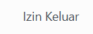

# Akademik

Video \[]

Menu **Akademik** merupakan fitur yang disediakan khusus bagi pengguna dengan role **Orang Tua** untuk memantau perkembangan akademik anaknya di pesantren. Menu ini terdiri dari dua dropdown utama (Absensi Santri dan Nilai Santri).

## 1. Absensi Santri

**Absensi Santri** adalah submenu pada menu Akademik yang memungkinkan orang tua untuk memantau kehadiran harian anak di pesantren, termasuk status hadir, izin, sakit, atau alfa, lengkap dengan tanggal dan keterangannya.

Foto \[List/tree Absensi Santri]

Pada tampilan tersebut, terdapat kolom yaitu kehadiran. Penjelasan kolom kehadiran adalah sebagai berikut:&#x20;

| Kehadiran                                                                                                                 | Informasi Detail                                                       |
| ------------------------------------------------------------------------------------------------------------------------- | ---------------------------------------------------------------------- |
| 
<figure><figcaption></figcaption></figure>
 | Santri mengikuti kegiatan seperti biasa.                               |
| 
<figure><figcaption></figcaption></figure>
 | Santri tidak masuk karena alasan kesehatan.                            |
| 
<figure><figcaption></figcaption></figure>
                 | Santri tidak hadir karena telah mendapatkan izin dari pihak pesantren. |
| 
<figure><figcaption></figcaption></figure>
          | Santri masih izin keluar dari pesantren dalam waktu tertentu.          |
| 
<figure><figcaption></figcaption></figure>
                 | Santri tidak hadir tanpa keterangan atau izin yang sah.                |

## 2. Nilai Santri

**Nilai Santri** adalah submenu pada menu Akademik memungkinkan orang tua melihat rekap hasil belajar santri, seperti tugas, ujian, dan penilaian akhir, sehingga orang tua dapat memantau perkembangan akademik anak secara berkala.&#x20;

Foto \[List/tree Nilai Santri]

## 3. Tabel Ringkasan Menu Akademik

| Menu           | Fungsi                                                 | Data yang Ditampilkan                                            |
| -------------- | ------------------------------------------------------ | ---------------------------------------------------------------- |
| Absensi Santri | Melihat status kehadiran anak pada tiap mata pelajaran | Tanggal, Jam ke-, Mapel, Kelas, Status Kehadiran                 |
| Nilai Santri   | Melihat nilai akademik anak                            | Nama Penilaian, Mapel, Tipe Penilaian, Semester, Nilai, Predikat |
