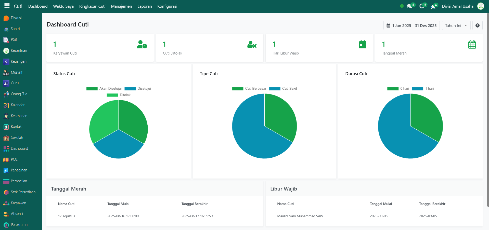

# Dashboard Cuti

<figure><figcaption></figcaption></figure>

Halaman **Dashboard Cuti** merupakan tampilan utama pada modul Cuti yang menampilkan ringkasan informasi mengenai status cuti karyawan secara real-time.&#x20;

Pada bagian atas dasbor, terdapat sejumlah card informasi utama yang memberikan gambaran singkat terkait kondisi cuti karyawan. Setiap card dapat diklik untuk menampilkan informasi lebih detail. Berikut adalah jenis informasi yang ditampilkan pada masing-masing card di dasbor:

| Card             | Fungsi                                              | Informasi Detail                                                             |
| ---------------- | --------------------------------------------------- | ---------------------------------------------------------------------------- |
| Karyawan Cuti    | Menampilkan jumlah karyawan yang sedang cuti.       | Memudahkan admin atau HR untuk memantau jumlah karyawan yang aktif cutinya.  |
| Cuti Ditolak     | Menampilkan jumlah pengajuan cuti yang ditolak.     | Memberikan data terkait pengajuan cuti yang tidak disetujui.                 |
| Hari Libur Wajib | Menampilkan jumlah libur wajib dalam periode aktif. | Memberikan informasi libur nasional atau libur wajib yang berlaku di sistem. |
| Tanggal Merah    | Menampilkan jumlah tanggal merah yang tercatat.     | Memberikan informasi hari libur berdasarkan kalender yang sudah ditentukan.  |

Pada bagian tengah halaman, terdapat beberapa grafik visualisasi data cuti, grafik ini membantu pengguna untuk memahami pola pengajuan cuti secara lebih cepat dan visual.:

| Grafik      | Fungsi                                                                                             |
| ----------- | -------------------------------------------------------------------------------------------------- |
| Status Cuti | Menampilkan distribusi status cuti berdasarkan kategori: _Akan Disetujui, Disetujui, dan Ditolak_. |
| Tipe Cuti   | Menampilkan jenis cuti karyawan seperti _Cuti Berbayar_ dan _Cuti Sakit_.                          |
| Durasi Cuti | Menunjukkan distribusi durasi cuti yang diajukan, misalnya _0 hari_ atau _1 hari_.                 |

Pada bagian bawah halaman, terdapat dua tabel utama yang menampilkan informasi terkait hari libur:

| Tabel         | Fungsi                                   | Informasi Detail                                                             |
| ------------- | ---------------------------------------- | ---------------------------------------------------------------------------- |
| Tanggal Merah | Menampilkan daftar tanggal merah.        | Berisi informasi nama hari libur, tanggal mulai, dan tanggal berakhir.       |
| Libur Wajib   | Menampilkan daftar libur wajib nasional. | Berisi informasi nama hari libur wajib, tanggal mulai, dan tanggal berakhir. |
