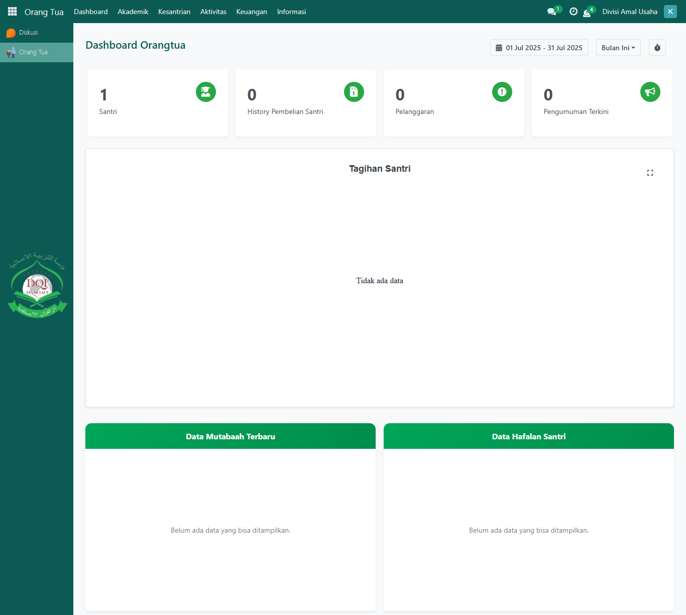

# Dashboard Orang Tua

<figure><figcaption></figcaption></figure>

Halaman **Dashboard Orang Tua** merupakan tampilan utama yang pertama kali terlihat setelah orang tua berhasil login ke sistem. Di halaman ini, disajikan ringkasan informasi penting mengenai anak (santri) secara real-time. Pada bagian atas dasbor, terdapat sejumlah _card_ informasi utama yang memberikan gambaran singkat terkait kondisi dan aktivitas santri. Setiap _card_ dapat diklik untuk menampilkan informasi lebih detail. Berikut adalah jenis informasi yang ditampilkan pada masing-masing _card_ di dasbor:

| Card                     | Fungsi                                                                 |
| ------------------------ | ---------------------------------------------------------------------- |
| Santri                   | Menunjukkan jumlah anak (santri) yang terhubung dengan akun orang tua. |
| History Pembelian Santri | Menampilkan jumlah transaksi pembelian yang dilakukan oleh santri.     |
| Pelanggaran              | Menampilkan total pelanggaran disiplin santri.                         |
| Pengumuman Terkini       | Menunjukkan jumlah pengumuman terbaru dari pihak pesantren.            |

Pada bagian tengah page, terdapat juga grafik dengan judul "Tagihan Santri".

| Grafik                      | Fungsi                                                        |
| --------------------------- | ------------------------------------------------------------- |
| Grafik Pie - Tagihan Santri | Menampilkan jumlah tagihan santri berdasarkan status tagihan. |

Sementara di bagian bawah, terdapat dua tabel list data yang memiliki informasi yang berbeda.&#x20;

| Tabel                 | Fungsi                                                |
| --------------------- | ----------------------------------------------------- |
| Data Mutabaah Terbaru | Menunjukkan daftar aktivitas mutaba'ah harian santri. |
| Data Hafalan Santri   | Menampilkan daftar perkembangan hafalan santri.       |

