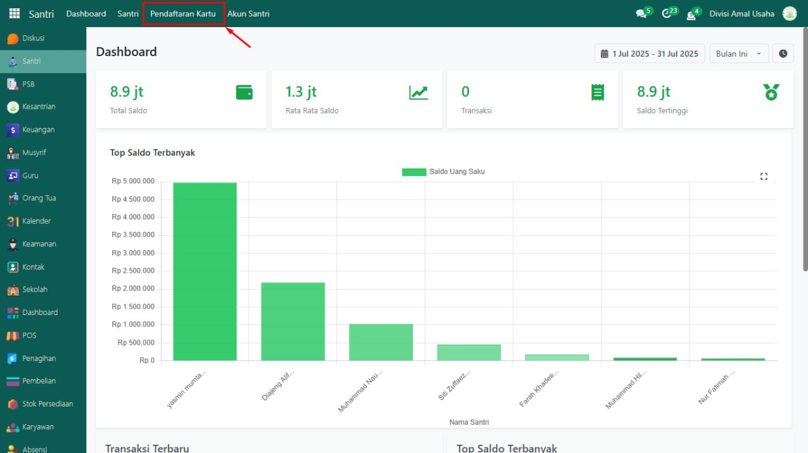

# Dashboard Stok Persediaan

<figure><figcaption></figcaption></figure>

Halaman **Dashboard Stok Persediaan** merupakan tampilan utama yang pertama kali terlihat setelah staf gudang atau administrator berhasil login ke sistem. Di halaman ini, disajikan ringkasan informasi penting mengenai manajemen persediaan barang secara real-time, termasuk transfer internal, penerimaan barang, dan status delivery order. Berikut adalah penjelasan detail mengenai komponen-komponen yang ada pada dasbor:

Pada bagian atas dasbor, terdapat beberapa card yang memberikan gambaran singkat tentang aktivitas stok persediaan. Setiap card dapat diklik untuk menampilkan informasi lebih detail.

| Card              | Fungsi                                                                                                              | informasi Detail                                                          |
| ----------------- | ------------------------------------------------------------------------------------------------------------------- | ------------------------------------------------------------------------- |
| Transfer Internal | Menampilkan jumlah operasi transfer stok barang pada lokasi internal ke lokasi lainnya dalam satu gudang yang sama. | Membantu untuk memantau frekuensi barang apa saja yang telah dipindahkan. |
| Penerimaan Barang | Menunjukkan jumlah operasi penerimaan barang yang telah terjadi.                                                    | Memastikan kelengkapan penerimaan barang sesuai pesanan.                  |
| Delivery Order    | Menampilkan jumlah delivery order yang baru diproses.                                                               | Membantu memantau frekuensi pengiriman barang.                            |
| Mutasi Barang     | Menampilkan jumlah mutasi barang yang tercatat.                                                                     | Melacak perpindahan barang antar gudang atau lokasi.                      |

Bagian tengah halaman menampilkan informasi terkait status transfer internal, penerimaan barang dan delivery order dalam bentuk daftar atau grafik interaktif.

| Grafik                   | Status                                          | informasi Detail                                                    |
| ------------------------ | ----------------------------------------------- | ------------------------------------------------------------------- |
| Transfer Internal        | Draft, Menunggu, Siap, Selesai, dan Dibatalkan. | Menampilkan status dari operasi transfer internal.                  |
| Status Penerimaan Barang | Draft, Menunggu, Siap, Selesai, dan Dibatalkan. | Menampilkan status dari operasi penerimaan barang.                  |
| Delivery Order           | Draft, Menunggu, Siap, Selesai, dan Dibatalkan. | Menampilkan status dari operasi delivery order (pengiriman barang). |

Pada bagian bawah halaman, terdapat  dua tabel yang menampilkan detail delivery order terbaru dan penerimaan barang terbaru.

| Tabel                     | Fungsi                                                                     | informasi Detail                                                         |
| ------------------------- | -------------------------------------------------------------------------- | ------------------------------------------------------------------------ |
| Delivery Order Terbaru    | Menampilkan transaksi pengiriman barang terbaru yang sedang/telah terjadi. | Terdapat informasi referensi transaksi, dari/kepada, kontak, dan status. |
| Penerimaan Barang Terbaru | Menampilkan transaksi penerimaan barang terbaru yang sedang/telah terjadi. | Terdapat informasi referensi transaksi, dari/kepada, kontak, dan status. |
