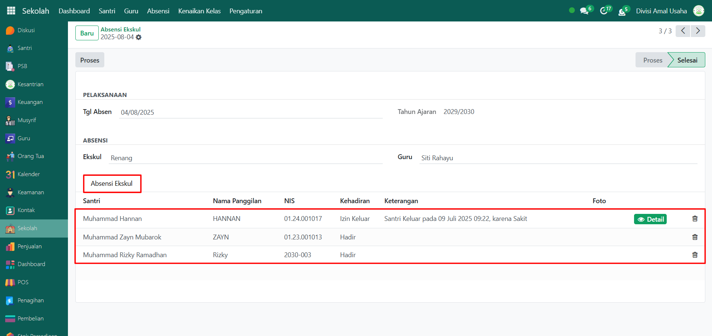

# Absensi Ekskul

Video \[]

## Riwayat Absensi Ekskul

Data **Riwayat Absensi Ekskul** merupakan kumpulan catatan kehadiran santri dalam kegiatan ekstrakurikuler (ekskul). Fitur ini membantu administrator dalam memantau keaktifan santri pada kegiatan ekskul, lengkap dengan informasi guru pembina, tahun ajaran, hingga status absensi.

### Melihat Riwayat Absensi Ekskul

Berikut adalah langkah-langkah untuk melihat data riwayat absensi ekskul pada Odoo Pesantren.

1. Login menggunakan akun administrator. Jika Anda belum memahami cara login sebagai admin, silakan lihat panduan [**Login Admin** di sini](../../panduan-login/login-admin.md).
2.  Buka modul **Sekolah**, lalu klik menu **Absensi** kemudian pilih submenu **Absensi Ekskul**.

    <figure><figcaption></figcaption></figure>

3.  Pada halaman **Absensi Ekskul**, akan ditampilkan daftar seluruh absensi dari setiap kegiatan ekskul dalam filter kelompok yaitu pertanggal. Informasi utama yang ditampilkan meliputi: nama ekskul, guru pembina, tanggal absen, tahun ajaran, serta status absensi.

    <figure><figcaption></figcaption></figure>

4.  Klik **toggle dropdown pencarian**, lalu gunakan fitur **Filter** untuk memudahkan pencarian. Anda dapat memfilter berdasarkan status absensi atau filter kelompok tertentu seperti nama ekskul, guru pembina, dan tahun ajaran.

    <figure><figcaption></figcaption></figure>

5.  Setelah filter diaktifkan, sistem akan otomatis menampilkan daftar riwayat absensi sesuai dengan filter yang dipilih.

    <figure><figcaption></figcaption></figure>

6. Untuk melihat detail dari absensi, klik salah satu data absensi yang ada pada daftar.
7.  Akan tampil halaman form absensi yang berisi informasi detail dari absensi tersebut. Pada **Tab Absensi Ekskul**, Anda dapat melihat daftar santri yang mengikuti kegiatan ekskul beserta status kehadirannya.

    <figure><figcaption></figcaption></figure>

8. Dengan langkah ini, administrator dapat memantau riwayat absensi ekskul secara lengkap, baik secara keseluruhan maupun detail tiap kegiatan.
