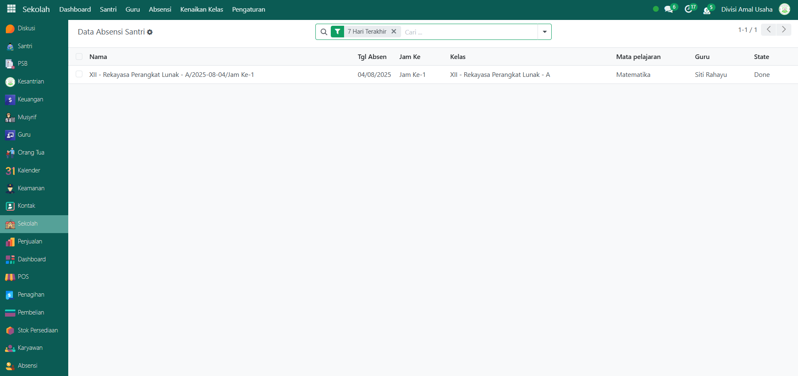

# Absensi Santri

Video \[]

## Riwayat Absensi Santri

Data **Riwayat Absensi Santri** merupakan kumpulan catatan absensi berdasarkan kelas, mata pelajaran, guru, dan status absensi santri. Fitur ini memudahkan administrator untuk meninjau absensi yang sudah dilakukan pada setiap pertemuan.

### Melihat Riwayat Absensi Santri

Berikut adalah langkah-langkah untuk melihat data riwayat absensi santri pada Odoo Pesantren.

1. Login menggunakan akun administrator. Jika Anda belum memahami cara login sebagai admin, silakan lihat panduan [**Login Admin** di sini](../../panduan-login/login-admin.md).
2.  Buka modul **Sekolah**, lalu pilih menu **Absensi** dan submenu **Absensi Santri**.

    <figure><figcaption></figcaption></figure>

3.  Pada halaman **Absensi Santri**, akan ditampilkan daftar seluruh absensi dari setiap kelas. Setiap data absensi memiliki informasi seperti **tanggal absen, nama kelas, mata pelajaran, guru, jam pelajaran, serta status absensi.**

    <figure><figcaption></figcaption></figure>

4.  Klik **toggle dropdown pencarian**, lalu gunakan fitur **Filter** untuk memudahkan pencarian, misalnya dengan memilih absensi pada beberapa hari terakhir atau filter kelompok seperti perkelas, mapel, guru, dan tanggal.

    <figure><figcaption></figcaption></figure>

5.  Setelah filter diaktifkan, sistem akan otomatis menampilkan daftar riwayat absensi yang sesuai dengan filter tersebut.

    <figure><figcaption></figcaption></figure>

6. Untuk melihat detail dari suatu absensi, klik salah satu data absensi yang ada di daftar.&#x20;
7.  Akan tampil halaman form absensi yang berisi informasi detail dari absensi. Pada **Tab Absensi Santri**, Anda dapat melihat daftar santri yang terdaftar dalam kelas tersebut beserta status kehadirannya.

    <figure><figcaption></figcaption></figure>

8.  Pada **Tab Jurnal**, Anda dapat melihat informasi tambahan seperti tema, materi pembelajaran, RPP yang digunakan, serta pertemuan ke berapa absensi tersebut dilakukan.

    <figure><figcaption></figcaption></figure>

9. Dengan langkah ini, Anda dapat memantau dan memastikan data absensi santri tercatat dengan benar sesuai dengan kelas dan jadwal pelajaran yang berlangsung.
