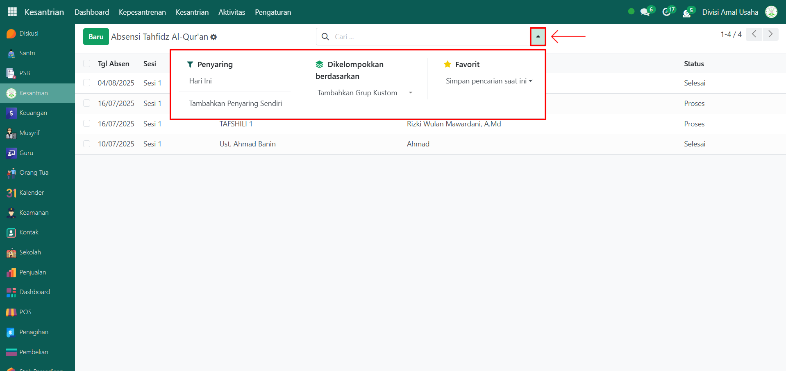

# Absensi Tahfidz

Video \[]

## Riwayat Absensi Tahfidz

Data **Riwayat Absensi Tahfidz** merupakan kumpulan catatan kehadiran santri pada kegiatan halaqah tahfidz Al-Qur’an. Fitur ini membantu administrator dalam memantau keaktifan santri berdasarkan halaqah, sesi tahfidz, guru pembina, serta status absensi.

### Melihat Riwayat Absensi Tahfidz

Berikut adalah langkah-langkah untuk melihat riwayat absensi tahfidz pada Odoo Pesantren.

1. Login menggunakan akun administrator. Jika Anda belum memahami cara login sebagai admin, silakan lihat panduan [**Login Admin** di sini](../../panduan-login/login-admin.md).
2.  Buka modul **Kesantrian**, lalu klik menu **Kepesantrenan** kemudian pilih submenu **Absensi Tahfidz**.

    <figure><figcaption></figcaption></figure>

3.  Pada halaman **Absensi Tahfidz**, Anda akan melihat daftar seluruh absensi dari setiap sesi halaqah. Informasi utama yang ditampilkan meliputi: **Tanggal Absen**, **Sesi Tahfidz**, **Nama Halaqah**, **Ustadz**, dan **Status Absensi**.

    <figure><figcaption></figcaption></figure>

4.  Klik **toggle dropdown pencarian**, lalu gunakan fitur **Filter** untuk memudahkan pencarian, misalnya filter berdasarkan **Hari Ini**.

    <figure><figcaption></figcaption></figure>

5. Setelah filter diaktifkan, sistem akan otomatis menampilkan daftar riwayat absensi sesuai dengan filter yang dipilih.
6. Untuk melihat detail absensi, klik salah satu data absensi yang ada pada daftar.
7.  Akan tampil halaman form absensi yang berisi informasi detail dari absensi tersebut. Pada **Tab Daftar Halaqah**, Anda dapat melihat daftar santri yang mengikuti kegiatan tahfidz Al-Qur’an beserta status kehadirannya.

    <figure><figcaption></figcaption></figure>

8. Dengan langkah ini, administrator dapat memantau riwayat absensi tahfidz santri secara lengkap baik perhalaqah maupun per santri.
