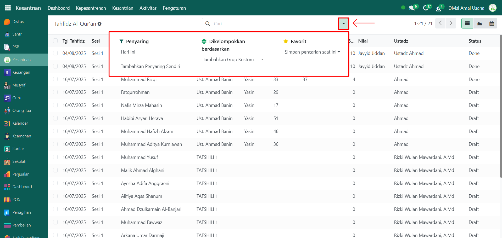

# Absensi Tahsin

Video \[]

## Riwayat Absensi Tahsin

Data **Riwayat Absensi Tahsin** merupakan kumpulan catatan kehadiran santri dalam kegiatan tahsin Al-Qur’an. Fitur ini membantu administrator untuk memantau keaktifan santri pada setiap halaqah tahsin, berdasarkan sesi, ustadz pembina, serta status absensinya.

### Melihat Riwayat Absensi Tahsin

Berikut adalah langkah-langkah untuk melihat riwayat absensi tahsin pada Odoo Pesantren.

1. Login menggunakan akun administrator. Jika Anda belum memahami cara login sebagai admin, silakan lihat panduan [**Login Admin** di sini](../../panduan-login/login-admin.md).
2.  Buka modul **Kesantrian**, lalu pilih menu **Kepesantrenan** dan klik submenu **Absensi Tahsin**.

    <figure><figcaption></figcaption></figure>

3.  Pada halaman **Absensi Tahsin**, Anda akan melihat daftar seluruh data absensi dari setiap sesi halaqah. Informasi utama yang ditampilkan meliputi: nama halaqah, sesi tahsin, ustadz pembina, tanggal absen, dan status absensi.

    <figure><figcaption></figcaption></figure>

4.  Klik **toggle dropdown pencarian**, lalu gunakan fitur **Filter** untuk mempersempit pencarian, misalnya filter berdasarkan **Hari Ini**.

    <figure><figcaption></figcaption></figure>

5. Setelah filter diaktifkan, sistem akan otomatis menampilkan daftar riwayat absensi sesuai dengan filter yang dipilih.
6. Untuk melihat detail absensi, klik salah satu data absensi dari daftar.
7.  Akan tampil halaman form absensi yang berisi informasi detail dari absensi tersebut. Pada **Tab Daftar Halaqah**, Anda dapat melihat daftar santri yang mengikuti kegiatan tahsin Al-Qur’an beserta status kehadirannya.

    <figure><figcaption></figcaption></figure>

8. Dengan langkah ini, administrator dapat memantau riwayat absensi tahsin santri secara lengkap berdasarkan halaqah maupun per santri.
