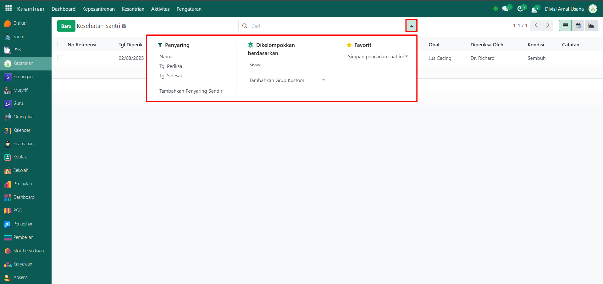
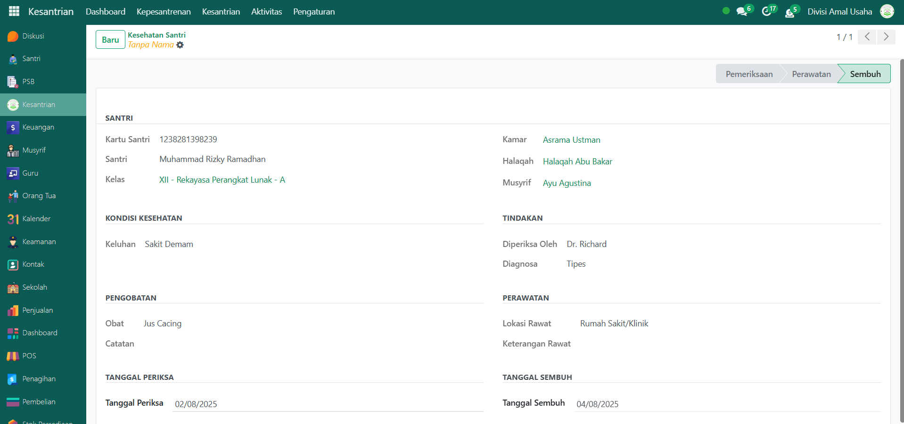

# Kesehatan Santri

Video \[]

## Riwayat Kesehatan Santri

**Riwayat Kesehatan Santri** adalah kumpulan data yang mencatat segala aktivitas pemeriksaan, pengobatan, perawatan, hingga pemulihan kesehatan santri selama berada di lingkungan pesantren. Data ini sangat penting untuk memantau kondisi kesehatan santri serta memberikan informasi historis kepada pihak-pihak yang berkepentingan seperti musyrif, perawat, dan administrator.

### Melihat Riwayat Kesehatan Santri

Berikut adalah langkah-langkah untuk melihat riwayat kesehatan santri pada Odoo Pesantren.

1. Login menggunakan akun administrator. Jika Anda belum memahami cara login sebagai admin, silakan lihat panduan [**Login Admin** di sini](../../panduan-login/login-admin.md).
2.  Buka modul **Kesantrian**, lalu klik menu **Aktivitas** kemudian submenu **Kesehatan Santri**.

    <figure><figcaption></figcaption></figure>

3.  Anda akan melihat daftar seluruh riwayat kesehatan santri. Setiap entri mencakup informasi sebagai berikut yaitu, **Nomor Referensi**, **Tanggal Diperiksa**, **Nama Santri**, **Kelas Santri**, **Keluhan**, **Obat yang diberikan**, **Pemeriksa**, **Kondisi saat diperiksa (Pemeriksaan, Pengobatan/Perawatan, Sembuh)**, dan **Catatan tambahan**.

    <figure><figcaption></figcaption></figure>

4.  Klik **toggle dropdown pencarian** untuk menampilkan fitur **Filter** untuk memudahkan pencarian, misalnya filter **Nama Santri**, **Tanggal Periksa**, **Tanggal Selesai** serta filter **Kelompok** berdasarkan **Santri/Siswa**.

    <figure><figcaption></figcaption></figure>

5.  Setelah filter diaktifkan, sistem akan secara otomatis menampilkan data yang sesuai dengan kriteria pencarian.

    <figure><figcaption></figcaption></figure>

6. Untuk melihat detail dari salah satu data kesehatan santri, klik pada baris data tersebut.
7.  Anda akan diarahkan ke tampilan **form kesehatan**, yang berisi informasi lengkap seperti **identitas santri**, **kondisi kesehatan, tindakan oleh pemeriksa, obat atau perawatan yang diberikan**, dan **tanggal pemeriksaan hingga tanggal sembuh**.

    <figure><figcaption></figcaption></figure>

8. Data riwayat ini dapat digunakan untuk evaluasi, pembinaan lanjutan, atau pembuatan laporan kesehatan santri secara menyeluruh.
