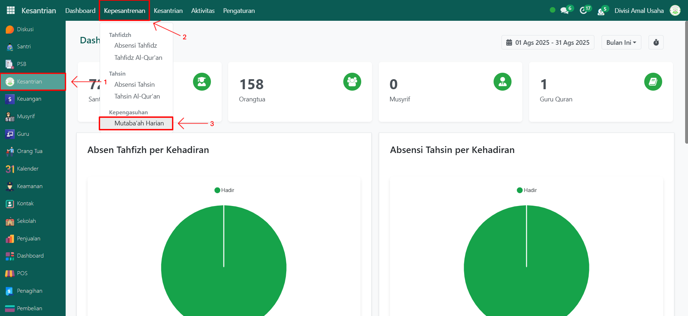
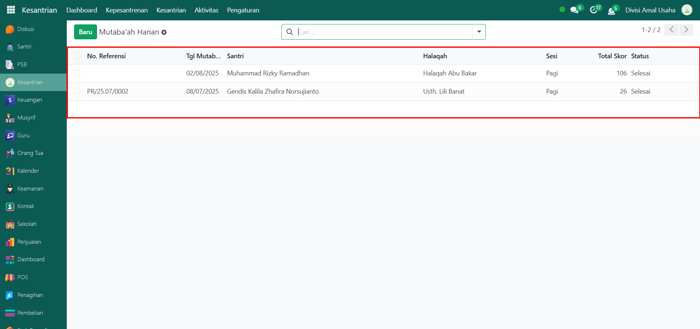
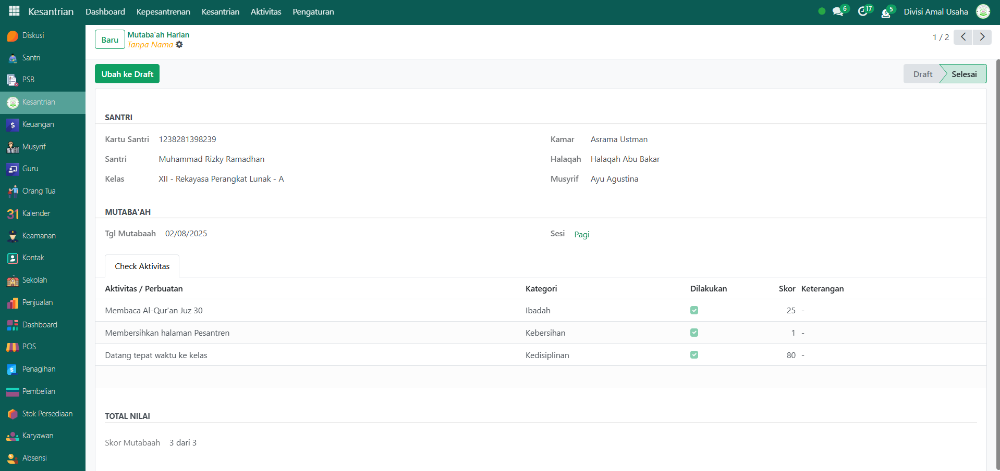

# Mutaba'ah Harian

Video \[]

## Riwayat Mutaba'ah Harian Santri

Data **Riwayat Mutaba'ah Harian Santri** merupakan catatan kegiatan harian santri yang mencakup pelaksanaan ibadah, kedisiplinan, kebersihan, dan aspek pembinaan lainnya. Data ini digunakan untuk memantau perkembangan karakter dan kedisiplinan santri sehari-hari dalam lingkungan pesantren.

### Melihat Riwayat Mutaba'ah Harian Santri

Berikut adalah langkah-langkah untuk melihat riwayat mutaba'ah harian santri pada Odoo Pesantren.

1. Login menggunakan akun administrator. Jika Anda belum memahami cara login sebagai admin, silakan lihat panduan [**Login Admin** di sini](../../panduan-login/login-admin.md).
2.  Buka modul **Kesantrian**, lalu klik menu **Kepesantrenan** kemudian pilih submenu **Mutaba'ah Harian**.

    <figure><figcaption></figcaption></figure>

3.  Pada halaman ini, Anda akan melihat daftar seluruh data **Mutaba'ah Harian Santri**. Setiap entri memuat informasi seperti: **Nomor Referensi**, **Tanggal Mutaba’ah**, **Nama Santri**, **Nama Halaqah**, **Sesi Mutaba’ah**, **Total Skor**, dan **Status Mutaba’ah**.

    <figure><figcaption></figcaption></figure>

4. Untuk melihat informasi lebih detail, klik salah satu data pada daftar mutaba’ah harian santri.
5.  Anda akan diarahkan ke halaman **form detail** yang berisi informasi lengkap mengenai **identitas santri**, **rincian kegiatan mutaba’ah (seperti ibadah**, **kebersihan**, **adab**, dan lainny&#x61;**)**, **skor atau nilai dari masing-masing kegiatan mutaba'ah**, dan **total skor yang diperoleh santri dalam mutaba’ah tersebut**.

    <figure><figcaption></figcaption></figure>

6. Data riwayat ini dapat digunakan untuk evaluasi, pembinaan lanjutan, atau pembuatan laporan muutaba'ah harian santri secara menyeluruh.
