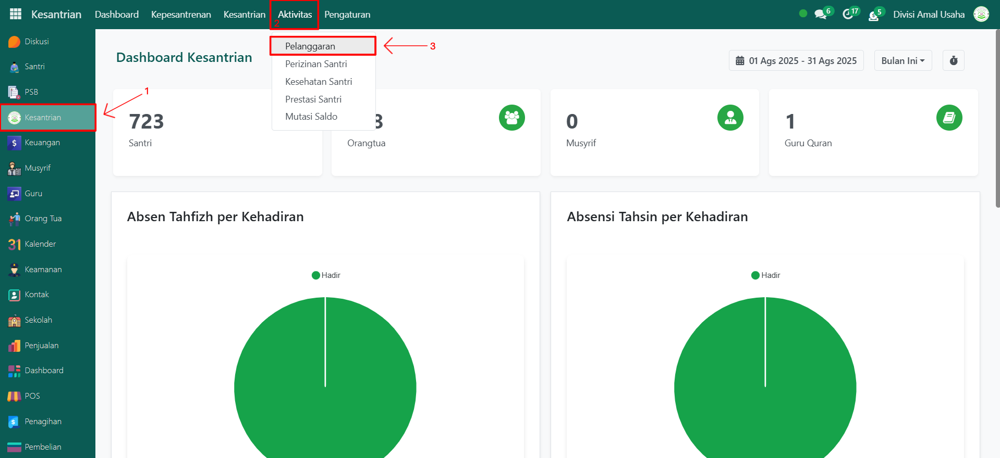
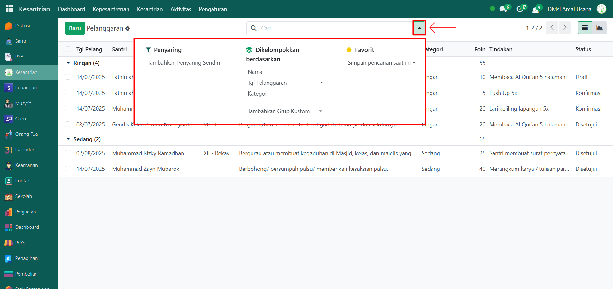

# Pelanggaran

Video \[]

## Riwayat Pelanggaran

**Riwayat Pelanggaran Santri** adalah data rekam jejak pelanggaran yang dilakukan oleh santri selama berada di pesantren. Data ini mencakup informasi jenis pelanggaran, kategori, poin pelanggaran, serta tindakan yang diberikan oleh pihak musyrif atau administrator. Tujuan dari pencatatan ini adalah untuk memantau kedisiplinan dan perkembangan karakter santri.

### Melihat Riwayat Pelanggaran Santri

Berikut adalah langkah-langkah untuk melihat riwayat pelanggaran santri pada Odoo Pesantren.

1. Login menggunakan akun administrator. Jika Anda belum memahami cara login sebagai admin, silakan lihat panduan [**Login Admin** di sini](../../panduan-login/login-admin.md).
2.  Buka modul **Kesantrian**, lalu klik menu **Aktivitas** kemudian submenu **Pelanggaran**.

    <figure><figcaption></figcaption></figure>

3.  Pada halaman ini, Anda akan melihat daftar seluruh pelanggaran santri yang telah dicatat. Setiap entri menampilkan informasi penting meliputi: **Tanggal Pelanggaran**, **Nama Santri**, **Kelas Santri**, **Nama Pelanggaran**, **Kategori Pelanggaran**, **Jumlah Poin Pelanggaran**, **Tindakan/Hukuman**, dan **Status Pelanggaran**.

    <figure><figcaption></figcaption></figure>

4.  Klik **toggle dropdown pencarian**, kemudian gunakan fitur **Filter** **Kelompok** untuk menyaring data berdasarkan **Nama Santri**, **Tanggal Pelanggaran**, **Kategori**, atau kriteria lainnya.

    <figure><figcaption></figcaption></figure>

5.  Setelah filter diaktifkan, sistem akan secara otomatis menampilkan data pelanggaran yang sesuai dengan kriteria pencarian.

    <figure><figcaption></figcaption></figure>

6. Untuk melihat detail dari suatu pelanggaran, klik salah satu entri dalam daftar pelanggaran.
7.  Anda akan diarahkan ke tampilan form pelanggaran yang menampilkan informasi lengkap, seperti: **identitas santri**, **rincian pelanggaran yang dilakukan**, **tindakan/hukuman yang diberikan**, dan **catatan dari musyrif atau administrator yang menangani kasus tersebut**.

    <figure><figcaption></figcaption></figure>

8. Data riwayat ini dapat digunakan untuk evaluasi, pembinaan lanjutan, atau pembuatan laporan pelanggaran santri secara menyeluruh.
