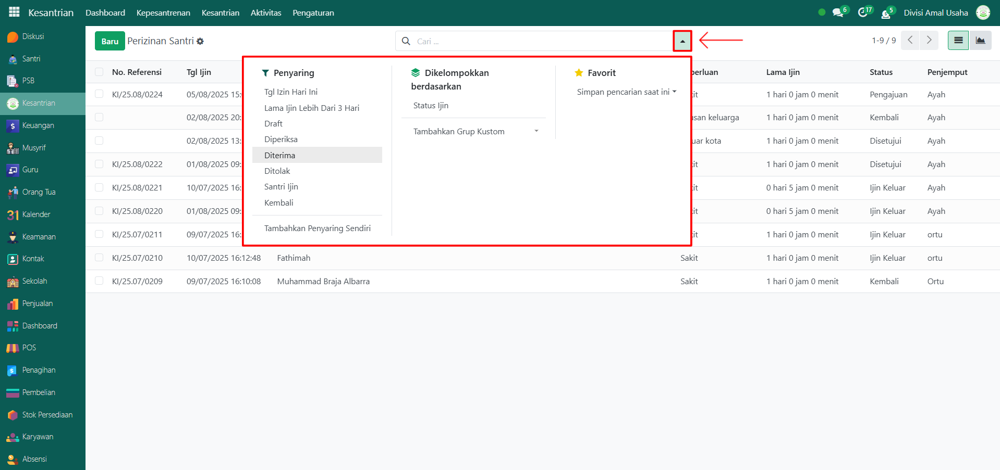

# Perizinan Santri

Video \[]

## Riwayat Perizinan Santri

**Riwayat Perizinan Santri** adalah kumpulan data yang mencatat seluruh pengajuan izin yang dilakukan oleh santri selama berada di pesantren. Data ini mencakup informasi terkait waktu izin, keperluan, penjemput, status izin, dan riwayat proses persetujuan dari musyrif maupun administrator. Tujuan dari pencatatan ini adalah untuk memastikan keteraturan dan pengawasan terhadap mobilitas santri di luar lingkungan pesantren.

### Melihat Riwayat Perizinan Santri

Berikut adalah langkah-langkah untuk melihat data riwayat perizinan santri pada Odoo Pesantren.

1. Login menggunakan akun administrator. Jika Anda belum memahami cara login sebagai admin, silakan lihat panduan [**Login Admin** di sini](../../panduan-login/login-admin.md).
2.  Buka modul **Kesantrian**, lalu klik menu **Aktivitas** kemudian pilih submenu **Perizinan Santri**.

    <figure><figcaption></figcaption></figure>

3.  Anda akan melihat daftar semua data pengajuan izin santri yang pernah dicatat. Setiap entri menampilkan informasi berikut yaitu, nomor referensi, tanggal izin, nama santri, kamar santri, nama halaqah, musyrif pembina, keperluan izin, lama izin, status izin (Draft, Diperiksa, Diterima, Ditolak, Santri Izin, Kembali), dan nama penjemput.

    <figure><figcaption></figcaption></figure>

4. Klik **toggle dropdown pencarian**, lalu gunakan fitur **Filter** untuk memudahkan pencarian, misalnya filter **NON SPP, SPP, Tagihan Belum Lunas dan Sudah Lunas** serta filter kelompok yaitu **per nama santri, komponen biaya, periode tagihan, dan ruang kelas.**
5.  Klik **toggle dropdown pencarian**, lalu gunakan fitur **Filter** untuk memudahkan pencarian, misalnya filter **Tanggal Izin Hari Ini, Lama Izin Lebih Dari 3 Hari, Status Perizinan (Draf, Diperiksa, Diterima, Ditolak, Santri Ijin, dan Kembali)** serta filter **Kelompok** seperti per **Status Ijin**.

    <figure><figcaption></figcaption></figure>

6.  Setelah filter diaktifkan, sistem akan secara otomatis menampilkan data yang sesuai dengan kriteria pencarian.

    <figure><figcaption></figcaption></figure>

7. Untuk melihat detail dari salah satu data perizinan, klik pada baris data tersebut.
8.  Anda akan diarahkan ke tampilan **form perizinan**, yang menampilkan informasi lengkap mengenai pengajuan izin, seperti:

    * **Identitas santri**
    * **Tanggal dan keperluan izin**
    * **Data penjemput**
    * **Proses persetujuan izin (oleh musyrif dan/atau administrator)**
    * **Status terkini dari izin tersebut**

    <figure><figcaption></figcaption></figure>
