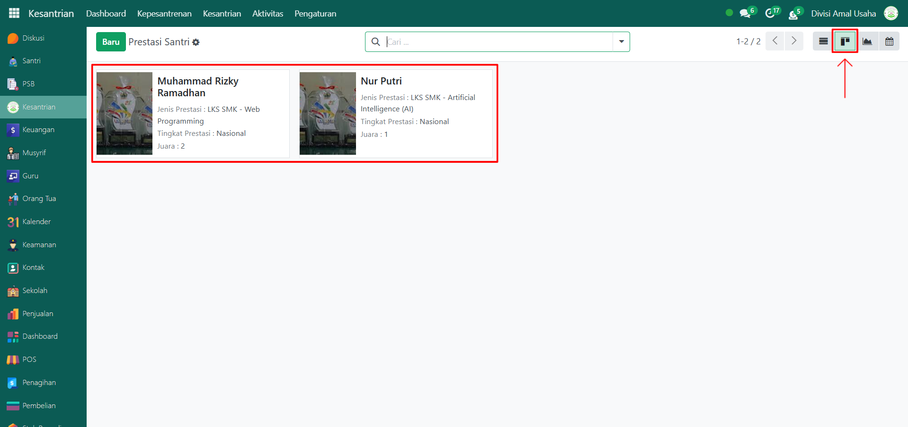
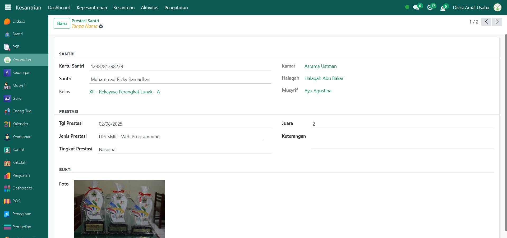

# Prestasi Santri

Video

## Riwayat Prestasi Santri

**Riwayat Prestasi Santri** merupakan data yang mencatat seluruh capaian dan penghargaan yang diraih oleh santri selama menempuh pendidikan di pesantren. Informasi ini dapat digunakan sebagai referensi dalam penilaian karakter, semangat belajar, serta keaktifan santri dalam berbagai bidang akademik maupun non-akademik.

### Melihat Riwayat Prestasi Santri

Berikut adalah langkah-langkah untuk melihat data riwayat prestasi santri pada Odoo Pesantren.

1. Login menggunakan akun administrator. Jika Anda belum memahami cara login sebagai admin, silakan lihat panduan [**Login Admin** di sini](../../panduan-login/login-admin.md).
2.  Buka modul **Kesantrian**, kemudian pilih menu **Aktivitas**, dan klik submenu **Prestasi Santri**.

    <figure><figcaption></figcaption></figure>

3.  Pada halaman ini, Anda akan melihat daftar seluruh data prestasi santri. Setiap data memiliki informasi utama berupa: nomor referensi, tanggal prestasi, nama santri, jenis prestasi, tingkat prestasi, dan perolehan juara.

    <figure><figcaption></figcaption></figure>

4.  Untuk mengubah tampilan daftar menjadi tampilan **Kanban**, klik ikon **Kanban** yang berada di samping ikon **List/Grid** pada pojok kanan atas.

    <figure><figcaption></figcaption></figure>

5. Jika Anda ingin melihat detail dari salah satu data prestasi santri, klik pada baris atau kartu data prestasi yang ingin ditinjau.
6.  Anda akan diarahkan ke halaman **form detail**, yang menampilkan informasi lengkap tentang prestasi santri tersebut, seperti:

    * Identitas santri
    * Jenis dan kategori prestasi
    * Tingkat dan pencapaian (juara)
    * Bukti dokumentasi seperti foto sertifikat atau kegiatan

    <figure><figcaption></figcaption></figure>
