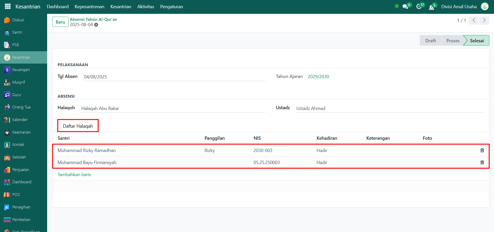

# Tahfidz Al-Qur'an



## Riwayat Tahfidz Al-Qur'an

**Riwayat Tahfidz Al-Qur’an** merupakan kumpulan data kegiatan hafalan santri yang dicatat oleh guru/ustadz pembimbing. Data ini mencakup informasi tentang halaqah, santri, surah yang dihafal, jumlah baris ayat, nilai tahfidz, dan status hafalan. Fitur ini penting untuk membantu administrator dalam memantau perkembangan tahfidz setiap santri.

### Melihat Riwayat Tahfidz Al-Qur'an

Berikut adalah langkah-langkah untuk melihat riwayat tahfidz al-qur'an pada Odoo Pesantren.

1. Login menggunakan akun administrator. Jika Anda belum memahami cara login sebagai admin, silakan lihat panduan [**Login Admin** di sini](../../panduan-login/login-admin.md).
2.  Buka modul **Kesantrian**, lalu klik menu **Kepesantrenan** kemudian pilih submenu **Tahfidz Al-Qur’an**.

    <figure><figcaption></figcaption></figure>

3.  Di halaman ini Anda akan melihat daftar semua kegiatan tahfidz santri. Setiap entri menampilkan informasi meliputi: **Tanggal Tahfidz**, **Sesi Tahfidz**, **Nama Santri**, **Nama Halaqah**, **Nama Surah**, **Ayat Awal**, **Ayat Akhir**, **Jumlah Baris**, **Nilai**, **Ustadz**, dan **Status Tahfidz**.

    <figure><figcaption></figcaption></figure>

4.  Klik **toggle dropdown pencarian**, lalu gunakan fitur **Filter** untuk menyesuaikan data, misalnya filter berdasarkan tanggal **Hari Ini**.

    <figure><figcaption></figcaption></figure>

5. Setelah filter diaktifkan, sistem akan otomatis menampilkan data riwayat tahfidz sesuai dengan kriteria filter yang dipilih.
6. Klik salah satu entri dari daftar untuk melihat detail riwayat tahfidz.
7.  Anda akan diarahkan ke tampilan form tahfidz yang berisi informasi lengkap seperti **identitas santri**, **rincian pelaksanaan tahfidz**, dan **penilaian tahfidz**.

    <figure><figcaption></figcaption></figure>

8. Dengan langkah-langkah ini, Anda dapat memonitor perkembangan hafalan Al-Qur’an santri secara detail dan terstruktur.
