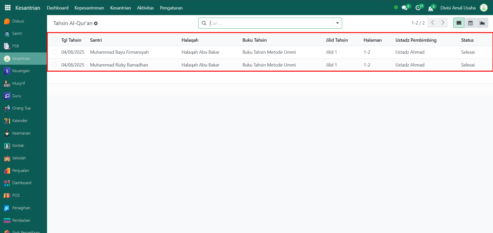

# Tahsin Al-Qur'an



## Riwayat Tahsin Al-Qur'an

Data **Riwayat Tahsin Al-Qur’an** adalah kumpulan data pelaksanaan kegiatan tahsin yang dilakukan oleh santri di bawah bimbingan guru/ustadz halaqah. Kegiatan ini mencakup penilaian kualitas bacaan Al-Qur’an, jilid, halaman, dan progres santri dalam memperbaiki bacaan mereka. Data ini digunakan oleh administrator untuk memantau perkembangan kemampuan membaca Al-Qur’an santri secara berkala.

### Melihat Riwayat Tahsin Al-Qur'an

Berikut adalah langkah-langkah untuk melihat data riwayat tahsin al-qur'an pada Odoo Pesantren.

1. Login menggunakan akun administrator. Jika Anda belum memahami cara login sebagai admin, silakan lihat panduan [**Login Admin** di sini](../../panduan-login/login-admin.md).
2.  Buka modul **Kesantrian**, lalu klik menu **Kepesantrenan** kemudian pilih submenu **Tahsin Al-Qur’an**.

    <figure><figcaption></figcaption></figure>

3.  Pada halaman ini, Anda akan melihat daftar seluruh kegiatan tahsin yang telah dicatat. Setiap entri menampilkan informasi meliputi: **Tanggal Tahsin**, **Nama Santri**, **Nama Halaqah**, **Buku Tahsin**, **Jilid Tahsin**, **Halaman yang dibaca**, **Ustadz Pembimbing**, dan **Status Pelaksanaan Tahfidz**.

    <figure><figcaption></figcaption></figure>

4.  Klik **toggle dropdown pencarian**, lalu gunakan fitur **Filter** untuk menyesuaikan data, misalnya filter berdasarkan tanggal **Hari Ini**.

    <figure><figcaption></figcaption></figure>

5. Setelah filter diaktifkan, sistem akan secara otomatis menampilkan daftar riwayat tahsin yang sesuai dengan kriteria pencarian Anda.
6. Klik salah satu entri dari daftar untuk melihat **detail** kegiatan tahsin tersebut.
7.  Anda akan diarahkan ke tampilan form tahsin yang memuat informasi lengkap, seperti **identitas santri**, **detail pelaksanaan tahsin**, dan **penilaian tahsin**.

    <figure><figcaption></figcaption></figure>

8. Dengan langkah-langkah ini, Anda dapat memantau dan mengevaluasi perkembangan tahsin santri secara menyeluruh dan akurat.
