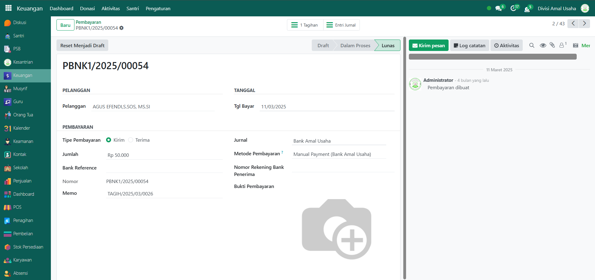

# Pembayaran

Video \[]

## Riwayat Pembayaran

**Riwayat Pembayaran** adalah kumpulan data transaksi pembayaran yang dilakukan oleh pesantren, baik berupa pembayaran dari santri (customer) maupun pembayaran kepada pemasok (vendor). Melalui fitur ini, administrator dapat dengan mudah memantau seluruh transaksi pembayaran, termasuk status, metode, jurnal, dan pihak terkait dalam proses pembayaran tersebut.

### Melihat Riwayat Pembayaran

Berikut adalah langkah-langkah untuk melihat data riwayat pembayaran pada Odoo Pesantren.

1. Login menggunakan akun administrator. Jika Anda belum memahami cara login sebagai admin, silakan lihat panduan [**Login Admin** di sini](../../panduan-login/login-admin.md).
2.  Buka modul **Keuangan**, lalu klik menu **Aktivitas** kemudian pilih submenu **Pembayaran**.

    <figure><figcaption></figcaption></figure>

3.  Pada halaman ini akan ditampilkan daftar seluruh data pembayaran. Setiap baris data mencakup informasi: **Nomor Referensi, Tanggal Pembayaran, Jurnal, Metode Pembayaran, Pelanggan/Pemasok, Jumlah Pembayaran**, dan **Status Pembayaran**.

    <figure><figcaption></figcaption></figure>

4.  Klik tombol **toggle dropdown pencarian** untuk menampilkan fitur **Filter**. Anda dapat menggunakan berbagai filter pencarian, seperti: pembayaran dari pelanggan (customer) atau ke pemasok (vendor), Draft, Dalam Proses, terdapat filter kelompokRekanan, Siswa, Jurnal, Metode Pembayaran, Status, Tanggal Pembayaran, Mata Uang, dan Perusahaan.

    <figure><figcaption></figcaption></figure>

5.  Setelah filter diterapkan, sistem akan secara otomatis menyaring dan menampilkan data riwayat pembayaran sesuai kriteria yang dipilih.

    <figure><figcaption></figcaption></figure>

6. Untuk melihat detail pembayaran, klik salah satu entri dari daftar pembayaran.
7.  Sistem akan menampilkan **formulir pembayaran** yang berisi informasi lengkap, termasuk:

    * **Pelanggan atau Pemasok**
    * **Tanggal dan Jumlah Pembayaran**
    * **Jurnal dan Metode Pembayaran**
    * **Referensi Faktur yang Dibayar** (jika terkait)

    <figure><figcaption></figcaption></figure>
