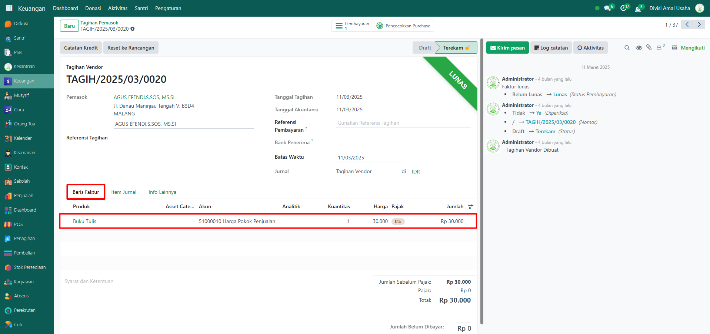
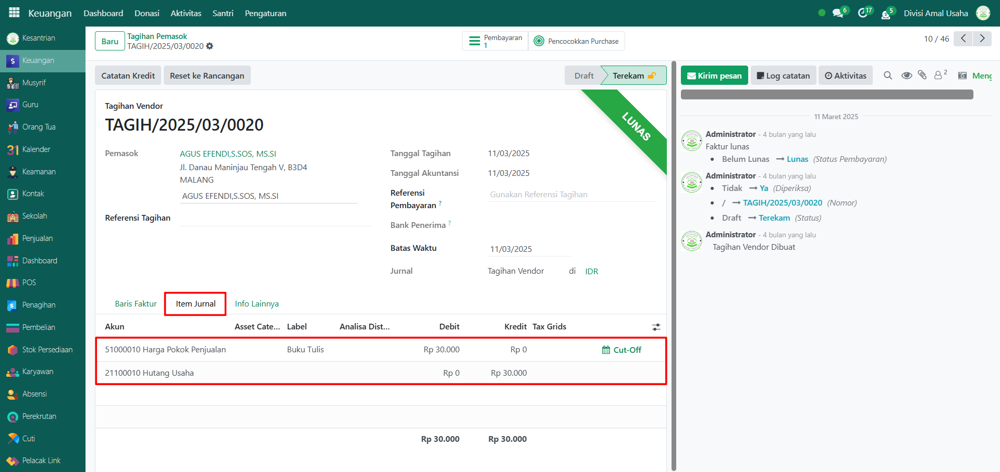
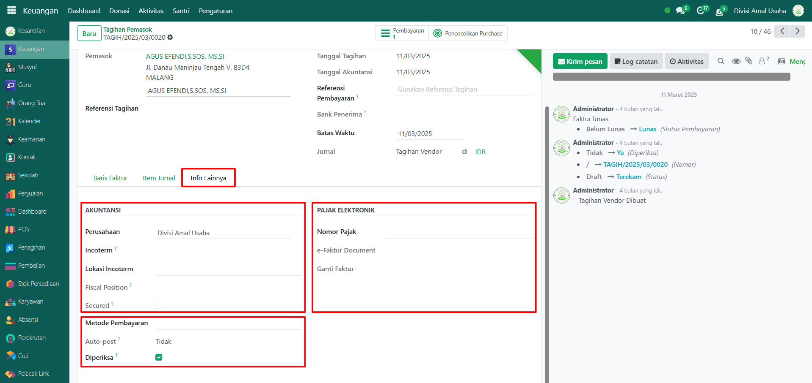

# Tagihan Pemasok

Video \[]

## Riwayat Tagihan Pemasok

**Riwayat Tagihan Pemasok** adalah data historis yang mencatat seluruh tagihan yang diterbitkan oleh pemasok/vendor kepada pesantren. Fitur ini memudahkan administrator dalam memantau kewajiban pembayaran terhadap pemasok, termasuk jumlah tagihan, status pembayaran, serta informasi jurnal akuntansi yang terkait.

### Melihat Riwayat Tagihan Pemasok

Berikut adalah langkah-langkah untuk melihat data riwayat tagihan pemasok pada Odoo Pesantren.

1. Login menggunakan akun administrator. Jika Anda belum memahami cara login sebagai admin, silakan lihat panduan [**Login Admin** di sini](../../panduan-login/login-admin.md).
2.  Buka modul **Keuangan**, lalu klik menu **Aktivitas** kemudian pilih submenu **Tagihan Pemasok**.

    <figure><figcaption></figcaption></figure>

3.  Pada halaman ini, Anda akan melihat daftar semua data tagihan pemasok. Setiap data menampilkan informasi: **nomor referensi, tanggal tagihan, nama pemasok/vendor, total tagihan, sisa tagihan, status tagihan, dan status pembayaran**.

    <figure><figcaption></figcaption></figure>

4.  Klik **toggle dropdown pencarian**, lalu gunakan fitur **Filter** untuk memudahkan pencarian, misalnya **NON SPP, SPP, Tagihan Belum Lunas dan Sudah Lunas** serta filter kelompok yaitu **per nama santri, komponen biaya, periode tagihan, dan ruang kelas.**

    <figure><figcaption></figcaption></figure>

5.  Setelah filter diaktifkan, sistem akan secara otomatis menampilkan data yang sesuai dengan kriteria pencarian.

    <figure><figcaption></figcaption></figure>

6.  Untuk mengubah tampilan daftar, klik ikon **Kanban** di samping ikon **List** sesuai preferensi visual Anda.

    <figure><figcaption></figcaption></figure>

7. Klik salah satu data tagihan dari daftar untuk melihat detail informasi tagihan pemasok.
8.  Sistem akan menampilkan **formulir detail tagihan**, yang mencakup:

    * **Informasi Pemasok**
    * **Detail Tagihan**

    Pada **Tab Baris Faktur** akan menampilkan daftar produk yang dibeli dari pemasok/vendor

    <figure><figcaption></figcaption></figure>

9.  Pada **Tab Item Jurnal** untuk melihat daftar akun-akun yang digunakan dalam pencatatan jurnal atas transaksi tagihan pemasok.

    <figure><figcaption></figcaption></figure>

10. Pada **Tab Info Lainnya**, Anda dapat menemukan detail tambahan seperti informasi akuntansi dan pengaturan pajak elektronik (e-Faktur).

    <figure><figcaption></figcaption></figure>
