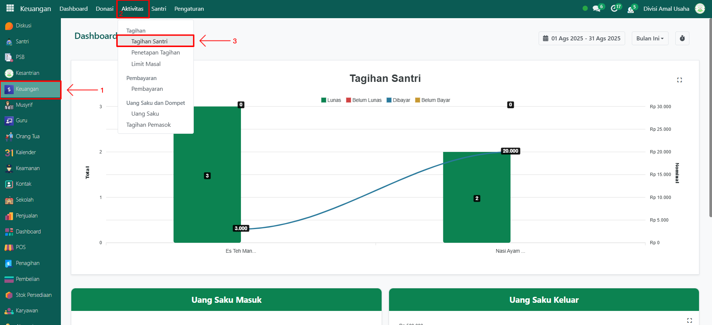
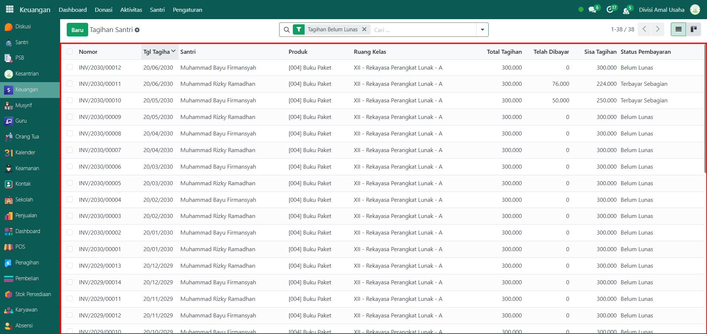
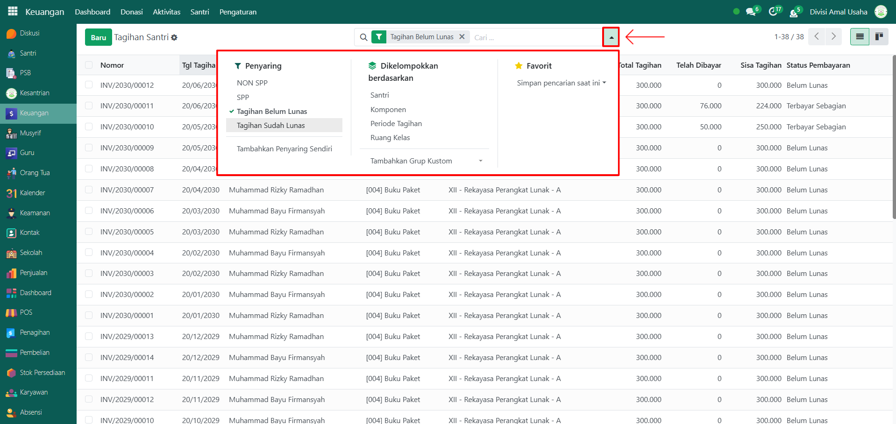
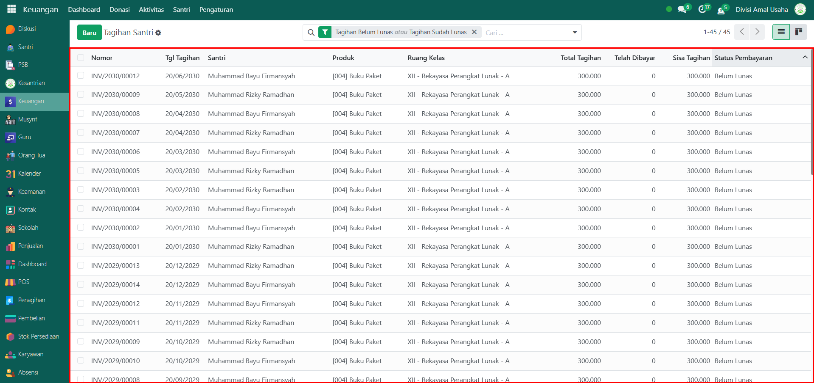
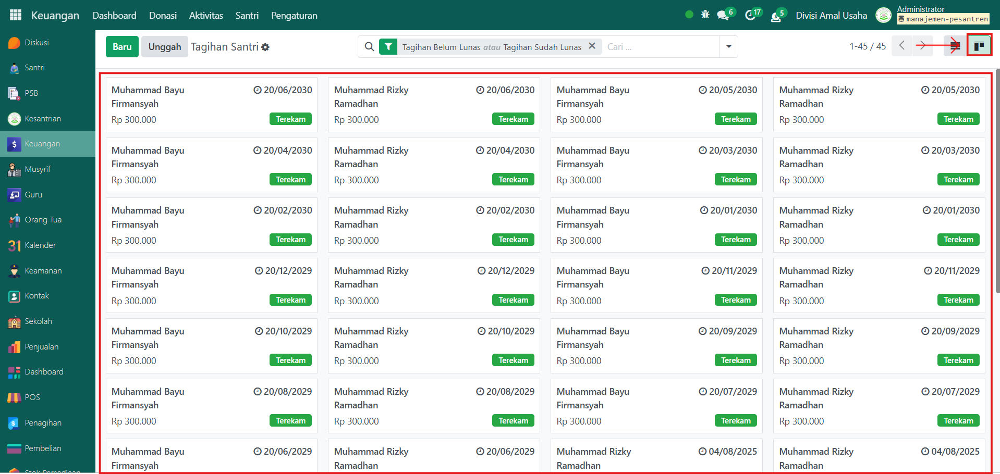
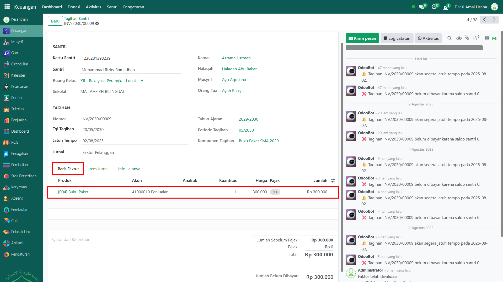
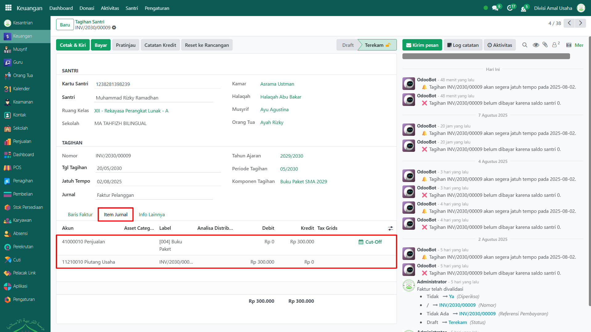
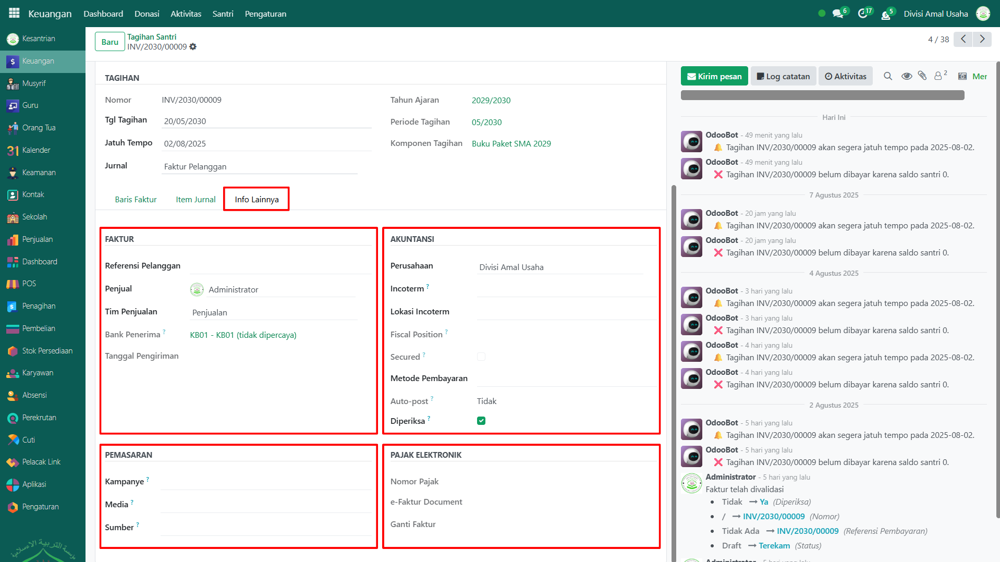

# Tagihan Santri

Video \[]

## Riwayat Tagihan Santri

**Riwayat Tagihan Santri** adalah kumpulan data yang menampilkan seluruh transaksi keuangan santri yang berkaitan dengan tagihan pembayaran. Fitur ini digunakan untuk memantau pembayaran, sisa tagihan, hingga status pelunasan dari berbagai produk atau layanan yang digunakan santri di lingkungan pesantren.

### Melihat Riwayat Tagihan Santri

Berikut adalah langkah-langkah untuk melihat riwayat tagihan santri pada Odoo Pesantren.

1. Login menggunakan akun administrator. Jika Anda belum memahami cara login sebagai admin, silakan lihat panduan [**Login Admin** di sini](../../panduan-login/login-admin.md).
2.  Buka modul **Keuangan**, lalu klik menu **Aktivitas** kemudian pilih submenu **Tagihan Santri**.

    <figure><figcaption></figcaption></figure>

3.  Pada halaman ini, Anda akan melihat daftar seluruh data tagihan santri. Setiap data menampilkan informasi seperti: **nomor referensi, tanggal tagihan, nama santri, produk yang dibeli, kelas santri, total tagihan, jumlah yang telah dibayar, sisa tagihan, dan status pembayaran**.

    <figure><figcaption></figcaption></figure>

4.  Klik **toggle dropdown pencarian**, lalu gunakan fitur **Filter** untuk memudahkan pencarian, misalnya **NON SPP, SPP, Tagihan Belum Lunas dan Sudah Lunas** serta filter kelompok yaitu **per nama santri, komponen biaya, periode tagihan, dan ruang kelas.**

    <figure><figcaption></figcaption></figure>

5.  Setelah filter diaktifkan, sistem akan secara otomatis menampilkan data yang sesuai dengan kriteria pencarian.

    <figure><figcaption></figcaption></figure>

6.  Anda dapat mengubah tampilan daftar menjadi mode **Kanban** dengan mengklik ikon **Kanban** di sebelah ikon **List**.

    <figure><figcaption></figcaption></figure>

7. Untuk melihat detail suatu tagihan, klik salah satu data tagihan santri dari daftar yang tersedia.
8.  Sistem akan menampilkan **formulir detail tagihan**, yang berisi informasi lengkap seperti:

    * **Identitas Santri**
    * **Detail Tagihan**

    Pada **Tab Baris Faktur** yang berisi daftar produk yang dibeli oleh santri.

    <figure><figcaption></figcaption></figure>

9.  Pada **Tab Item Jurnal**, Anda dapat melihat rincian akun-akun yang terlibat dalam pencatatan jurnal atas transaksi tersebut.

    <figure><figcaption></figcaption></figure>

10. Pada **Tab Info Lainnya**, Anda dapat menemukan informasi tambahan seperti nomor faktur, referensi akuntansi, informasi pemasaran, serta pengaturan pajak elektronik (e-Faktur).

    <figure><figcaption></figcaption></figure>
