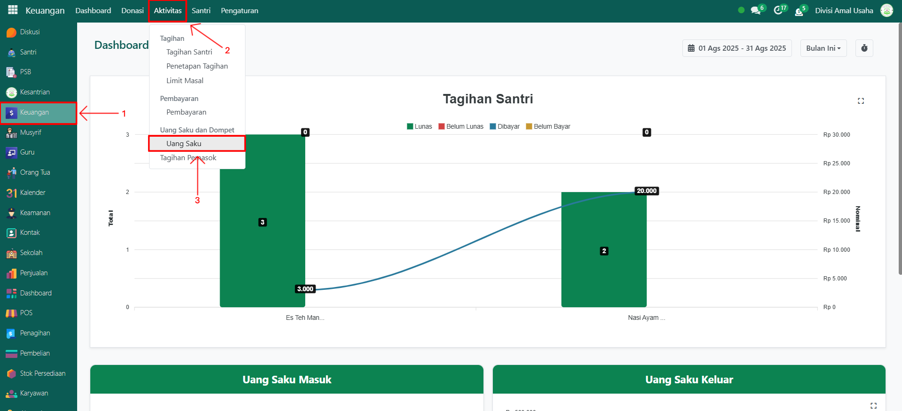
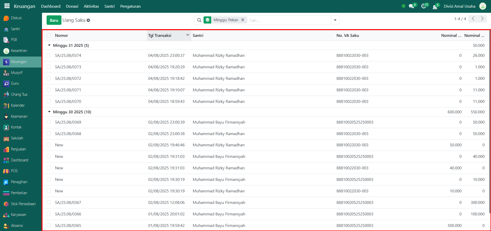
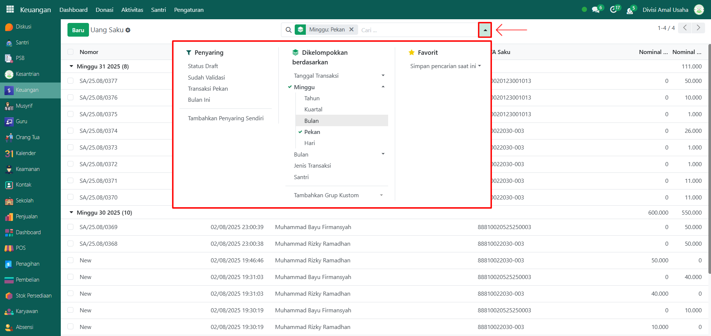
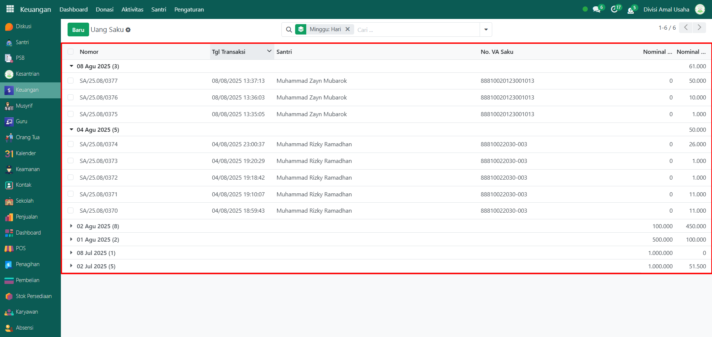
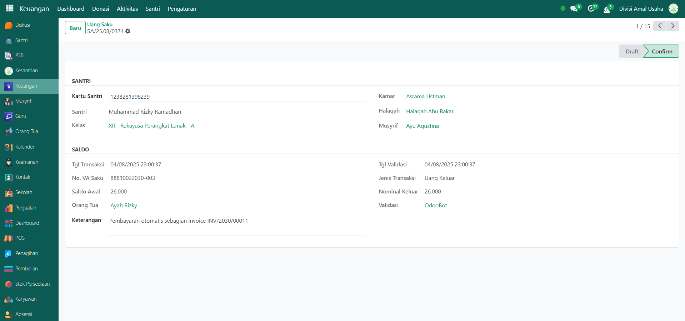

# Transaksi Dompet Santri

Video \[]

## Riwayat Transaksi Dompet Santri

Data **Riwayat Transaksi Dompet Santri** merupakan fitur yang digunakan untuk memantau seluruh aktivitas keuangan yang terjadi dalam dompet digital santri. Fitur ini mencatat setiap pemasukan maupun pengeluaran dari saldo santri, sehingga administrator dapat melakukan monitoring transaksi secara menyeluruh dan akurat.

### Melihat Riwayat Transaksi Dompet Santri

Berikut adalah langkha-langkah untuk melihat data riwayat transaksi dompet santri pada Odoo Pesantren.

1. Login menggunakan akun administrator. Jika Anda belum memahami cara login sebagai admin, silakan lihat panduan [**Login Admin** di sini](../../panduan-login/login-admin.md).
2.  Buka modul **Keuangan**, lalu klik menu **Aktivitas** kemudian pilih submenu **Uang Saku**.

    <figure><figcaption></figcaption></figure>

3.  Pada halaman tersebut, Anda akan melihat daftar semua transaksi dompet santri. Setiap data ditampilkan dalam format tabel yang mencakup: **Nomor Referensi**, **Tanggal Transaksi**, **Nama Santri**, **Nomor VA Saku**, dan **Nominal Masuk/Keluar**.

    <figure><figcaption></figcaption></figure>

4.  Gunakan fitur **toggle dropdown pencarian** untuk menampilkan opsi filter. Anda dapat menyaring data berdasarkan **Status Transaksi**, **Transaksi Pekan Ini**, **Transaksi Bulan Ini** serta filter **Kelompok** berdasarkan **Tanggal Transaksi**, **Minggu**, **Bulan**, **Jenis Transaksi (Masuk/Keluar)**, dan **Nama Santri**.

    <figure><figcaption></figcaption></figure>

5.  Setelah filter diterapkan, sistem akan secara otomatis menampilkan data transaksi yang sesuai dengan kriteria yang Anda tentukan.

    <figure><figcaption></figcaption></figure>

6. Untuk melihat detail dari suatu transaksi, klik salah satu entri dalam daftar transaksi dompet santri.
7.  Anda akan diarahkan ke tampilan **formulir transaksi** yang memuat informasi lebih lengkap, seperti **identitas santri** (berisi informasi mengenai santri), **detail transaksi** (berisi informasi lengkap mengenai transaksi seperti jenis transaksi, nominal, dan lainnya).

    <figure><figcaption></figcaption></figure>

8. Jika diperlukan, Anda dapat menggunakan tindakan lanjutan sesuai hak akses Anda, seperti koreksi data atau validasi manual.
