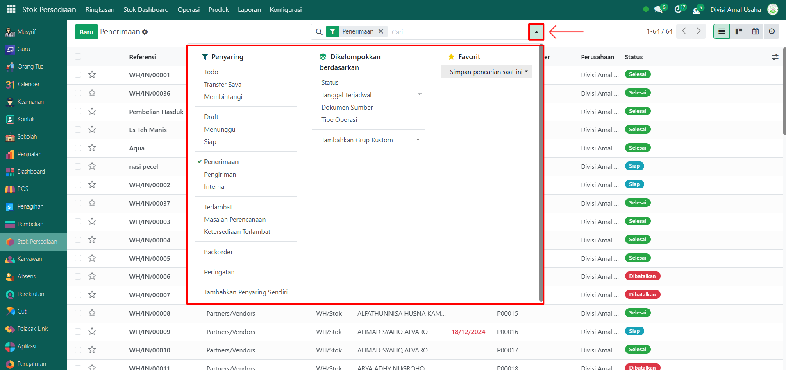
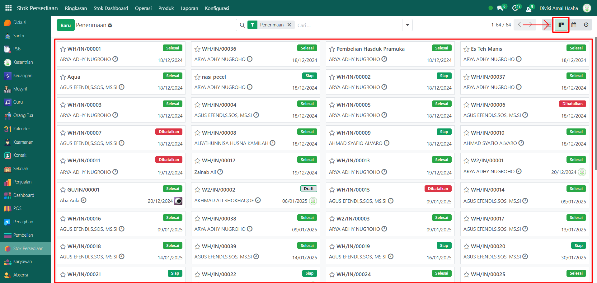
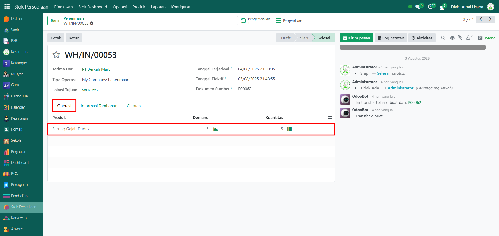
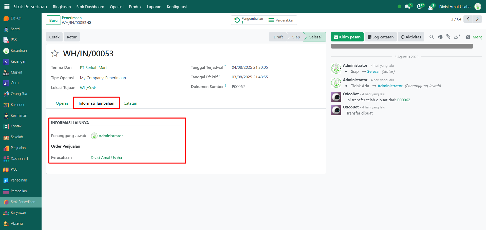
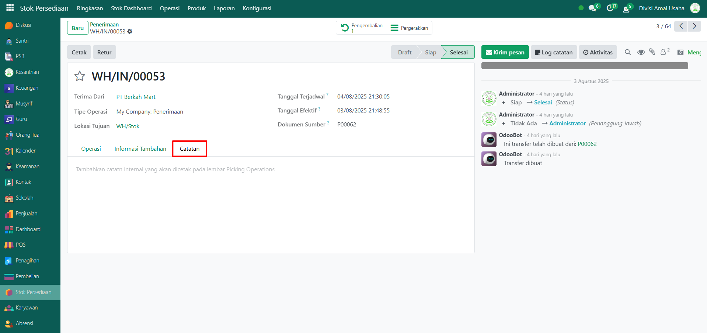

# Penerimaan Barang

Video \[]

## Riwayat Penerimaan Barang

Data **Riwayat Penerimaan Barang** pada Odoo Pesantren digunakan untuk mencatat dan memantau seluruh aktivitas penerimaan barang yang masuk ke gudang atau lokasi tertentu, baik dari pemasok maupun transfer internal. Informasi ini penting dalam proses kontrol persediaan dan memastikan ketepatan data stok barang.

### Melihat Riwayat Penerimaan Barang

Berikut adalah langkah-langkah untuk melihat data riwayat penerimaan barang pada Odoo Pesantren.

1. Login menggunakan akun administrator. Jika Anda belum memahami cara login sebagai admin, silakan lihat panduan [**Login Admin** di sini](../../panduan-login/login-admin.md).
2.  Buka modul **Stok Persediaan**, lalu klik menu **Operasi** kemudian pilih submenu **Penerimaan**.

    <figure><figcaption></figcaption></figure>

3.  Pada halaman ini, Anda akan melihat daftar semua aktivitas penerimaan barang. Setiap data ditampilkan dalam satu baris tabel dengan informasi utama: **Nomor** **Referensi**, **Dari** (sebagai pengirim barang), **Kepada** (sebagai lokasi gudang), **Kontak**, **Tanggal Terjadwal**, **Dokumen Sumber**, dan **Status Penerimaan Barang**.

    <figure><figcaption></figcaption></figure>

4.  Klik **toggle pencarian** untuk menampilkan fitur **Filter**. Anda dapat menggunakan beberapa filter yang tersedia seperti **Todo**, **Transfer Saya**, **Status**, dan lainnya serta filter **Kelompok** berdasarkan **Status**, **Tanggal Terjadwal**, **Dokumen Sumber**, dan **Tipe Operasi**.

    <figure><figcaption></figcaption></figure>

5. Setelah filter diaktifkan, data riwayat penerimaan barang akan otomatis disesuaikan berdasarkan kriteria yang Anda pilih.
6.  Anda dapat mengubah tampilan daftar menjadi **Kanban** dengan mengklik icon **Kanban** di samping icon tampilan **List**.

    <figure><figcaption></figcaption></figure>

7. Untuk melihat detail dari suatu aktivitas penerimaan, klik salah satu entri dalam daftar.
8.  Anda akan diarahkan ke halaman formulir yang menampilkan informasi lengkap terkait penerimaan barang tersebut. Pada **Tab Operasi** akan menampilkan daftar produk yang diterima beserta jumlah dan detail lainnya.

    <figure><figcaption></figcaption></figure>

9.  Pada **Tab Informasi Tambahan** akan menampilkan informasi seperti penanggung jawab operasional, tipe operasi, dan perusahaan terkait.

    <figure><figcaption></figcaption></figure>

10. Pada **Tab Catatan** akan berisi catatan tambahan atau instruksi khusus yang dicantumkan selama proses penerimaan.

    <figure><figcaption></figcaption></figure>
