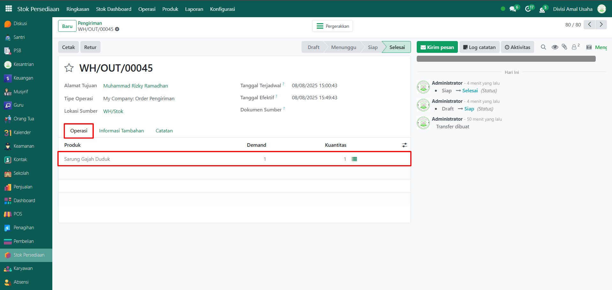

# Pengiriman

Video \[]

## Riwayat Pengiriman Barang

**Riwayat Pengiriman Barang** pada Odoo Pesantren digunakan untuk memantau dan mencatat seluruh aktivitas pengiriman barang dari gudang ke pelanggan, santri, atau pihak lain. Fitur ini membantu memastikan proses distribusi berjalan tepat waktu, sesuai tujuan, dan terdokumentasi dengan baik.

### Melihat Riwayat Pengiriman Barang

Berikut adalah langkah-langkah untuk melihat data riwayat pengiriman barang pada Odoo Pesantren.

1. Login menggunakan akun administrator. Jika Anda belum memahami cara login sebagai admin, silakan lihat panduan [**Login Admin** di sini](../../panduan-login/login-admin.md).
2.  Buka modul **Stok Persediaan**, lalu klik menu **Operasi** kemudian pilih submenu **Pengiriman**.

    <figure><figcaption></figcaption></figure>

3.  Halaman akan menampilkan daftar seluruh aktivitas pengiriman barang. Setiap entri ditampilkan dalam satu baris dengan informasi: **Referensi, Dari, Kepada, Rekanan, Tanggal Terjadwal, Dokumen Sumber, Perusahaan Saat Ini**, dan **Status Pengiriman Barang**.

    <figure><figcaption></figcaption></figure>

4.  Klik ikon **dropdown pencarian** untuk menampilkan opsi filter. Beberapa filter yang dapat digunakan antara lain yaitu, **To Do, Transfer Saya, Status**, serta filter Kelompok seperti **Status**, **Tanggal Terjadwal**, **Dokumen Sumber**, dan **Tipe Operasi**.

    <figure><figcaption></figcaption></figure>

5. Setelah filter diaktifkan, data riwayat pengiriman barang akan otomatis diperbarui sesuai kriteria yang dipilih.
6.  Anda dapat mengubah tampilan daftar menjadi **Kanban** dengan mengklik ikon Kanban di samping ikon tampilan List.

    <figure><figcaption></figcaption></figure>

7. Untuk melihat detail suatu pengiriman, klik salah satu entri pada daftar.
8.  Anda akan diarahkan ke halaman formulir yang menampilkan informasi lengkap terkait penerimaan barang tersebut, yang terdiri dari beberapa tab, yaitu **Tab Operasi, Tab Informasi Tambahan, dan Tab Catatan**, Pada **Tab Operasi** akan menampilkan daftar produk yang dikirim beserta jumlah dan detail terkait tujuan pengiriman.

    <figure><figcaption></figcaption></figure>

9.  Pada **Tab Informasi Tambahan** akan **b**erisi informasi tambahan seperti penanggung jawab operasi, tipe operasi, dan perusahaan yang terlibat.

    <figure><figcaption></figcaption></figure>

10. Pada **Tab Catatan** akan menyediakan catatan atau instruksi khusus terkait pengiriman barang.

    <figure><figcaption></figcaption></figure>
