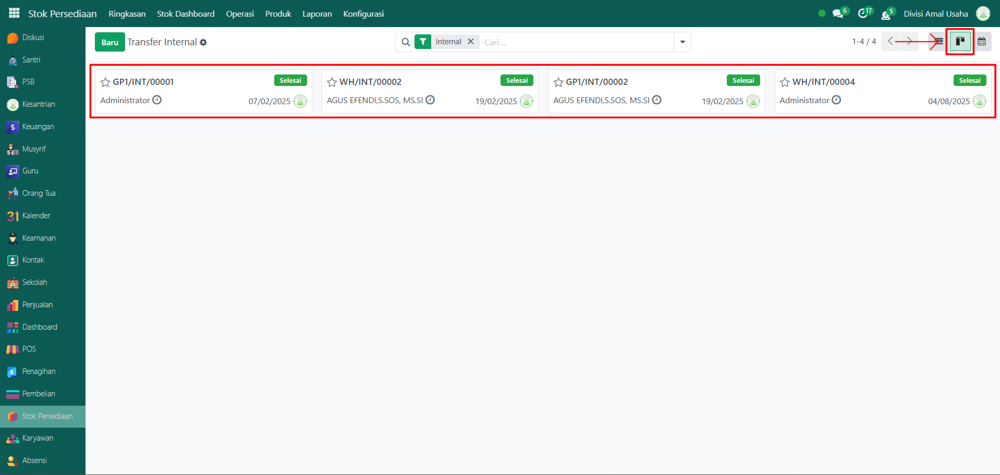

# Transfer Internal Barang



## Riwayat Transfer Internal Barang

Data **Riwayat Transfer Internal Barang** pada Odoo Pesantren digunakan untuk mencatat dan memantau seluruh aktivitas perpindahan barang antar lokasi di dalam satu perusahaan atau pesantren. Proses ini biasanya dilakukan untuk mendistribusikan barang dari gudang pusat ke gudang cabang, atau antar bagian di area operasional yang sama.

### Melihat Riwayat Transfer Internal Barang

Berikut adalah langkah-langkah untuk melihat data riwayat transfer internal barang pada Odoo Pesantren.

1. Login menggunakan akun administrator. Jika Anda belum memahami cara login sebagai admin, silakan lihat panduan [**Login Admin** di sini](../../panduan-login/login-admin.md).
2.  Buka modul **Stok Persediaan**, lalu klik menu **Operasi** kemudian pilih submenu **Internal**.

    <figure><figcaption></figcaption></figure>

3.  Halaman akan menampilkan daftar seluruh aktivitas transfer internal barang. Setiap entri ditampilkan dalam satu baris dengan informasi: **Nomor** **Referensi**, **Dari** (sebagai lokasi gudang), **Kepada** (sebagai lokasi gudang), **Kontak**, **Tanggal Terjadwal**, **Dokumen Sumber**, dan **Status Transfer Internal Barang**.

    <figure><figcaption></figcaption></figure>

4.  Klik **toggle pencarian** untuk menampilkan fitur **Filter**. Beberapa filter yang dapat digunakan antara lain yaitu **Todo**, **Transfer Saya**, **Status**, dan lainnya serta filter **Kelompok** berdasarkan **Status**, **Tanggal Terjadwal**, **Dokumen Sumber**, dan **Tipe Operasi**.

    <figure><figcaption></figcaption></figure>

5. Setelah filter diaktifkan, daftar riwayat transfer internal barang akan otomatis diperbarui sesuai kriteria yang dipilih.
6.  Ubah tampilan daftar menjadi **Kanban** jika diperlukan dengan mengklik icon **Kanban** di samping icon tampilan **List**.

    <figure><figcaption></figcaption></figure>

7. Untuk melihat detail suatu transfer internal, klik salah satu entri pada daftar.
8.  Anda akan diarahkan ke halaman formulir yang menampilkan informasi lengkap terkait transfer internal barang tersebut. Pada **Tab Operasi** akan menampilkan daftar produk yang dipindahkan beserta jumlah dan lokasi asal/tujuan.

    <figure><figcaption></figcaption></figure>

9.  Pada **Tab Informasi Tambahan** akan berisi detail tambahan seperti penanggung jawab operasi atau informasi lainnya.

    <figure><figcaption></figcaption></figure>

10. Pada **Tab Catatan** akan menyediakan catatan atau instruksi khusus terkait transfer internal barang.

    <figure><figcaption></figcaption></figure>
