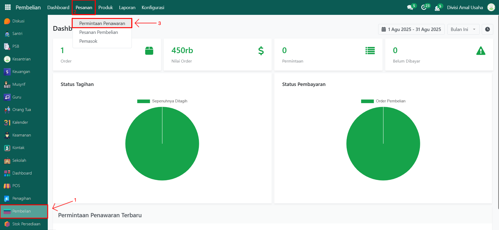
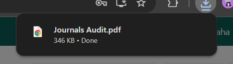
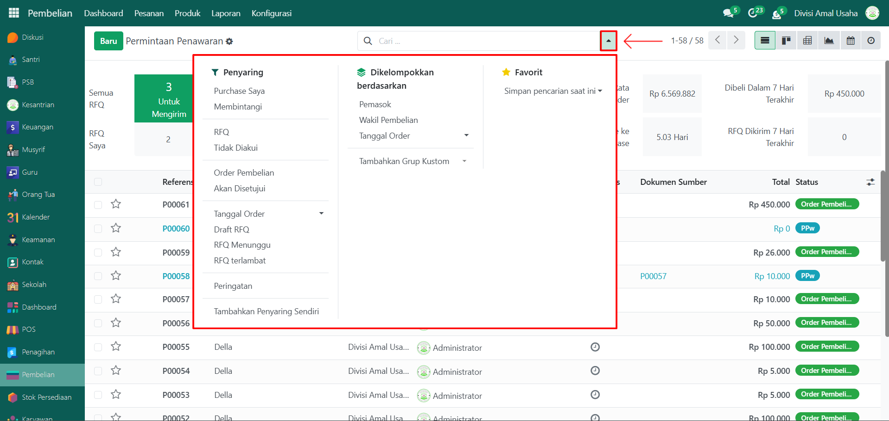
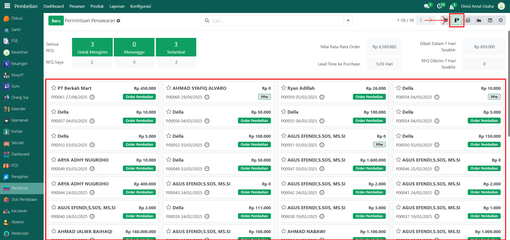
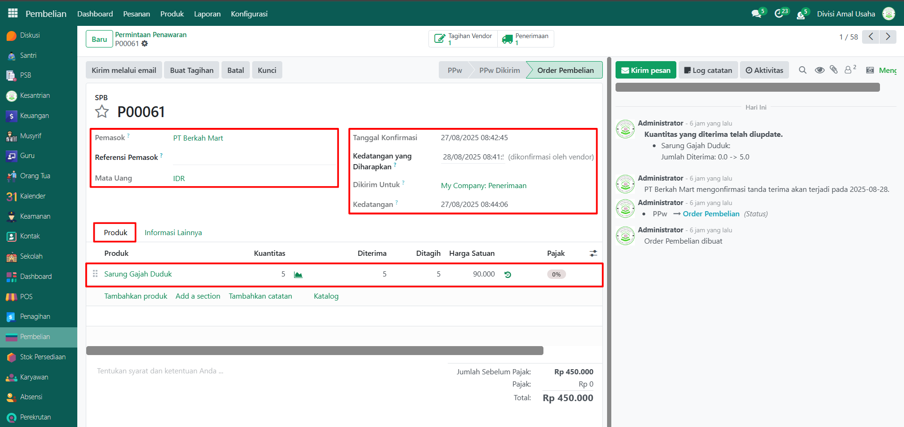
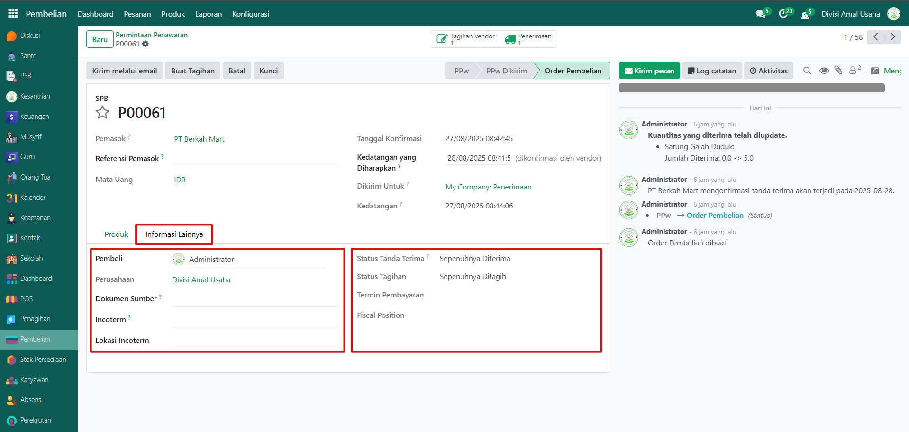

# Permintaan Penawaran

Video \[]

## Riwayat Permintaan Penawaran

**Riwayat Permintaan Penawaran** pada Odoo Pesantren digunakan untuk memantau semua permintaan penawaran yang diajukan kepada pemasok. Setiap entri berisi informasi seperti nomor referensi, pemasok, pembeli, tenggat waktu pesanan, total nilai penawaran, dan status pembelian.

### Melihat Riwayat Permintaan Penawaran

Berikut adalah langkah-langkah untuk melihat data riwayat permintaan penawaran pada Odoo Pesantren.

1. Login menggunakan akun administrator. Jika Anda belum memahami cara login sebagai admin, silakan lihat panduan [**Login Admin** di sini](../../panduan-login/login-admin.md).
2.  Buka modul **Pembelian**, lalu klik menu **Pesanan** kemudian pilih submenu **Permintaan Penawaran**.

    <figure><figcaption></figcaption></figure>

3.  Pada halaman ini, Anda akan melihat daftar lengkap data permintaan penawaran, yang mencakup informasi seperti **nomor referensi, pemasok, pembeli, deadline order, total, dan status pembelian**.

    <figure><figcaption></figcaption></figure>

4.  Klik dropdown pencarian dan aktifkan fitur **Filter** untuk memudahkan pencarian data berdasarkan kriteria seperti **Pembelian Saya, RFQ, Tanggal Order, dan lain-lain**. Anda juga dapat melakukan pengelompokan berdasarkan **Pemasok, Wakil Pembelian, atau Tanggal Order**.

    <figure><figcaption></figcaption></figure>

5. Setelah filter diaktifkan, data yang sesuai dengan kriteria pencarian akan ditampilkan secara otomatis.
6.  Untuk mengubah tampilan daftar menjadi mode **Kanban**, klik icon **Kanban** di sebelah icon **List**.

    <figure><figcaption></figcaption></figure>

7. Untuk melihat detail suatu **permintaan penawaran**, klik data permintaan penawaran yang diinginkan dari daftar.
8.  Sistem akan menampilkan formulir permintaan penawaran yang mencakup, **Informasi Penawaran** yang berisi detail penawaran termasuk **pemasok, deadline order, dan lainnya**. Pada Tab **Produk** berisi daftar produk yang dibeli dari pemasok.

    <figure><figcaption></figcaption></figure>

9.  Kemudian di Tab **Informasi Lainnya** berisi detail lain seperti pembeli dan informasi terkait lainnya.

    <figure><figcaption></figcaption></figure>
