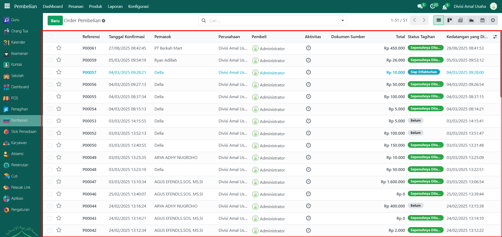

# Pesanan Pembelian

Video \[]

## Riwayat Pesanan Pembelian

**Riwayat Pesanan Pembelian** pada Odoo Pesantren digunakan untuk memantau seluruh pesanan pembelian yang telah dibuat. Setiap entri memuat informasi detail seperti nomor referensi, tanggal konfirmasi, pemasok, pembeli, total nilai pesanan, dan status penagihan.

### Melihat Riwayat Pesanan Pembelian

Berikut adalah langkah-langkah untuk melihat data riwayat pesanan pembelian pada Odoo Pesantren.

1. Login menggunakan akun administrator. Jika Anda belum memahami cara login sebagai admin, silakan lihat panduan [**Login Admin** di sini](../../panduan-login/login-admin.md).
2.  Buka modul **Pembelian**, lalu klik menu **Pesanan** kemudian pilih submenu **Pesanan Pembelian**.

    <figure><figcaption></figcaption></figure>

3.  Pada halaman ini, Anda akan melihat daftar lengkap data pesanan pembelian, yang mencakup informasi seperti **Nomor Referensi**, **Tanggal Konfirmasi**, **Pemasok**, **Pembeli, Total**, dan **Status Tagihan**.

    <figure><figcaption></figcaption></figure>

4.  Klik **toggle pencarian** dan aktifkan fitur **Filter** untuk memudahkan pencarian data berdasarkan kriteria seperti **Orderku, Siap Difakturkan, Tagihan Diterima, Tanggal Order, dan lain-lain**. Anda juga dapat melakukan pengelompokan berdasarkan **Pemasok, Wakil Pembelian, atau Tanggal Order**.

    <figure><figcaption></figcaption></figure>

5. Setelah filter diaktifkan, data yang sesuai dengan kriteria pencarian akan ditampilkan secara otomatis.
6.  Untuk mengubah tampilan daftar menjadi mode **Kanban**, klik icon **Kanban** di sebelah icon **List**.

    <figure><figcaption></figcaption></figure>

7. Untuk melihat detail suatu **pesanan pembelian**, klik data **pesanan pembelian** yang diinginkan dari daftar.
8.  Sistem akan menampilkan formulir pesanan pembelian yang mencakup, **Informasi Pembelian** yang berisi detail pembelian termasuk **pemasok, tanggal konfirmasi, dan lainnya**. Pada Tab **Produk** berisi daftar produk yang dibeli dari pemasok.

    <figure><figcaption></figcaption></figure>

9.  Kemudian di Tab **Informasi Lainnya** berisi detail lain seperti pembeli dan informasi terkait lainnya.

    <figure><figcaption></figcaption></figure>
