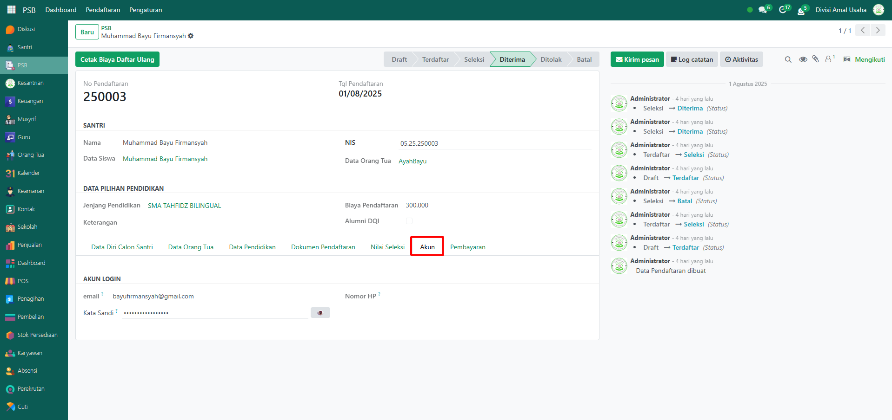

# Riwayat Pendaftaran

Video \[]

## Riwayat Pendaftaran

**Data Riwayat Pendaftaran** merupakan kumpulan data yang tersimpan ketika ada user yang melakukan pendaftaran. Data akan ditampilkan berupa list dengan filter jenjang. Pada tampilan awal, list akan menampilkan nomor pendaftaran, nama pendaftar, jenjang, tanggal pendaftaran, dan statusnya.

### Melihat Riwayat Pendaftaran

Berikut adalah langkah-langkah untuk melihat data riwayat pendaftaran pada Odoo Pesantren.

1. Login menggunakan akun administrator. Jika Anda belum memahami cara login sebagai admin, silakan lihat panduan [**Login Admin** di sini](../panduan-login/login-admin.md).
2.  Buka modul **PSB**, lalu klik menu **Pendaftaran**.&#x20;

    <figure><figcaption></figcaption></figure>

3.  Disini anda akan melihat list dengan data yang difilter berdasarkan **jenjang** pendaftaran. Anda bisa mengklik setiap jenjang untuk melihat semua pendaftar yang mendaftar di jenjang tersebut. Setiap data memiliki header yaitu **Nomor Pendaftaran, Nama Pendaftar, Jenjang Pendidikan, Tanggal Pendaftaran, Total Nilai Seleksi, dan Status Pendaftaran**.&#x20;

    <figure><figcaption></figcaption></figure>

4.  Klik dropdown pencarian dan aktifkan fitur **Filter** untuk memudahkan pencarian data berdasarkan kriteria seperti **By Jenjang, dan Nilai Tertinggi**. Anda juga dapat melakukan pengelompokan berdasarkan **Jenjang, Provinsi, Kota, Kecamatan, Asal Sekolah, Jenis Kelamin, Kewarganegaraan, dan Tanggal Daftar**.

    <figure><figcaption></figcaption></figure>

5. Setelah filter diaktifkan, data yang sesuai dengan kriteria pencarian akan ditampilkan secara otomatis.
6. Jika anda ingin melihat detail dari setiap pendaftar, anda bisa mengklik list salah satu pendaftar.
7.  Anda akan melihat tampilan form yang berisi informasi detail dari pendaftar dan kemudian di Tab **Data Diri Calon Santri** Anda dapat melihat informasi data calon santri yang mendaftar.

    <figure><figcaption></figcaption></figure>

8.  Pada Tab **Data Orang Tua**, Anda dapat melihat informasi data orang tua dari calon santri.

    <figure><figcaption></figcaption></figure>

9.  Pada Tab **Pendidikan**, Anda dapat melihat informasi data pendidikan sebelumnya dari calon santri.

    <figure><figcaption></figcaption></figure>

10. Pada Tab **Dokumen Pendaftaran**, Anda dapat melihat informasi dokumen pendaftaran yang dari calon santri.

    <figure><figcaption></figcaption></figure>

11. Pada Tab **Nilai Seleksi**, Anda dapat melihat informasi nilai seleksi yang telah dicatat dari calon santri.

    <figure><figcaption></figcaption></figure>

12. Pada Tab **Akun**, Anda dapat melihat informasi akun santri yang terdaftar pada sistem.

    <figure><figcaption></figcaption></figure>

13. Pada Tab **Pembayaran**, Anda dapat melihat informasi pembayaran biaya pendaftaran dari calon santri (lunas/belum lunas).

    <figure><figcaption></figcaption></figure>
