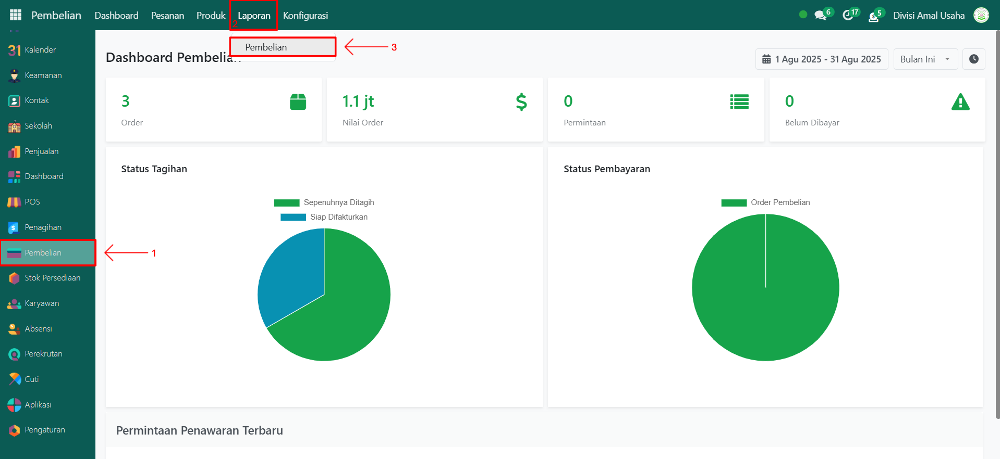
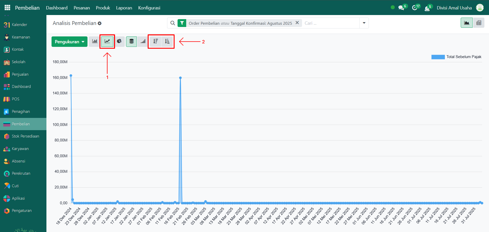
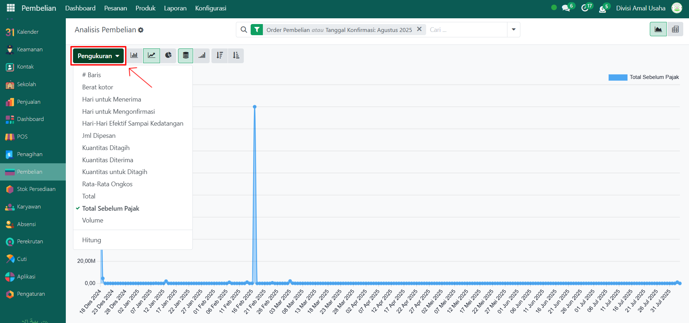
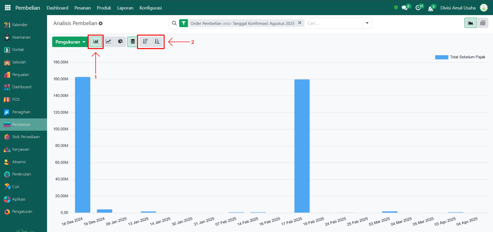
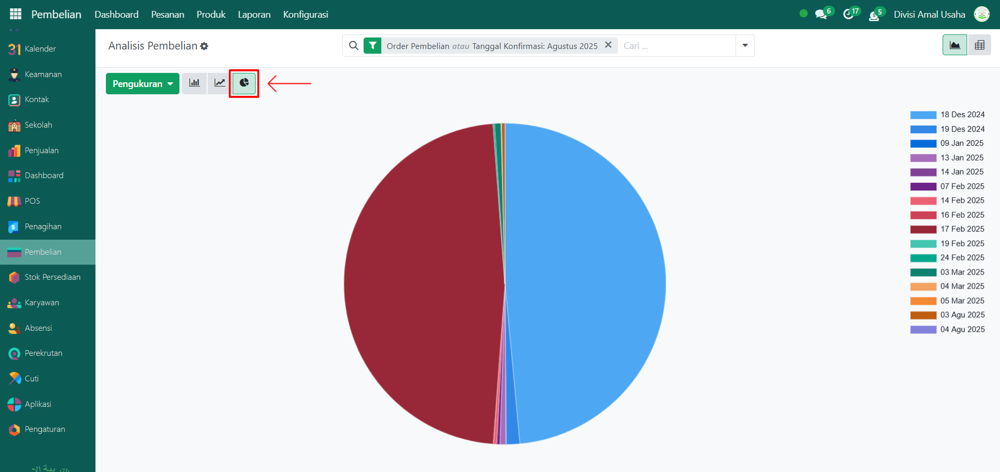
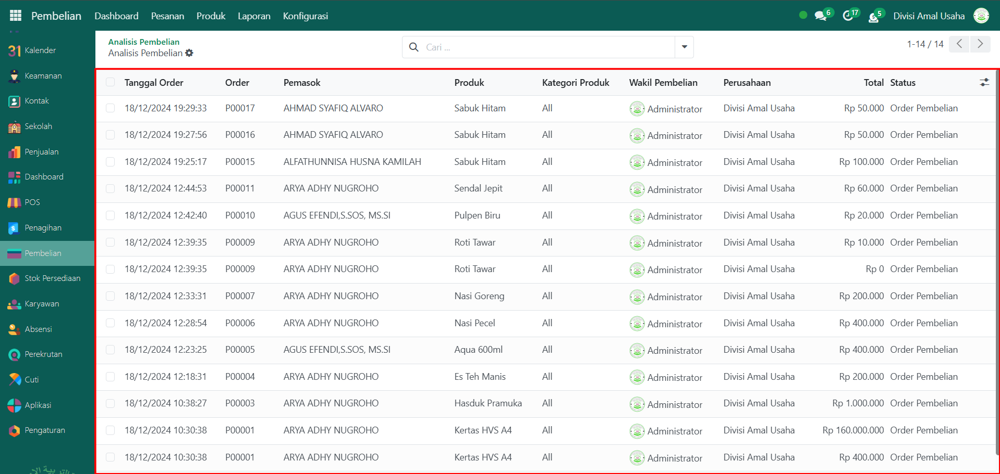
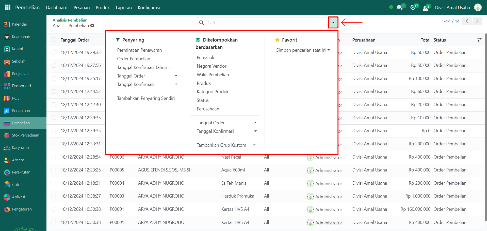
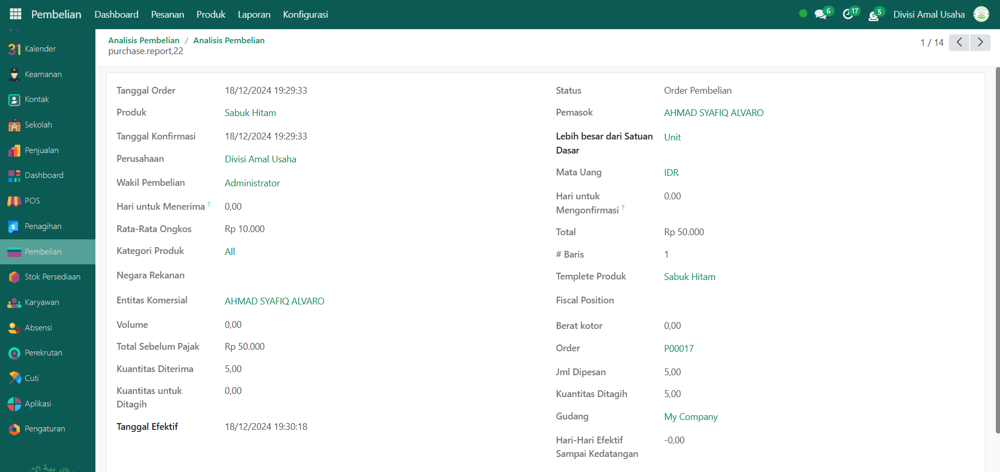

# Laporan Pembelian



## Laporan Pembelian

**Laporan Pembelian** digunakan untuk memantau dan menganalisis data transaksi pembelian dari pemasok. Laporan ini menyajikan data dalam bentuk grafik dan tabel sehingga memudahkan pengguna dalam melakukan evaluasi pembelian barang.

### Melihat Laporan Pembelian

Berikut adalah langkah-langkah untuk melihat laporan pembelian pada Odoo Pesantren.

1. Login menggunakan akun administrator. Jika Anda belum memahami cara login sebagai admin, silakan lihat panduan [**Login Admin** di sini](../panduan-login/login-admin.md).
2.  Buka modul **Pembelian**, lalu klik menu **Laporan** kemudian pilih submenu **Pembelian**.

    <figure><figcaption></figcaption></figure>

3.  Secara default, halaman awal akan menampilkan **grafik garis (line chart)** berdasarkan **Total Pembelian Sebelum Pajak**. Anda dapat mengubah urutan data menjadi **Ascending** (kecil ke besar) atau **Descending** (besar ke kecil).

    <figure><figcaption></figcaption></figure>

4.  Klik tombol **"Pengukuran"** untuk menampilkan daftar pilihan nilai yang ingin ditampilkan pada grafik, seperti **Berat Kotor, Total, Volume, Kuantitas, Jumlah Dipesan**, dan lainnya. Pilih salah satu sesuai kebutuhan.

    <figure><figcaption></figcaption></figure>

5. Mengubah jenis grafik seperti grafik batang ataupun grafik pie, yaitu:
   *   Untuk mengubah tampilan dari grafik garis menjadi grafik batang dengan klik icon **grafik batang (bar chart)**. Urutan data juga dapat diubah menjadi Ascending atau Descending.

       <figure><figcaption></figcaption></figure>

   *   Untuk mengubah tampilan dari grafik batang menjadi grafik pie dengan klik icon **grafik pie (pie chart)**.

       <figure><figcaption></figcaption></figure>

6. Klik pada elemen grafik (batang, garis, atau pie) untuk melihat detail informasi pembelian yang diwakili oleh elemen tersebut.&#x20;
7.  Halaman ini akan menampilkan daftar seluruh data pembelian dalam bentuk tabel. Setiap entri menampilkan informasi penting meliputi: **Tanggal Order, Nomor Referensi Order, Pemasok, Produk, Kategori Produk, Pembeli, Total Harga**, dan **Status Pembelian**.

    <figure><figcaption></figcaption></figure>

8.  Gunakan **toggle pencarian** untuk melakukan penyaringan data, seperti berdasarkan **Permintaan Penawaran, Order Pembelian, Tanggal Order**, dan **Tanggal Konfirmasi**. Anda juga dapat melakukan pengelompokan data berdasarkan **Pemasok, Negara Pemasok, Wakil Pembelian**, dan lainnya.

    <figure><figcaption></figcaption></figure>

9. Setelah filter atau pengelompokan diterapkan, sistem akan menampilkan data sesuai kriteria yang telah dipilih.
10. Klik salah satu baris data pembelian untuk melihat **detail pembelian**, termasuk informasi **Tanggal Order, Pemasok, Produk, Total Harga, Kuantitas Barang**, dan keterangan lainnya.

    <figure><figcaption></figcaption></figure>
