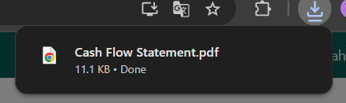

# Arus Kas

Video \[]

## Laporan Arus Kas

Laporan **Arus Kas** pada Odoo Pesantren digunakan untuk menampilkan aliran masuk dan keluar kas dalam periode tertentu. Laporan ini membantu mengetahui sumber penerimaan dan penggunaan dana, sehingga dapat digunakan untuk memantau likuiditas dan kesehatan keuangan.

### Mencetak Laporan Arus Kas

Berikut adalah langkah-langkah untuk mencetak laporan arus kas pada Odoo Pesantren.

1. Login menggunakan akun administrator. Jika Anda belum memahami cara login se bagai admin, silakan lihat panduan [**Login Admin** di sini](../../panduan-login/login-admin.md).
2.  Buka modul **Penagihan**, lalu klik menu **Laporan** kemudian pilih submenu **Arus Kas**.

    <figure><figcaption></figcaption></figure>

3.  Akan muncul form pop up untuk mencetak laporan arus kas, pilih jenis entri yang akan disertakan dalam laporan:

    * **All Posted Entries** → hanya menampilkan transaksi entri jurnal yang sudah diposting.
    * **All Entries** → menampilkan semua transaksi entri jurnal, baik _draft_ maupun yang sudah diposting.

    Centang opsi **Display Debit/Credit Columns** jika ingin menampilkan kolom debit dan kredit pada laporan yang dicetak. Lalu masukkan **Tanggal Mulai** periode laporan yang ingin ditampilkan.

    <figure><figcaption></figcaption></figure>

4.  Masukkan **Tanggal Selesai** periode laporan.

    <figure><figcaption></figcaption></figure>

5.  Setelah semua pengaturan selesai, klik tombol **"Print"** untuk memulai proses pencetakan Laporan Arus Kas.

    <figure><figcaption></figcaption></figure>

6.  Sistem akan menghasilkan laporan dalam format **PDF**.

    <figure><figcaption></figcaption></figure>

7.  Buka file PDF tersebut untuk melihat rincian aliran masuk dan keluar kas pada periode yang dipilih.

    <figure><figcaption></figcaption></figure>
