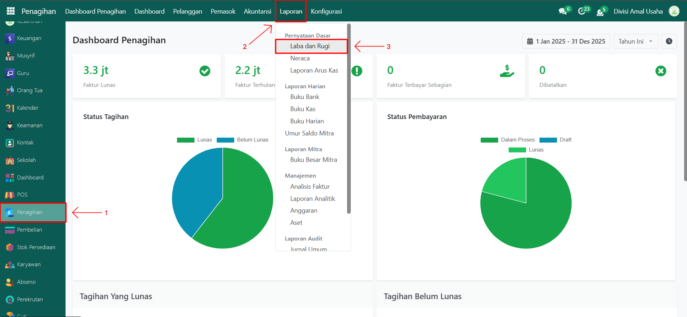
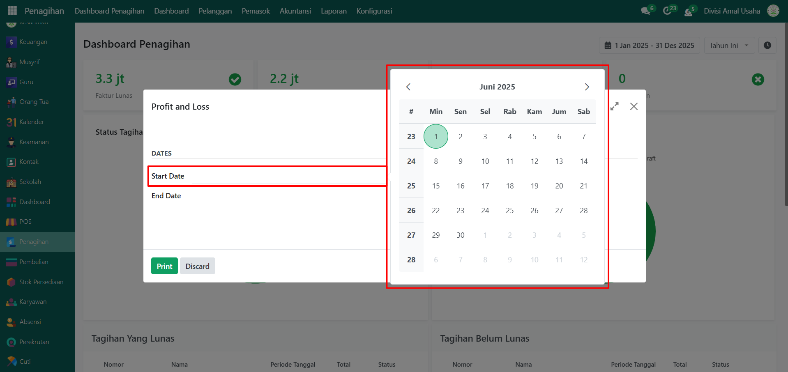
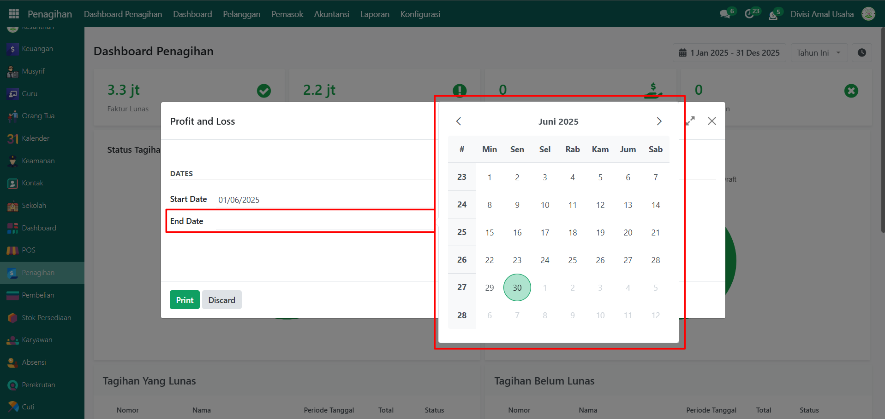
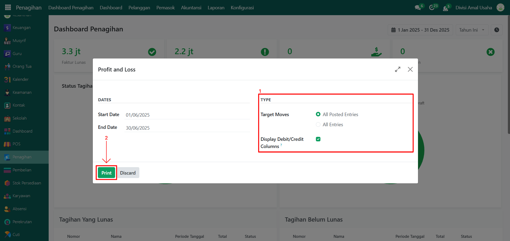
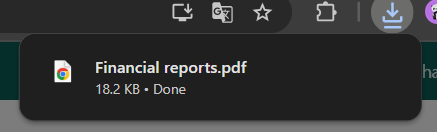
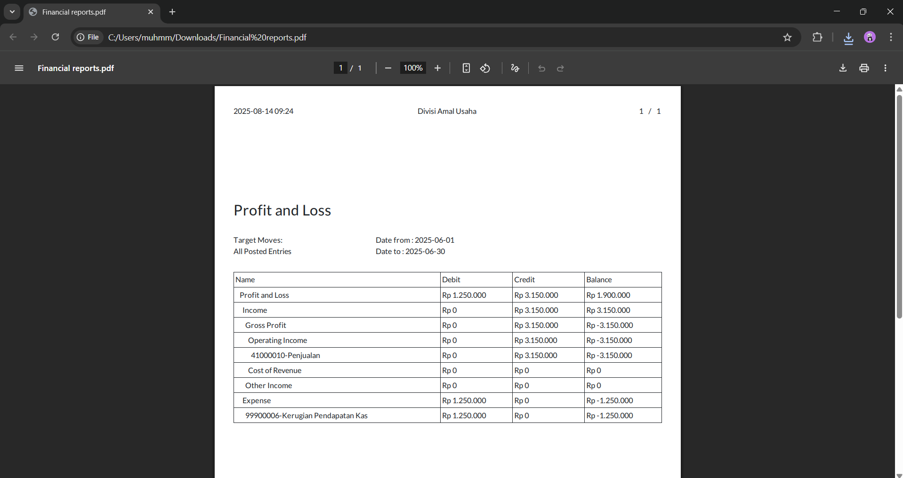

# Laba & Rugi

Video \[]

## &#x20;Laba & Rugi (Profit & Loss)

Laporan **Laba & Rugi** **(Profit & Loss)** pada Odoo Pesantren digunakan untuk mengetahui ringkasan pendapatan dan beban selama periode tertentu, sehingga dapat digunakan untuk menganalisis kinerja keuangan pesantren.

### Mencetak Laporan Laba & Rugi

Berikut adalah langkah-langkah untuk mencetak laporan laba & rugi pada Odoo Pesantren.

1. Login menggunakan akun administrator. Jika Anda belum memahami cara login sebagai admin, silakan lihat panduan [**Login Admin** di sini](../../panduan-login/login-admin.md).
2.  Buka modul **Penagihan**, lalu klik menu **Laporan** kemudian pilih submenu **Laba dan Rugi**.

    <figure><figcaption></figcaption></figure>

3.  Akan muncul form pop up untuk mencetak laporan laba dan rugi, masukkan **Tanggal Mulai** periode yang ingin ditampilkan pada laporan.

    <figure><figcaption></figcaption></figure>

4.  Masukkan **Tanggal Selesai** periode laporan sesuai kebutuhan.

    <figure><figcaption></figcaption></figure>

5.  Pilih jenis entri yang akan disertakan:

    * **All Posted Entries** → menampilkan hanya transaksi entri jurnal yang sudah diposting.
    * **All Entries** → menampilkan seluruh transaksi entri jurnal, baik _draft_ maupun yang sudah diposting.

    Jika diperlukan, centang opsi **Display Debit/Credit Columns** untuk menampilkan kolom debit dan kredit pada hasil cetakan. Setelah seluruh konfigurasi selesai, klik tombol **Print** untuk mulai mencetak Laporan Laba & Rugi.

    <figure><figcaption></figcaption></figure>

6.  Sistem akan menghasilkan file laporan dalam format **PDF**.

    <figure><figcaption></figcaption></figure>

7.  Buka file PDF tersebut untuk melihat detail informasi pendapatan, beban, dan hasil perhitungan laba atau rugi pada periode yang dipilih.

    <figure><figcaption></figcaption></figure>
