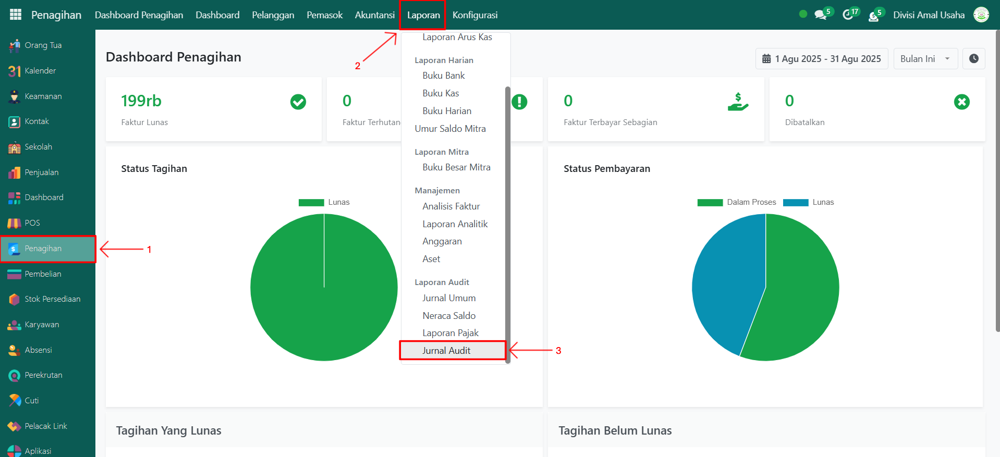

# Jurnal Audit

Video \[]

## Jurnal Audit (Journals Audit)

Laporan **Jurnal Audit (Journals Audit)** pada Odoo Pesantren digunakan untuk menampilkan seluruh transaksi jurnal yang telah dicatat dalam sistem, baik yang sudah diposting maupun masih berbentuk draft. Laporan ini membantu administrator atau auditor dalam menelusuri, memverifikasi, dan memastikan kelengkapan transaksi akuntansi sesuai periode tertentu.

### Mencetak Laporan Jurnal Audit

Berikut adalah langkah-langkah untuk mencetak laporan jurnal audit pada Odoo Pesantren.

1. Login menggunakan akun administrator. Jika Anda belum memahami cara login se bagai admin, silakan lihat panduan [**Login Admin** di sini](../../../panduan-login/login-admin.md).
2.  Buka modul **Penagihan**, lalu klik menu **Laporan**, kemudian pilih submenu **Jurnal Audit**.

    <figure><figcaption></figcaption></figure>

3.  Akan muncul sebuah **form konfigurasi laporan jurnal audit**. Pada form ini Anda dapat melakukan pengaturan yang diperlukan, seperti **Target Moves**, pilih opsi radio All Posted Entries untuk transaksi jurnal yang sudah diposting atau All Entries untuk seluruh transaksi, serta menentukan **periode laporan** dengan mengisi tanggal mulai dan tanggal berakhir.

    <figure><figcaption></figcaption></figure>

4. Setelah konfigurasi selesai, klik tombol **"Print"** untuk menghasilkan laporan jurnal audit.
5.  Sistem akan memproses dan menghasilkan laporan jurnal audit dalam format **PDF**.

    <figure><figcaption></figcaption></figure>
6.  Buka file **PDF laporan jurnal audit** untuk meninjau isi laporan.

    <figure><figcaption></figcaption></figure>
