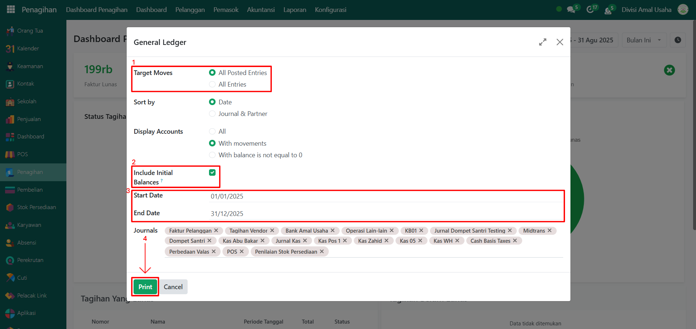
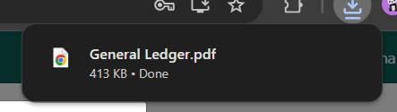
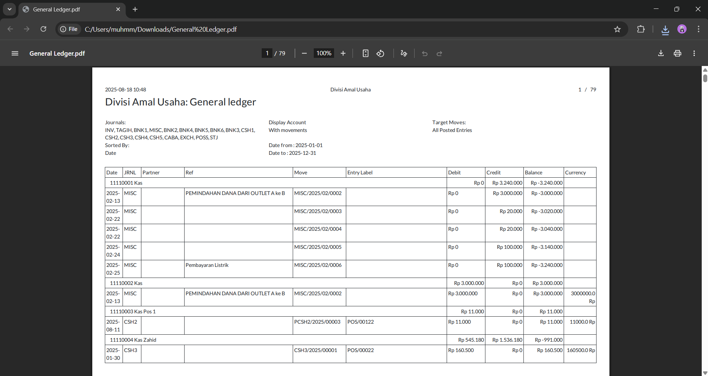

# Jurnal Umum

Video \[]

## Jurnal Umum (General Ledger)

Laporan **Jurnal Umum** **(General Ledger)** pada Odoo Pesantren berfungsi untuk menampilkan daftar transaksi akuntansi yang tercatat dalam jurnal. Laporan ini digunakan sebagai sumber utama dalam melihat pencatatan debit dan kredit yang telah dilakukan pada periode tertentu.

### Mencetak Laporan Jurnal Umum

Berikut adalh langkah-langkah untuk mencetak laporan jurnal umum pada Odoo Pesantren.

1. Login menggunakan akun administrator. Jika Anda belum memahami cara login se bagai admin, silakan lihat panduan [**Login Admin** di sini](../../../panduan-login/login-admin.md).
2.  Buka modul **Penagihan**, lalu klik menu **Laporan**, kemudian pilih submenu **Jurnal Umum**.

    <figure><figcaption></figcaption></figure>

3.  Akan muncul sebuah **form konfigurasi laporan jurnal umum**. Pada form ini, Anda dapat melakukan beberapa pengaturan sebelum mencetak laporan, antara lain: **Target Moves**, pilih salah satu opsi radio, yaitu _All Posted Entries_ atau _All Entries,_ **Include Initial Balance,** aktifkan opsi ini untuk menampilkan saldo awal (_initial balance_) pada laporan. **Periode Laporan,** masukkan tanggal mulai dan tanggal berakhir periode yang ingin ditampilkan.&#x20;

    <figure><figcaption></figcaption></figure>

4. Setelah selesai melakukan konfigurasi, klik tombol **"Print"** untuk memproses dan mencetak laporan jurnal umum.
5.  Sistem akan menghasilkan laporan jurnal umum dalam format **PDF**.

    <figure><figcaption></figcaption></figure>

6.  Buka file PDF laporan jurnal umum untuk melihat daftar transaksi jurnal secara lengkap, termasuk kolom debit, kredit, dan saldo berjalan.

    <figure><figcaption></figcaption></figure>
