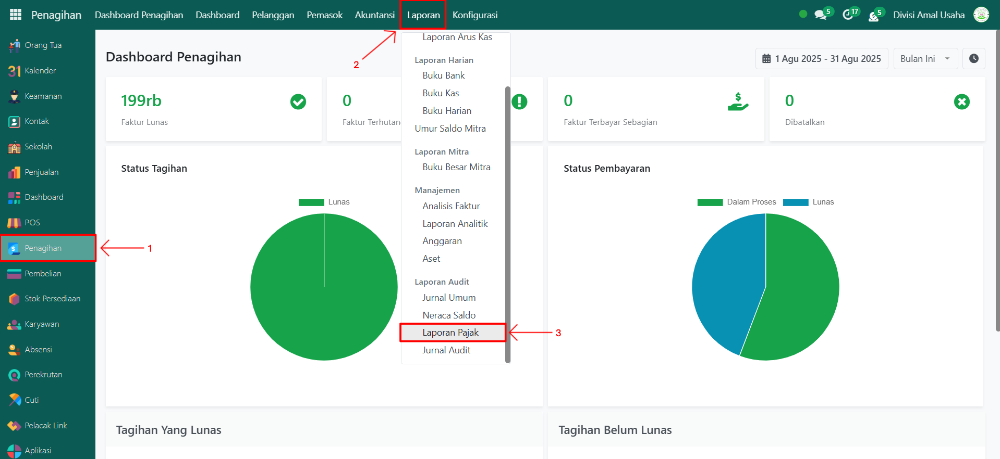
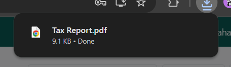

# Laporan Pajak



## Laporan Pajak (Tax Reports)

**Laporan Pajak (Tax Reports)** pada Odoo Pesantren digunakan untuk menampilkan dan mencetak ringkasan perhitungan pajak, baik pajak penjualan maupun pajak pembelian, dalam periode tertentu. Laporan ini membantu memastikan kepatuhan administrasi perpajakan dan memudahkan proses pelaporan pajak secara internal.

### Mencetak Laporan Pajak

Berikut adalah langkah-langkah untuk mencetak laporan pajak pada Odoo Pesantren.&#x20;

1. Login menggunakan akun administrator. Jika Anda belum memahami cara login se bagai admin, silakan lihat panduan [**Login Admin** di sini](../../../panduan-login/login-admin.md).
2.  Buka modul **Penagihan**, lalu klik menu **Laporan** kemudian pilih submenu **Laporan Pajak**.

    <figure><figcaption></figcaption></figure>

3.  Akan muncul sebuah **form konfigurasi laporan pajak**. Pada form ini Anda dapat melakukan pengaturan yang diperlukan, seperti menentukan **periode laporan** dengan mengisi tanggal mulai dan tanggal berakhir.&#x20;

    <figure><figcaption></figcaption></figure>

4. Setelah konfigurasi selesai, klik tombol **"Print"** untuk memproses laporan.
5.  Sistem akan menghasilkan laporan pajak dalam format **PDF**.

    <figure><figcaption></figcaption></figure>

6.  Buka file PDF laporan pajak untuk meninjau detail perhitungan pajak yang telah dihasilkan.

    <figure><figcaption></figcaption></figure>
