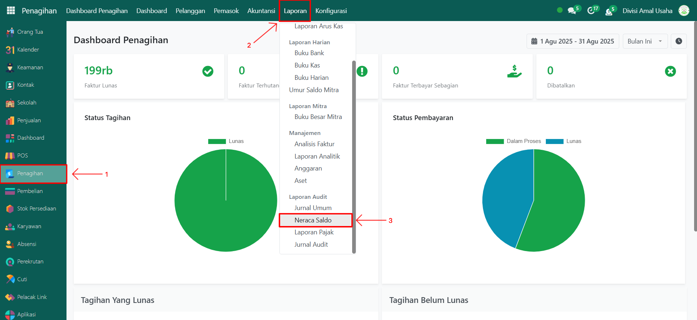
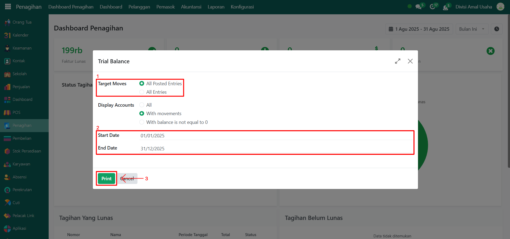
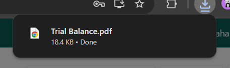
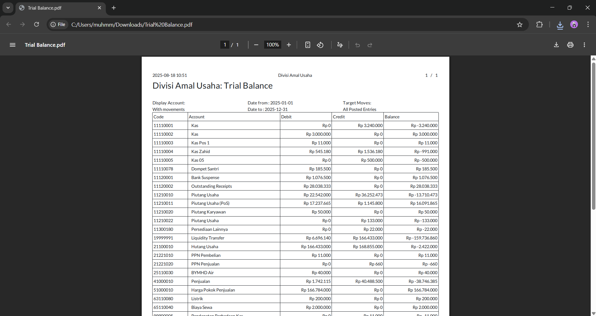

# Neraca Saldo

Video \[]

## Neraca Saldo (Trial Balance)

Laporan **Neraca Saldo (Trial Balance)** pada Odoo Pesantren berfungsi untuk menampilkan daftar saldo akun-akun dalam periode tertentu, yang terdiri dari saldo awal, total debit, total kredit, serta saldo akhir. Laporan ini membantu pengguna dalam memastikan keseimbangan pencatatan keuangan antara sisi debit dan kredit.

### Mencetak Laporan Neraca Saldo

Berikut adalah langkah-langkah untuk mencetak laporan neraca saldo pada Odoo Pesantren.

1. Login menggunakan akun administrator. Jika Anda belum memahami cara login se bagai admin, silakan lihat panduan [**Login Admin** di sini](../../../panduan-login/login-admin.md).
2.  Buka modul **Penagihan**, lalu klik menu **Laporan**, kemudian pilih submenu **Neraca Saldo**.

    <figure><figcaption></figcaption></figure>

3.  Akan muncul sebuah **form konfigurasi laporan neraca saldo**. Pada form ini Anda dapat melakukan pengaturan yang diperlukan, seperti **Target Moves,** pilih opsi radio _All Posted Entries_ untuk transaksi jurnal yang sudah diposting atau _All Entries_ untuk seluruh transaksi, serta menentukan **periode laporan** dengan mengisi tanggal mulai dan tanggal berakhir.&#x20;

    <figure><figcaption></figcaption></figure>

4. Setelah konfigurasi selesai, klik tombol **"Print"** untuk memproses laporan.
5.  Sistem akan menghasilkan laporan neraca saldo dalam format **PDF**.

    <figure><figcaption></figcaption></figure>

6.  Buka file **PDF laporan neraca saldo** untuk melihat detail saldo awal, pergerakan debit dan kredit, serta saldo akhir dari setiap akun.

    <figure><figcaption></figcaption></figure>
