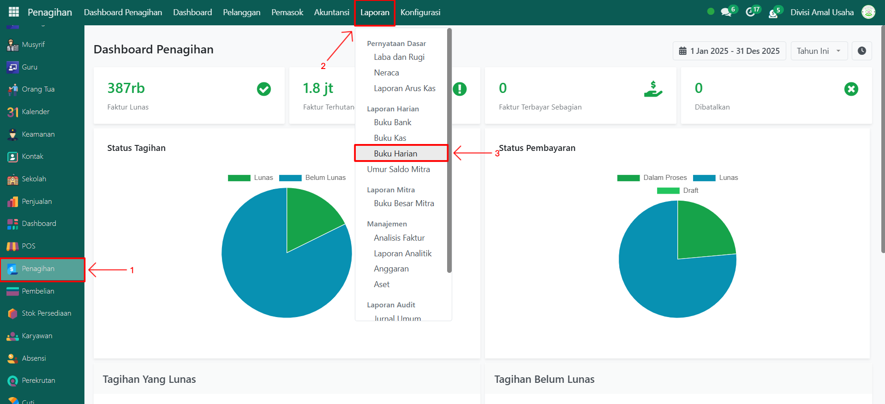

# Buku Harian

Video \[]

## Buku Harian

Laporan **Buku Harian** adalah laporan yang berfungsi untuk menampilkan seluruh transaksi akuntansi yang dicatat ke dalam jurnal harian. Laporan ini membantu memastikan semua transaksi keuangan tercatat secara rinci, baik transaksi kas, bank, maupun penyesuaian lainnya, sesuai periode yang dipilih.

### Mencetak Laporan Buku Harian

Berikut adalah langkah-langkah untuk mencetak laporan buku harian pada Odoo Pesantren.

1. Login menggunakan akun administrator. Jika Anda belum memahami cara login se bagai admin, silakan lihat panduan [**Login Admin** di sini](../../../panduan-login/login-admin.md).
2.  Buka modul **Penagihan**, lalu klik menu **Laporan** kemudian pilih submenu **Buku Harian**.

    <figure><figcaption></figcaption></figure>

3.  Akan tampil sebuah **form pop up** untuk konfigurasi laporan. Pada form ini, lakukan pengaturan berikut:

    * **Target Moves**: pilih _All Posted Entries_ untuk hanya menampilkan transaksi jurnal yang sudah diposting, atau _All Entries_ untuk menampilkan semua transaksi termasuk draft.
    * **Tanggal Mulai**: tentukan tanggal awal periode laporan.
    * **Tanggal Akhir**: tentukan tanggal akhir periode laporan.

    <figure><figcaption></figcaption></figure>

4. Setelah konfigurasi selesai, klik tombol **"Print"** untuk mulai mencetak laporan Buku Harian.
5.  Sistem akan menghasilkan laporan Buku Harian dalam format **PDF**.

    <figure><figcaption></figcaption></figure>

6.  Buka file PDF tersebut untuk melihat daftar transaksi harian yang berisi detail jurnal seperti tanggal, referensi, akun, deskripsi, serta nilai debit dan kredit.

    <figure><figcaption></figcaption></figure>

7. Jika diperlukan, laporan dapat **disimpan** sebagai arsip atau **dibagikan** ke pihak terkait sebagai bagian dari dokumentasi keuangan resmi.
