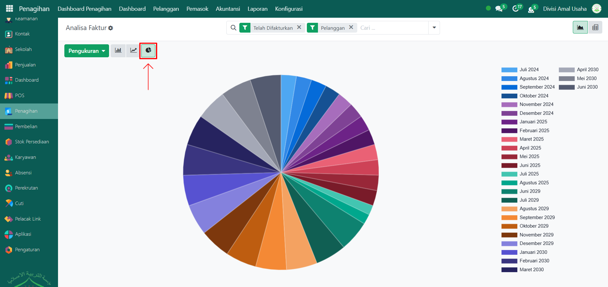

# Analisis Faktur



## Analisis Faktur

Laporan pada **Analisis Faktur** adalah laporan interaktif pada Odoo Pesantren yang digunakan untuk memantau performa penjualan maupun pembelian berdasarkan data faktur. Laporan ini dapat divisualisasikan dalam berbagai bentuk grafik maupun tabel, serta dilengkapi dengan filter dan pengukuran yang membantu proses analisis keuangan secara lebih detail.

### Melihat Analisis Faktur

Berikut adalah langkah-langkah untuk melihat analisis faktur pada Odoo Pesantren.

1. Login menggunakan akun administrator. Jika Anda belum memahami cara login se bagai admin, silakan lihat panduan [**Login Admin** di sini](../../../panduan-login/login-admin.md).
2.  Buka modul **Penagihan**, lalu klik menu **Laporan** kemudian pilih submenu **Analisis Faktur**.

    <figure><figcaption></figcaption></figure>

3.  Secara default, halaman Laporan Pesanan akan menampilkan **grafik line** berdasarkan jumlah sebelum pajak. Anda dapat mengurutkan grafik line dari **kecil ke besar (Ascending)** atau **besar ke kecil (Descending)**.

    <figure><figcaption></figcaption></figure>

4.  Klik tombol **"Pengukuran"** untuk menampilkan daftar opsi pengukuran yang tersedia, seperti **Harga Rata-Rata, Kuantitas Produk, Margin, dan lainnya**. Pilih salah satu sesuai kebutuhan analisis Anda.

    <figure><figcaption></figcaption></figure>

5. Mengubah jenis grafik seperti grafik batang ataupun grafik pie, yaitu:
   *   Untuk mengubah tampilan dari grafik garis menjadi grafik batang dengan klik icon **Grafik Batang (Bar Chart)**. Urutan data tetap dapat diatur Ascending atau Descending.

       <figure><figcaption></figcaption></figure>

   *   Untuk mengubah tampilan dari grafik batang menjadi grafik lingkaran dengan klik icon **Grafik Pie (Pie Chart)** .

       <figure><figcaption></figcaption></figure>

6. Klik pada salah satu elemen pada grafik (batang, garis, atau pie) untuk melihat detail faktur yang direpresentasikan oleh elemen tersebut.
7.  Halaman ini akan menampilkan daftar data faktur pelanggan. Setiap entri menampilkan informasi penting meliputi: **Nomor Referensi Faktur, Rekanan, Tanggal Faktur, Batas Waktu Tagihan, Produk, Jumlah Sebelum Pajak, dan Total dalam Mata Uang**.

    <figure><figcaption></figcaption></figure>

8.  Gunakan **toggle pencarian** untuk melakukan penyaringan (filter) data, misalnya: **Siap difakturkan, Telah Difakturkan, Pelanggan dan Pemasok, Faktur, Catatan kredit,** dan lainnya serta filter **Kelompok** berdasarkan **Penjual, Tim Penjualan, Rekanan, Kategori Produk, Status Faktur, Tanggal, dan Batas Waktu**.

    <figure><figcaption></figcaption></figure>

9. Setelah filter diterapkan, data yang ditampilkan akan menyesuaikan dengan kriteria filter tersebut.
10. Klik pada salah satu entri data faktur untuk membuka halaman detail faktur.
11. Halaman **analisis faktur** akan menampilkan informasi lengkap, termasuk **Penjual, Rekanan, Status Pembayaran, Tanggal Faktur, Total Harga, Produk, Status Faktur,** dan informasi lainnya.

    <figure><figcaption></figcaption></figure>
