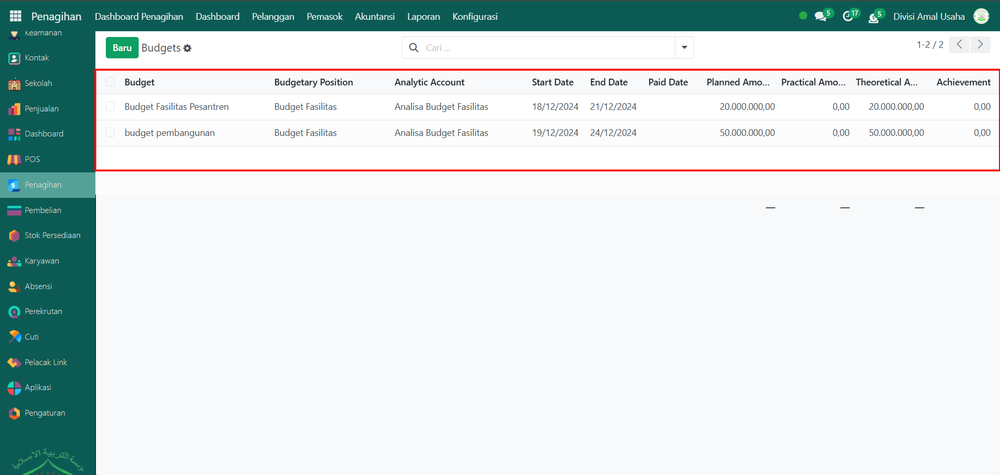
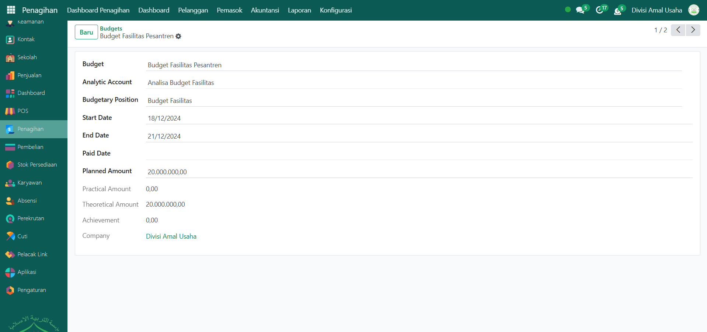

# Anggaran



## Anggaran

Laporan pada **Anggaran** di Odoo Pesantren digunakan untuk memantau dan mengontrol rencana keuangan yang telah ditetapkan. Dengan laporan ini, pengguna dapat membandingkan jumlah anggaran yang direncanakan dengan realisasi transaksi, sehingga memudahkan pengawasan serta evaluasi penggunaan dana.

### Melihat Anggaran

Berikut adalah langkah-langkah untuk melihat anggaran pada Odoo Pesantren.&#x20;

1. Login menggunakan akun administrator. Jika Anda belum memahami cara login se bagai admin, silakan lihat panduan [**Login Admin** di sini](../../../panduan-login/login-admin.md).
2.  Buka modul **Penagihan**, lalu klik menu **Laporan** kemudian pilih submenu **Anggaran**.

    <figure><figcaption></figcaption></figure>

3.  Sistem akan menampilkan daftar laporan anggaran yang tersedia dalam bentuk tabel.

    <figure><figcaption></figcaption></figure>

4. Klik salah satu baris data laporan anggaran untuk membuka halaman detail laporan tersebut.
5.  Halaman form laporan anggaran akan menampilkan informasi lengkap, meliputi: **Budget**, **Akun Analitik**, **Tanggal Mulai** dan **Tanggal Berakhir**, **Jumlah yang Direncanakan (Planned Amount)**, **Jumlah yang Terealisasi (Practical Amount)**, **Selisih Anggaran (Theoretical vs Practical)**, dan Informasi tambahan lain terkait anggaran tersebut.

    <figure><figcaption></figcaption></figure>
