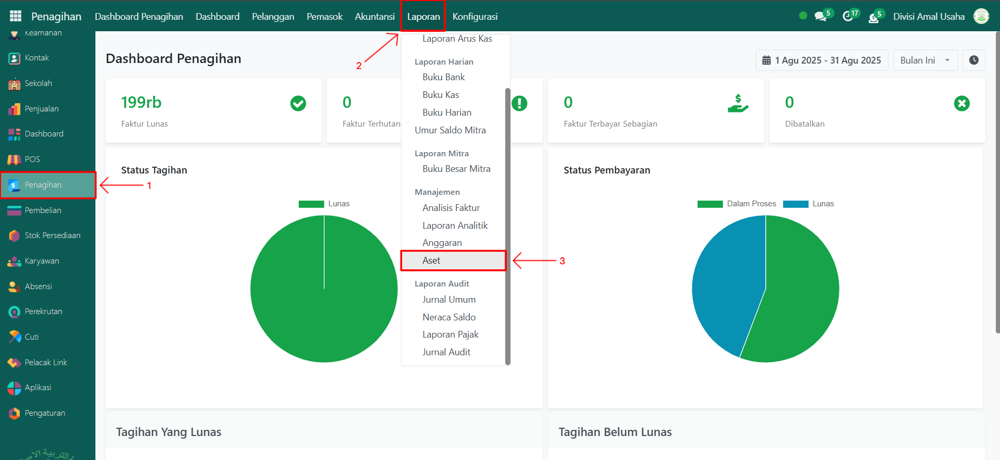
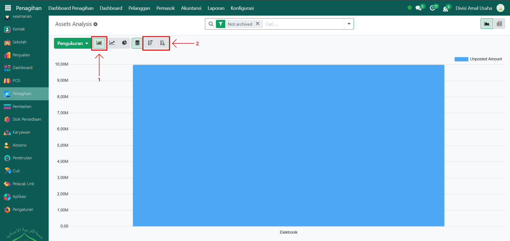
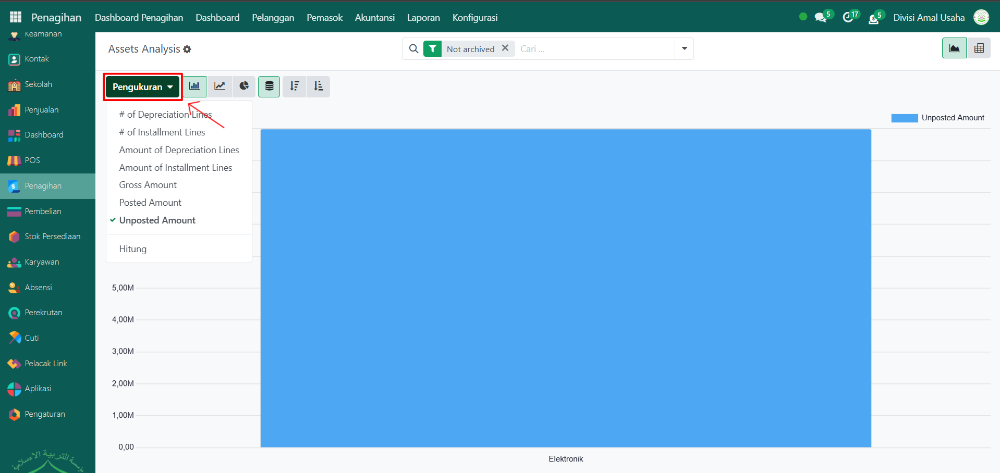

# Aset

Video \[]

## Aset

**Laporan Aset** pada Odoo Pesantren digunakan untuk memantau daftar aset tetap yang dimiliki oleh lembaga. Laporan ini menyajikan informasi terkait nilai perolehan, status aset, penyusutan, serta detail kategori aset yang memudahkan pengawasan dan analisis keuangan.

### Melihat Laporan Aset

Berikut adalah langkah-langkah untuk melihat laporan aset pada Odoo Pesantren.

1. Login menggunakan akun administrator. Jika Anda belum memahami cara login se bagai admin, silakan lihat panduan [**Login Admin** di sini](../../../panduan-login/login-admin.md).
2.  Buka modul **Penagihan**, lalu klik menu **Laporan** kemudian pilih submenu **Aset**.

    <figure><figcaption></figcaption></figure>

3.  Secara default, halaman **Laporan Aset** akan menampilkan **grafik batang** berdasarkan unposted amount. Anda dapat mengurutkan grafik batang dari **kecil ke besar (Ascending)** atau **besar ke kecil (Descending)**.&#x20;

    <figure><figcaption></figcaption></figure>

4.  Klik tombol **"Pengukuran"** untuk menampilkan daftar opsi pengukuran yang tersedia, seperti **Gross Amount, Posted Amount, Unposted Amount, dan lainnya**. Pilih salah satu sesuai kebutuhan analisis Anda.&#x20;

    <figure><figcaption></figcaption></figure>

5. Untuk mengubah jenis grafik:
   *   Klik ikon **Grafik Garis (Line Chart)** untuk mengubah tampilan dari grafik batang menjadi grafik garis. Urutan data tetap dapat diatur Ascending atau Descending.

       <figure><figcaption></figcaption></figure>

   *   Klik ikon **Grafik Pie (Pie Chart)** untuk mengubah tampilan dari grafik garis menjadi grafik lingkaran.

       <figure><figcaption></figcaption></figure>

6. Klik pada salah satu elemen pada grafik (batang, garis, atau pie) untuk melihat detail aset yang direpresentasikan oleh elemen tersebut.
7.  Halaman ini akan menampilan **daftar data laporan aset**.

    <figure><figcaption></figcaption></figure>

8.  Gunakan **toggle pencarian** untuk melakukan penyaringan (filter) data, misalnya: **Status Aset (Draft, Running), Not Archived, Posted, dan lainnya** atau Kelompok berdasarkan **Aset, Kategori Aset, Purchase Month, dan Deprication Month**.

    <figure><figcaption></figcaption></figure>

9. Setelah filter diterapkan, data yang ditampilkan akan menyesuaikan dengan kriteria filter tersebut.
10. Klik pada salah satu baris data aset untuk membuka halaman detail aset.
11. Halaman laporan aset akan menampilkan informasi lengkap, termasuk **Tanggal Penyusutan, Kategori Aset, Status Aset, Jumlah Aset, Aset,** dan informasi lainnya.

    <figure><figcaption></figcaption></figure>
