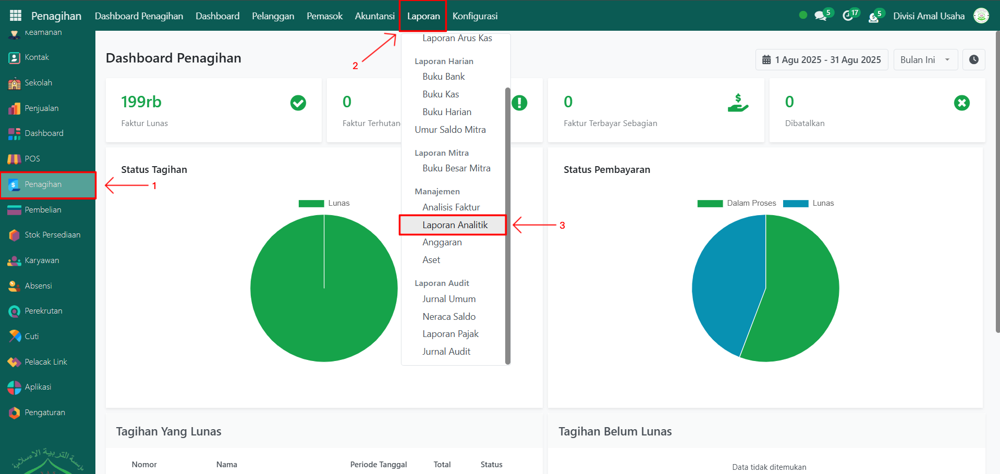
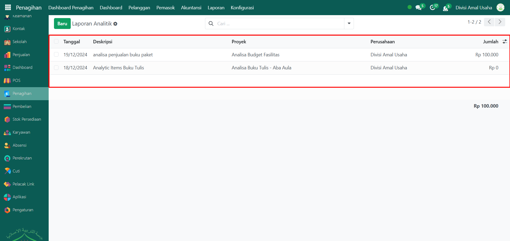
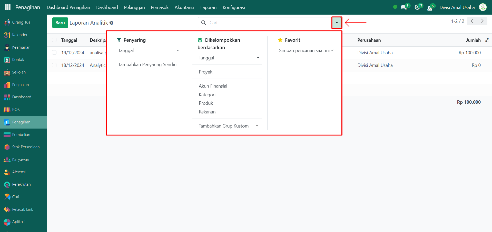
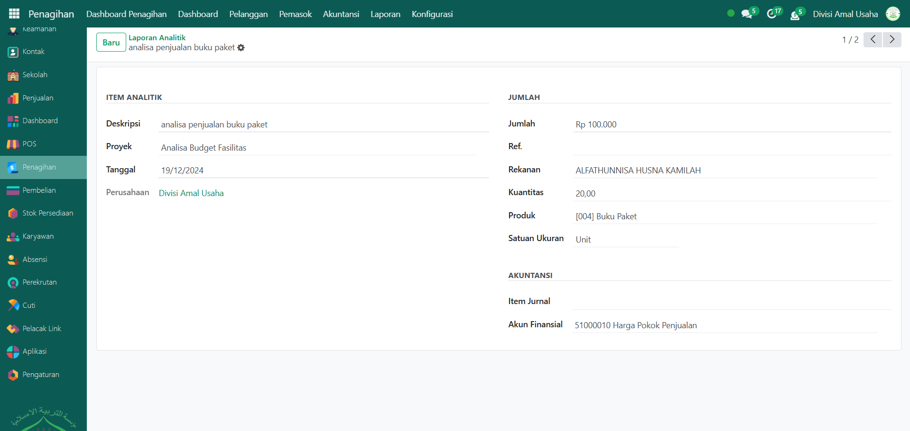

# Laporan Analitik



## Laporan Analitik

**Laporan Analitik** pada Odoo Pesantren digunakan untuk memantau transaksi yang terkait dengan akun analitik. Laporan ini membantu dalam menelusuri detail biaya maupun pendapatan yang tercatat berdasarkan kategori tertentu, seperti proyek, produk, atau akun finansial. Dengan laporan analitik, pengguna dapat menganalisis sumber pemasukan maupun pengeluaran secara lebih rinci sesuai kebutuhan.

### Melihat Laporan Analitik

Berikut adalah langkah-langkah untuk melihat laporan analitik pada Odoo Pesantren.&#x20;

1. Login menggunakan akun administrator. Jika Anda belum memahami cara login se bagai admin, silakan lihat panduan [**Login Admin** di sini](../../../panduan-login/login-admin.md).
2.  Buka modul **Penagihan**, lalu klik menu **Laporan** kemudian pilih submenu **Laporan Analitik**.

    <figure><figcaption></figcaption></figure>

3.  Sistem akan menampilkan daftar laporan analitik yang berisi data transaksi yang sudah tercatat.

    <figure><figcaption></figcaption></figure>

4.  Gunakan **toggle pencarian** untuk melakukan penyaringan (filter) data, misalnya: **Tanggal Analitik**, serta filter **Kelompok** berdasarkan **Tanggal Analitik**, **Proyek**, **Akun Finansial**, **Kategori**, **Produk**, dan **Rekanan**.

    <figure><figcaption></figcaption></figure>

5. Setelah filter diterapkan, daftar data akan diperbarui secara otomatis sesuai kriteria yang dipilih.
6. Klik salah satu baris pada daftar laporan analitik untuk membuka halaman detail laporan tersebut.
7.  Halaman laporan analitik akan menampilkan informasi lengkap, termasuk **Item Analitik**, **Jumlah**, **Rekanan**, **Kuantitas**, **Produk**, dan informasi lainnya.

    <figure><figcaption></figcaption></figure>
