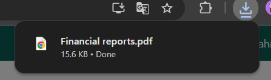

# Neraca



## Neraca (Balance Sheet)

Laporan **Neraca** **(Balance Sheet)** pada Odoo Pesantren digunakan untuk menampilkan posisi keuangan pada periode tertentu, meliputi aset, kewajiban, dan ekuitas. Laporan ini berguna untuk mengetahui kondisi keuangan secara menyeluruh pada akhir periode akuntansi.

### Mencetak Laporan Neraca

Berikut adalah langkah-langkah untuk mencetak laporan neraca pada Odoo Pesantren.

1. Login menggunakan akun administrator. Jika Anda belum memahami cara login sebagai admin, silakan lihat panduan [**Login Admin** di sini](../../panduan-login/login-admin.md).
2.  Buka modul **Penagihan**, lalu klik menu **Laporan** kemudian pilih submenu **Neraca**.

    <figure><figcaption></figcaption></figure>

3.  Akan muncul form pop up untuk mencetak laporan neraca, masukkan **Tanggal Mulai** periode yang ingin ditampilkan pada laporan.

    <figure><figcaption></figcaption></figure>

4.  Masukkan **Tanggal Selesai** periode sesuai kebutuhan.

    <figure><figcaption></figcaption></figure>

5.  Pilih jenis entri yang akan disertakan pada laporan:

    * **All Posted Entries** → menampilkan hanya transaksi entri jurnal yang sudah diposting.
    * **All Entries** → menampilkan seluruh transaksi entri jurnal, baik _draft_ maupun yang sudah diposting.

    Jika diperlukan, centang opsi **Display Debit/Credit Columns** untuk menampilkan kolom debit dan kredit pada hasil cetakan. Setelah konfigurasi selesai, klik tombol **"Print"** untuk memulai proses pencetakan Laporan Neraca.

    <figure><figcaption></figcaption></figure>

6.  Sistem akan menghasilkan laporan dalam format **PDF**.

    <figure><figcaption></figcaption></figure>

7.  Buka file PDF tersebut untuk melihat detail posisi keuangan, termasuk nilai aset, kewajiban, dan ekuitas pada periode yang dipilih.

    <figure><figcaption></figcaption></figure>
