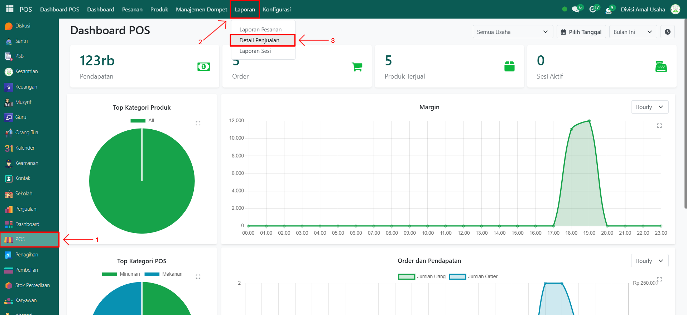
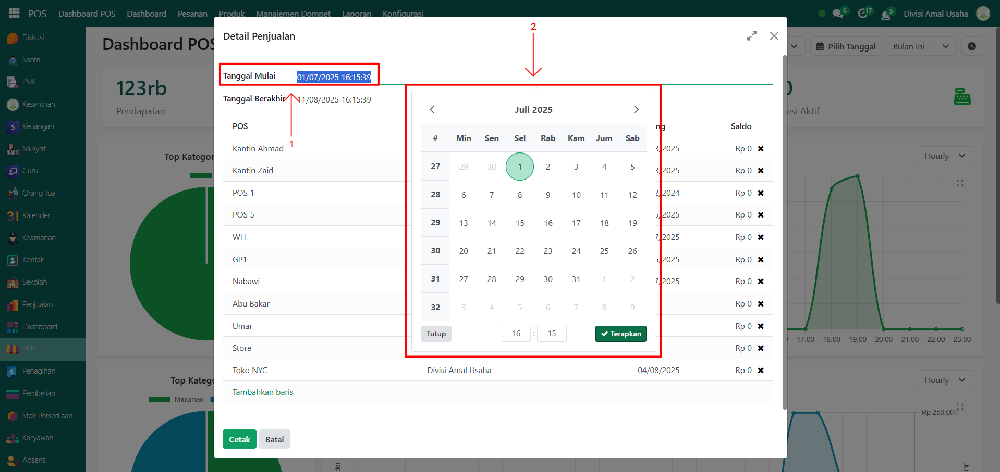
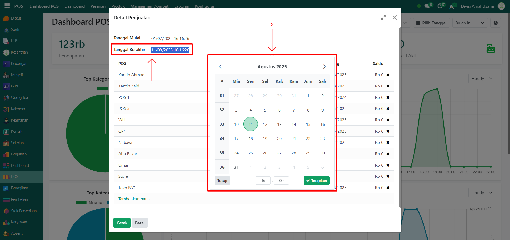
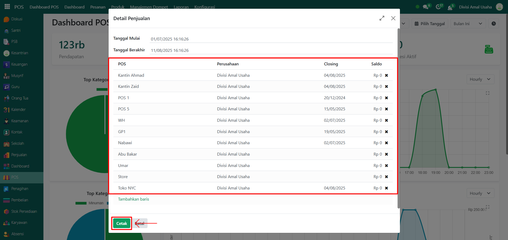
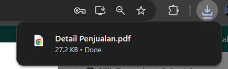
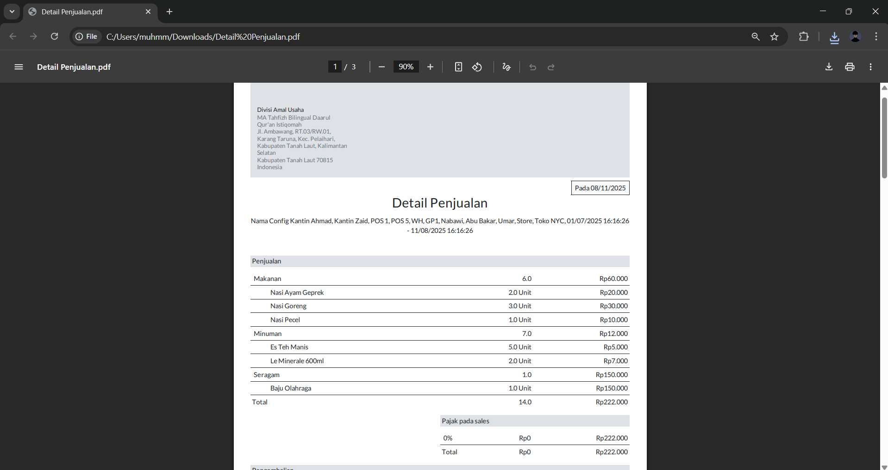

# Detail Penjualan

Video \[]

## Detail Penjualan POS

**Laporan Detail Penjualan POS** digunakan untuk menampilkan rincian transaksi penjualan pada setiap POS (Point of Sale) dalam periode tertentu. Laporan ini berguna untuk memantau performa penjualan, jumlah transaksi, nilai total penjualan, serta distribusi penjualan antar toko/pos.

### Melihat Detail Penjualan dari setiap POS

Berikut adalah langkah-langkah untuk melihat detail penjualan dari setiap POS pada Odoo Pesantren.

1. Login menggunakan akun administrator. Jika Anda belum memahami cara login sebagai admin, silakan lihat panduan [**Login Admin** di sini](../../panduan-login/login-admin.md).
2.  Buka modul **POS**, lalu klik menu **Laporan** kemudian pilih submenu **Detail Penjualan**.

    <figure><figcaption></figcaption></figure>

3.  Akan muncul **jendela pop-up** untuk menentukan parameter laporan. Pada kolom **Tanggal Mulai**, masukkan tanggal awal periode laporan.

    <figure><figcaption></figcaption></figure>

4.  Pada kolom **Tanggal Berakhir**, masukkan tanggal akhir periode laporan.

    <figure><figcaption></figcaption></figure>

5.  Pastikan pilihan **POS** sudah mencakup seluruh POS yang ingin dimasukkan dalam laporan. Anda juga dapat memilih POS tertentu jika hanya ingin menampilkan data dari POS tersebut. Jika sudah, klik tombol **"Cetak"** untuk memproses dan menghasilkan laporan detail penjualan.

    <figure><figcaption></figcaption></figure>

6.  Sistem akan mengunduh laporan dalam format **PDF** secara otomatis.

    <figure><figcaption></figcaption></figure>

7.  Buka file PDF tersebut untuk melihat rincian laporan, yang mencakup informasi seperti ringkasan transaksi POS, termasuk **daftar produk yang terjual**, **nilai penjualan**, **pajak**, **metode pembayaran**, **serta total transaksi pada setiap sesi POS**.

    <figure><figcaption></figcaption></figure>
