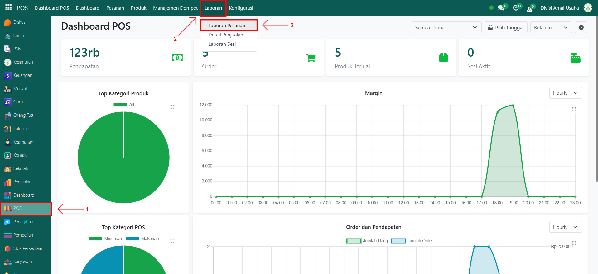
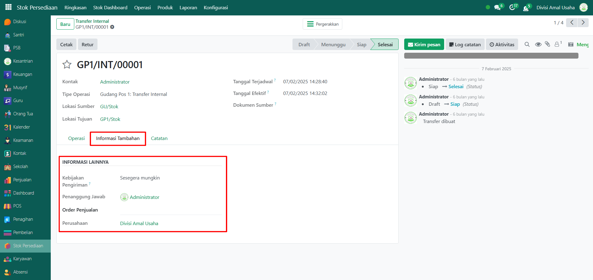
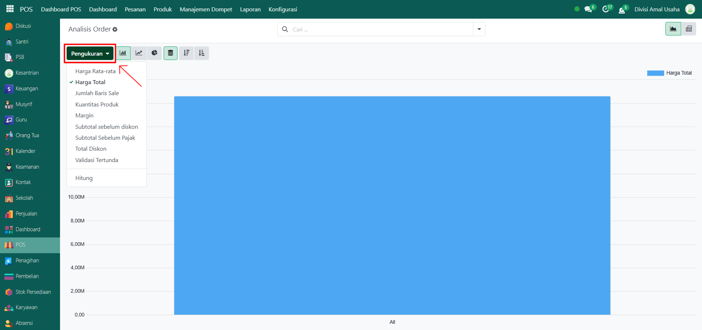
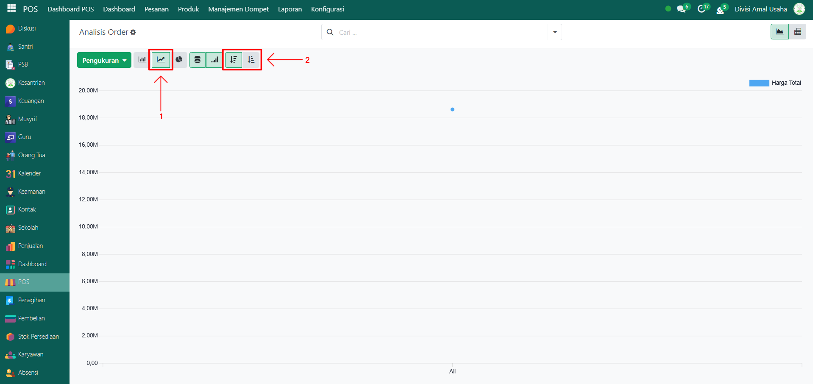
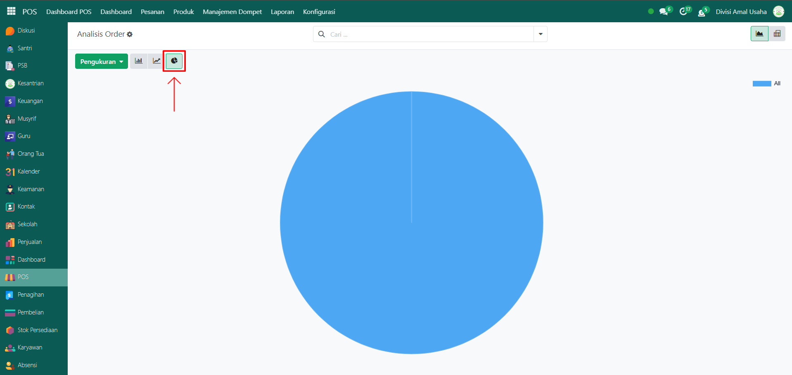
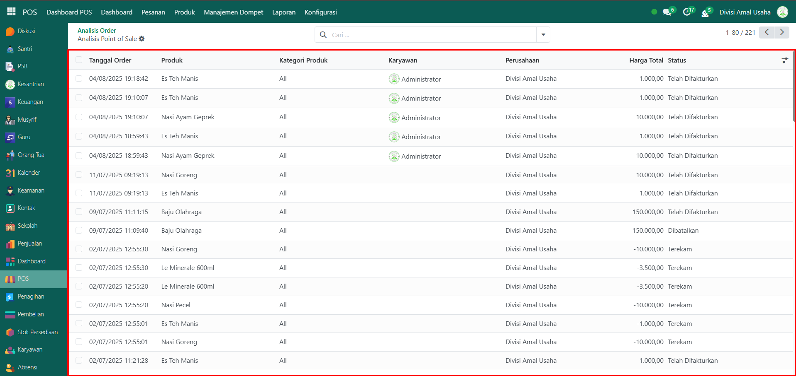
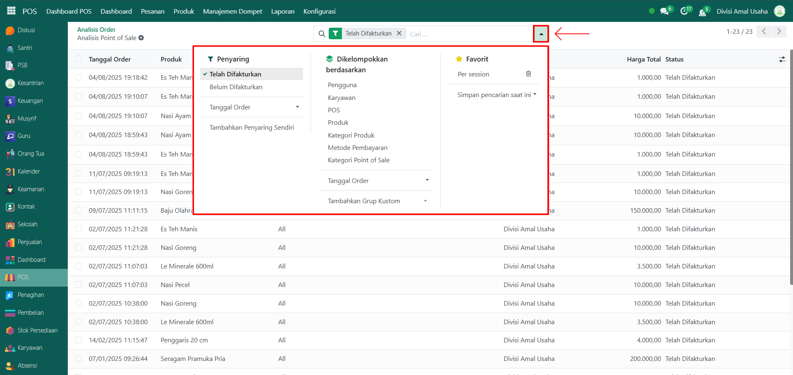
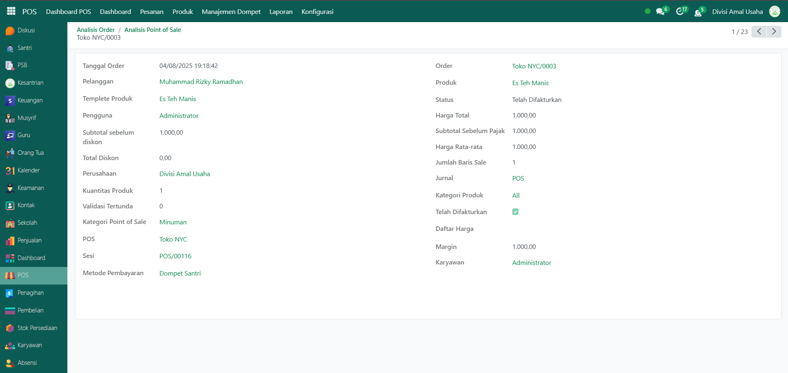

# Laporan Pesanan

Video \[]

## Laporan Pesanan POS

**Laporan Pesanan POS** digunakan untuk memantau seluruh pesanan yang dilakukan melalui sistem Point of Sale pada Odoo Pesantren. Laporan ini dapat ditampilkan dalam bentuk grafik maupun daftar data, sehingga memudahkan analisis penjualan berdasarkan berbagai parameter seperti total harga, jumlah produk, margin, kasir, metode pembayaran, dan lainnya.

### Melihat Laporan Pesanan POS

Berikut adalah langkah-langkah untuk melihat laporan pesanan pada Odoo Pesantren.

1. Login menggunakan akun administrator. Jika Anda belum memahami cara login sebagai admin, silakan lihat panduan [**Login Admin** di sini](../../panduan-login/login-admin.md).
2.  Buka modul **POS**, lalu klik menu **Laporan** dan kemudian pilih submenu **Laporan Pesanan**.

    <figure><figcaption></figcaption></figure>

3.  Secara default, halaman Laporan Pesanan akan menampilkan **grafik batang** berdasarkan total harga pesanan. Anda dapat mengurutkan grafik batang dari **kecil ke besar (Ascending)** atau **besar ke kecil (Descending)**.

    <figure><figcaption></figcaption></figure>

4.  Klik tombol **"Pengukuran"** untuk menampilkan daftar opsi pengukuran yang tersedia, seperti **Total Harga, Harga Rata-rata, Margin, Kuantitas Produk**, dan lainnya. Pilih salah satu sesuai kebutuhan analisis Anda.

    <figure><figcaption></figcaption></figure>

5. Untuk mengubah jenis grafik:
   *   Klik ikon **Grafik Garis (Line Chart)** untuk mengubah tampilan dari grafik batang menjadi grafik garis. Urutan data tetap dapat diatur Ascending atau Descending.

       <figure><figcaption></figcaption></figure>

   *   Klik ikon **Grafik Pie (Pie Chart)** untuk mengubah tampilan dari grafik garis menjadi grafik lingkaran.

       <figure><figcaption></figcaption></figure>

6. Klik pada salah satu elemen pada grafik (batang, garis, atau pie) untuk melihat detail pesanan yang direpresentasikan oleh elemen tersebut.
7.  Halaman ini akan menampilan **daftar data pesanan**. Setiap kolom menampilkan **Tanggal Order, Produk, Kategori Produk, Kasir, Total Harga, dan Status Pesanan**.

    <figure><figcaption></figcaption></figure>

8.  Gunakan **toggle pencarian** untuk melakukan penyaringan (filter) data, misalnya: **Telah Difakturkan, Belum Difakturkan, Tanggal Order**, atau **Kelompok** berdasarkan **Pelanggan, Karyawan/Kasir, POS, Produk, Kategori Produk, Metode Pembayaran**, dan lainnya.

    <figure><figcaption></figcaption></figure>

9. Setelah filter diterapkan, data yang ditampilkan akan menyesuaikan dengan kriteria filter tersebut.
10. Klik pada salah satu baris data pesanan untuk membuka halaman detail pesanan.
11. Halaman detail pesanan akan menampilkan informasi lengkap, termasuk **Tanggal Order, Pelanggan, Produk, Total Harga, POS, Sesi POS, Metode Pembayaran, Kasir**, dan informasi lainnya.

    <figure><figcaption></figcaption></figure>
