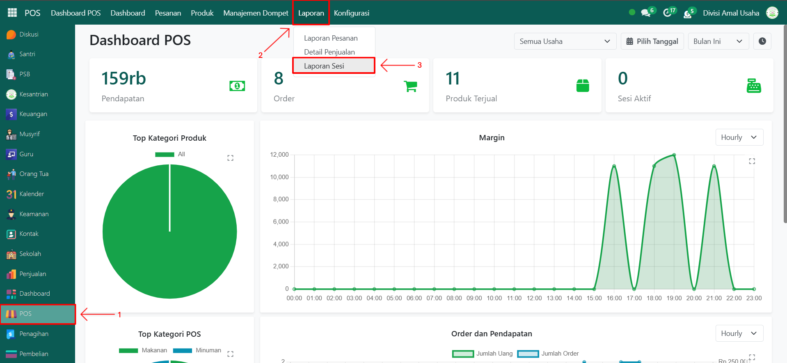
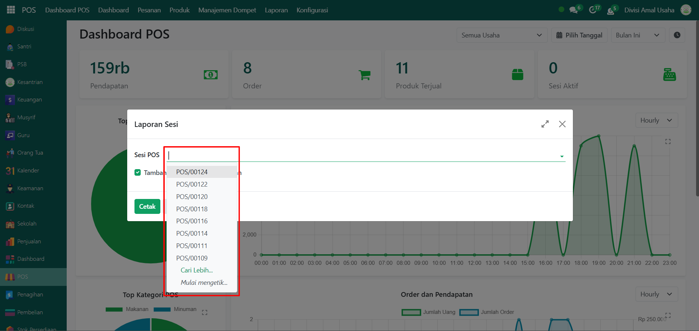
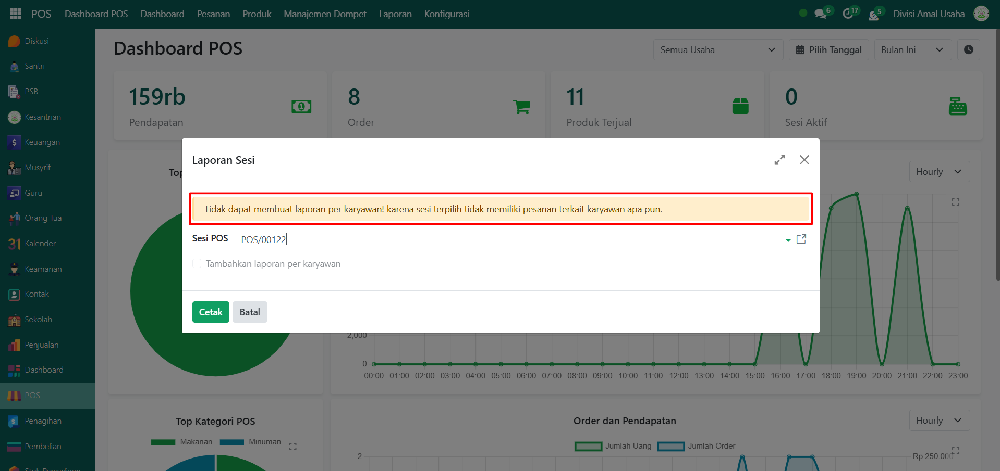
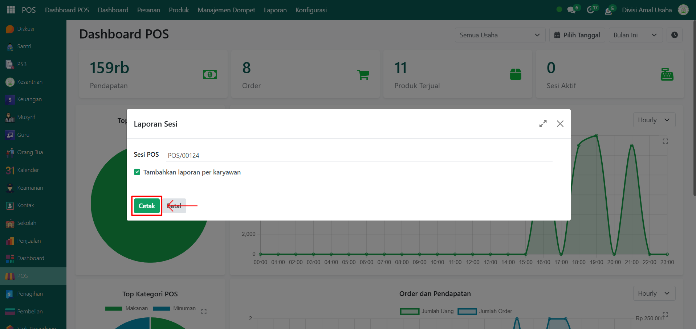
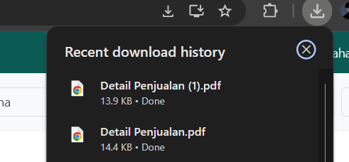
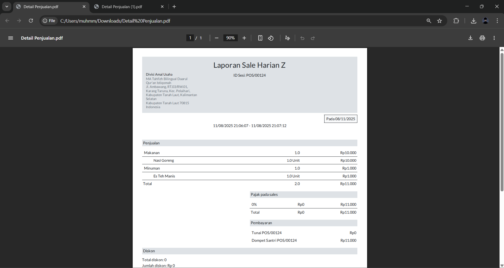
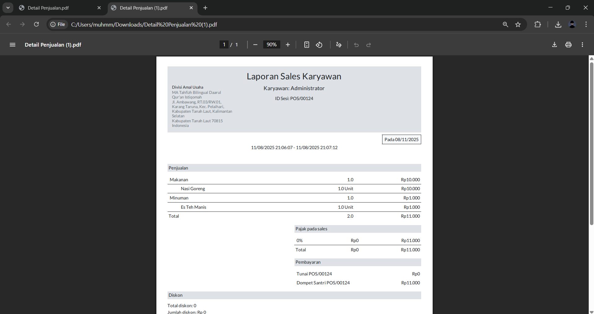

# Laporan Sesi

Video \[]

## Laporan Sesi POS

**Laporan Sesi POS** digunakan untuk menampilkan ringkasan transaksi yang terjadi pada sesi Point of Sale (POS). Laporan ini juga dapat menampilkan rincian transaksi per karyawan, jika pengaturan login karyawan diaktifkan.

### Melihat Laporan Sesi POS

Berikut adalah langkah-langkah untuk melihat laporan sesi POS pada Odoo Pesantren.

1. Login menggunakan akun administrator. Jika Anda belum memahami cara login sebagai admin, silakan lihat panduan [**Login Admin** di sini](../../panduan-login/login-admin.md).
2.  Buka modul **POS**, lalu klik menu **Laporan** kemudian pilih submenu **Laporan Sesi**.

    <figure><figcaption></figcaption></figure>

3.  Akan muncul **jendela pop-up** untuk menentukan parameter laporan. Pada kolom **Sesi POS**, pilih sesi yang telah dilakukan sebelumnya dan dibutuhkan pencetakan laporan sesi.

    <figure><figcaption></figcaption></figure>

4.  Aktifkan opsi **Cetak Laporan Per Karyawan** jika Anda ingin menambahkan laporan berdasarkan transaksi karyawan. Jika **konfigurasi** [**"Log in dengan Karyawan" di sini**](../../setup-and-konfigurasi/alur-setup-sistem/point-of-sale/sesi-point-of-sale.md) sudah dicentang pada saat menambahkan data POS, maka laporan per karyawan akan dapat dicetak.

    <figure><figcaption></figcaption></figure>

5.  Jika **konfigurasi** [**"Log in dengan Karyawan" di sini**](../../setup-and-konfigurasi/alur-setup-sistem/point-of-sale/sesi-point-of-sale.md) tidak dicentang, maka opsi laporan per karyawan tidak akan tersedia atau menampilkan pesan bahwa data tidak dapat ditampilkan.

    <figure><figcaption></figcaption></figure>

6.  Klik tombol **"Cetak"** untuk memproses dan menghasilkan laporan sesi (dan laporan per karyawan jika tersedia).

    <figure><figcaption></figcaption></figure>

7.  Sistem akan mengunduh laporan dalam format **PDF**.

    <figure><figcaption></figcaption></figure>

8.  **Laporan Sesi POS** akan menampilkan informasi seperti **total penjualan, metode pembayaran, saldo awal, saldo akhir**.

    <figure><figcaption></figcaption></figure>

9.  **Laporan Per Karyawan** (jika tersedia) akan menampilkan informasi transaksi yang dilakukan oleh masing-masing karyawan, termasuk **jumlah transaksi, total penjualan, dan metode pembayaran yang digunakan**.

    <figure><figcaption></figcaption></figure>
