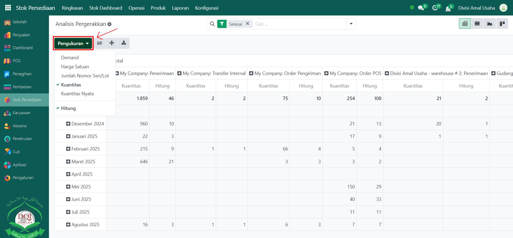

# Analisis Pergerakan

Video \[]

## Analisisi Pergerakan Barang

**Analisis Pergerakan Barang** pada Odoo Pesantren digunakan untuk memantau dan mengevaluasi pergerakan stok secara menyeluruh, baik dari sisi jumlah barang maupun nilai transaksinya. Laporan ini menampilkan ringkasan data berdasarkan periode tertentu dan jenis operasi, seperti penerimaan dari pemasok, pengiriman ke pelanggan, hingga perpindahan internal antar lokasi.

### Melihat Analisis Pergerakan Barang

Berikut adalah langkah-langkah untuk melihat analisis pergerakan barang pada Odoo Pesantren.

1. Login menggunakan akun administrator. Jika Anda belum memahami cara login sebagai admin, silakan lihat panduan [**Login Admin** di sini](../../panduan-login/login-admin.md).
2.  Buka modul **Stok Persediaan**, lalu klik menu **Laporan**, kemudian pilih submenu **Analisis Pergerakan**.

    <figure><figcaption></figcaption></figure>

3.  Halaman awal akan menampilkan tabel analisis pergerakan stok dengan kolom yang memuat total kuantitas atau nilai transaksi untuk setiap jenis operasi stok, seperti Penerimaan, Pengiriman, Operasi Internal, dan lainnya. Di sisi kiri tabel, data dikelompokkan berdasarkan periode (misalnya per bulan) untuk memudahkan analisis tren.

    <figure><figcaption></figcaption></figure>

4.  Klik tombol **Pengukuran** untuk mengubah parameter analisis, seperti mengukur berdasarkan **Kuantitas**, **Harga Satuan**, **Permintaan (Demand)**, atau metrik lainnya sesuai kebutuhan.

    <figure><figcaption></figcaption></figure>
