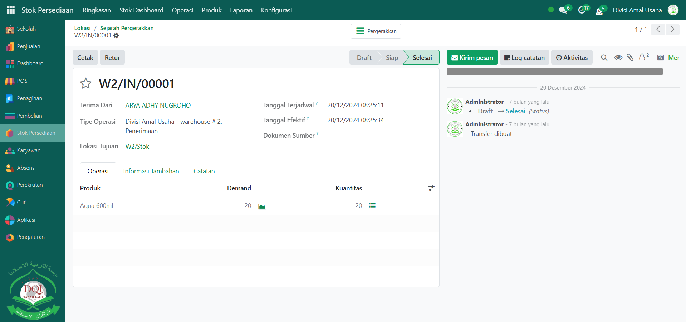
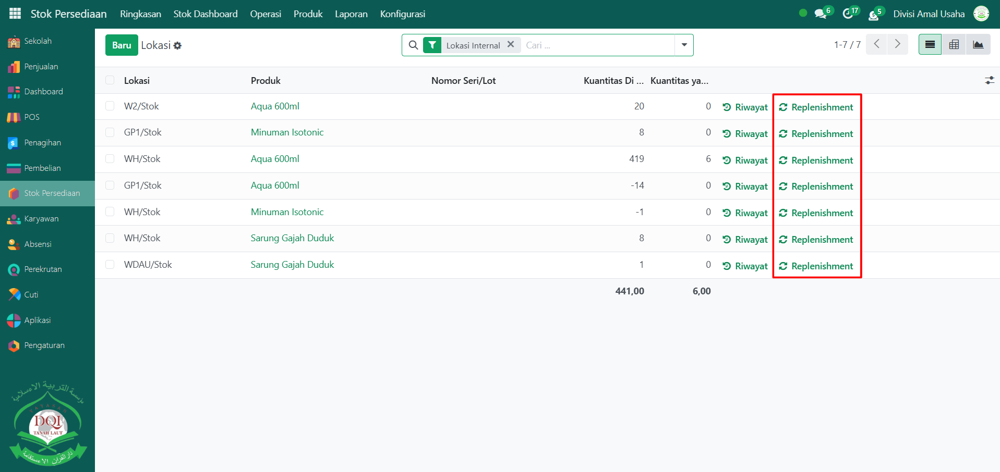

# Lokasi



## Laporan Lokasi Gudang

Laporan pada **Lokasi Gudang** digunakan untuk memantau posisi penyimpanan setiap produk di dalam sistem, termasuk informasi riwayat pergerakan stok serta aturan pengisian ulang (replenishment). Dengan laporan ini, pengguna dapat mengetahui secara detail lokasi penyimpanan barang, riwayat keluar-masuk barang, dan pengaturan stok minimum untuk memicu pemesanan ulang secara otomatis.

### Melihat Laporan Lokasi Gudang

Berikut adalah langkah-langkah untuk melihat laporan lokasi gudang pada Odoo Pesantren.

1. Login menggunakan akun administrator. Jika Anda belum memahami cara login sebagai admin, silakan lihat panduan [**Login Admin** di sini](../../panduan-login/login-admin.md).
2.  Buka modul **Stok Persediaan**, lalu klik menu **Laporan** kemudian pilih submenu **Lokasi**.

    <figure><figcaption></figcaption></figure>

3.  Halaman laporan lokasi akan menampilkan daftar lokasi penyimpanan barang yang tercatat di sistem, lengkap dengan informasi kuantitas dan status stoknya.

    <figure><figcaption></figcaption></figure>

4.  Untuk melihat riwayat perpindahan stok suatu produk, klik tautan **"Riwayat"** pada produk yang diinginkan.

    <figure><figcaption></figcaption></figure>

5.  Halaman **Riwayat Pergerakan Stok** akan menampilkan catatan keluar-masuk stok beserta tanggal dan referensi transaksinya.

    <figure><figcaption></figcaption></figure>

6. Klik salah satu entri pada riwayat tersebut untuk membuka detailnya.
7.  Pada halaman detail, Anda dapat melihat informasi lengkap terkait penerimaan barang dari pemasok, pengiriman barang ke pelanggan, atau perpindahan stok antar lokasi, termasuk tanggal, produk, dan kuantitas.

    <figure><figcaption></figcaption></figure>

8.  Kembali ke halaman laporan lokasi sebelumnya, lalu klik tautan **"Replenishment"** pada produk yang ingin Anda periksa aturan pemesanan ulangnya.

    <figure><figcaption></figcaption></figure>

9.  Halaman **Replenishment** menampilkan daftar aturan pengisian ulang stok. Jika stok berada di bawah jumlah minimum yang telah ditentukan, sistem akan membuat usulan pemesanan ulang secara otomatis.

    <figure><figcaption></figcaption></figure>

10. Jika diperlukan, Anda dapat menyesuaikan atau membuat aturan pemesanan ulang baru langsung dari halaman ini untuk memastikan ketersediaan stok tetap terjaga.
